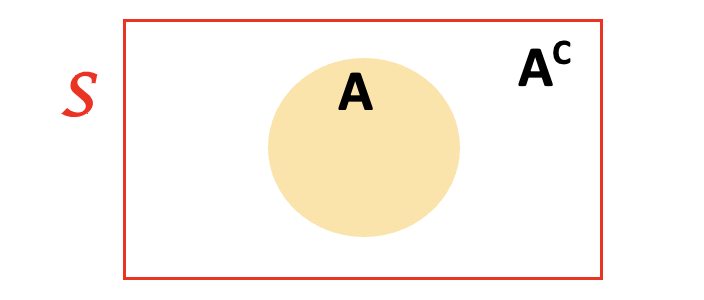
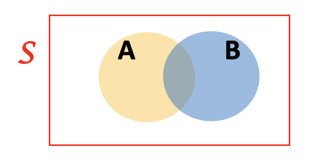
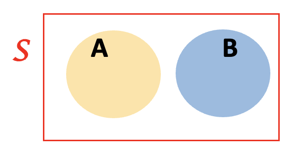
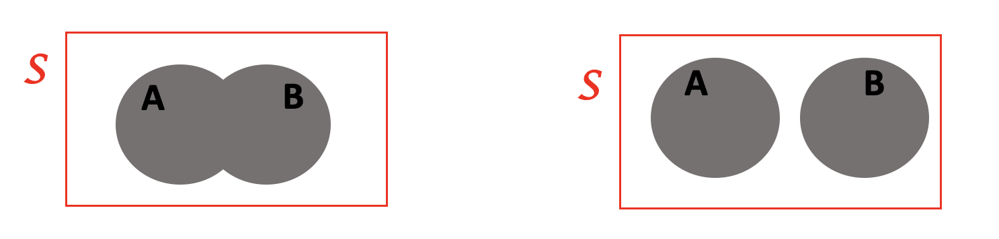

# Venn Diagrams

A Venn diagram is often used to represent events within a particular sample space. The sample space is represented by a rectangle. Events within the sample space are represented by circles within the rectangle.

The space outside of a circle, corresponds to the compliment of that event. 

Suppose we have two events (circles) in our Venn diagram. It’s possible that these events overlap in the region shaded by both colors, called the intersection. 

It’s also possible that these events are completely distinct and do not overlap (i.e. their intersection is empty). If two events have an empty intersection, we say they are mutually exclusive (or disjoint).

The union of two events represents the instance that either one of the events or both of the events occurs. The unions for both intersecting and disjoint examples are shaded in gray below.  

 
 
# Laws of Probability 

These are the mathematical rules that logically determine what we mean by the word “probability”. 
For any event $A$ in some sample space, $S$:

1. The probability event $A$ occurs is a number between (and including) $0$ and $1$
$$0 \leq Pr(A)\leq 1$$
2. The probability of the entire sample space is $1$.
$$Pr(S)=1$$

3. The probability event $A$ occurs is equal to one minus the probability that any other event in the sample space besides $A$ occurs.

And, for another event, $B$, in the same sample space:

4. The probability of the union of events $A$ and $B$ is the sum of their individual probabilities minus the probability of their intersection.
$$Pr(A \text{ or } B)=Pr(A)+Pr(B)-Pr(A \text{ and } B)$$
	
5. For independent events, $A$ and $B$, the probability of their intersection is the product of their individual probabilities. 
$$Pr(A\text{ and }B)=Pr(A)×Pr(B)$$
In general, if $A$ and $B$ are not necessarily independent events, then $Pr(A\text{ and } B) = Pr(A)\times Pr(B \mid A)$

## Definition of independence 

Two events $A$ and $B$ are said to be independent if and only if $Pr(A \text{ and }B) = Pr(A)\times Pr(B)$. Another, mathematically equivalent way to define independence is if $Pr(B \mid A) = Pr(B)$. 

# Random Variables 

A random variable is actually a very technical mathematical concept. For the purpose of this class, we can think of a random variable as a mathematical model for an observable random phenomena. Generally we use capital letters from the end of the English alphabet to denote random variables, e.g. $W$, $X$, $Y$, $Z$. We use the lowercase version of these letters to refer to an actual possible value for the random variable, e.g. $w$, $x$, $y$, $z$. Since every random variable comes with an associated probability distribution, each possible value has with it an associated probabilitiy that obeys the laws above. 

* A random variable is discrete if we can (given a possibly infinite amount of time) create a list of all of the possible outcomes of this variable. (E.g. categorical variables are always discrete, a random variable representing the number of people in line in discrete.)  

* A random variable is continuous if it is not discrete. A random variable can only be continuous if it is also quantitative. (E.g. a random variable representing the proportion of left-handed students in any classroom is continuous because we can’t ever list out all possible numbers between $0$ and $1$.) 

The expected value (AKA the mean or the average) of a random variable is the sum of the possible values time the probabilities of those possible values. I.e. for some random variable, $X$, that takes values in the sample space $S$:
$$E(X) = \sum_{x \in S}\left(x \times Pr(x) \right).$$

The variance of a random variable is the sum of the squared distance between each possible value and the expected value times the probabilities of those possible values. (The standard deviation of a random variable is the square root of the variance of the random variable.) I.e. for some random variable $X$, that takes values in the sample space $S$:
$$Var(X) = \sum_{x \in S} \left[(x - E(X)) \times Pr(x) \right].$$
