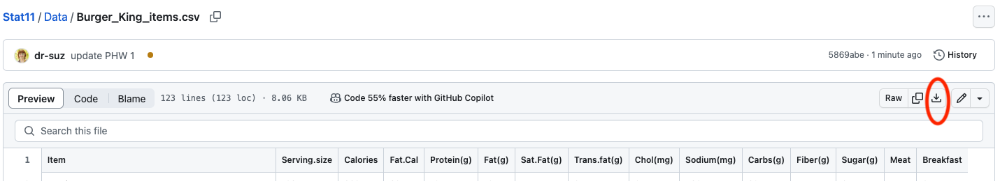

# Introduction and Purpose 

The data set you will analyse in this homework records information about different items on the menu at a local Burger King restaurant. One purpose of this assignment is to practice using software to explore and summarize qualities of these data consisting of $122$ observations and $15$ columns (the first column identifies the item name, the next $14$ correspond to different variables). Another purpose of this assignment is to begin to practice working with data through software. Most of your time on this assignment will be spent getting your software set up and on learning how to do basic exploratory statistics with either Excel or RStudio.


# Required Tech 

## Excel 

The skills necessary to complete this assignment in Excel are covered in the following seven videos:

* Excel 2016 with Data Analysis Toolpak Introduction to Excel 2016 with Data Analysis Toolpak (1:52)

* Excel 2016 with Data Analysis Toolpak Introduction to Excel 2016 with Data Analysis Toolpak: Common Procedures (3:08)

* Excel 2016 with Data Analysis Toolpak Descriptive Statistics and Confidence Intervals for a Mean (2:57)

* Excel 2016 with Data Analysis Toolpak Histogram (3:08)


## RStudio

The skills necessary to complete this assignment in RStudio are covered in the following seven videos:

* R Studio Video Introduction to R and RStudio  (1:52)

* R Studio Video Getting Started (3:51)

* R Studio Video Working with Data Objects 1 (3:29)

* R Studio Video Working with Data Objects 2 (5:15)

* R Studio Video Importing Data (4:36)

* R Studio Video Descriptive Statistics (3:33)

* R Studio Video Plotting - Histograms, Bar Charts, Boxplots, Scatterplots (4:08)


# Instructions

If you are analyzing this data in Excel you first need to [download the data set](https://github.com/dr-suz/Stat11/blob/main/Data/Burger_King_items.csv). There are several ways to do this but I think the simplest is to follow this link and then download the raw file and save it with the file name `Burger_King_items.csv`. (The image below shows you were to find the download button.)

<p align="center">{width=600px}</p>

If you are analyzing this data in RStudio, you will import the data with the following command
```{r, eval=FALSE}
Burger_King_items <- read.csv(
    "https://raw.githubusercontent.com/dr-suz/Stat11/main/Data/Burger_King_items.csv")
```
The data object is called `Burger_King_items`. 

Once you have access to the data set, complete all parts of the five problems in this assignment. You are encouraged to work with your classmates on this assignment but you must hand in your own, unique write up of the solutions. In a Word document, clearly label each problem's solution. Most solutions will include graphics which can be copied from Excel or RStudio and pasted into your solution document. All solutions require a written component. When you are ready to submit your assignment, save the Word document as a PDF and upload it to the link on Moodle for Project Homework \#1.


# Problem 1 

This is a three part question. For this data set, what constitutes an observational unit? What are the different variables being collected? Finally, which of the variables are quantitative and which are categorical and are there any variables that could be either/both?

  
  
# Problem 2

This is a three part question. Create a histogram for the variable `Sugar.g.` and determine if it looks like this sample could have been drawn from a Normal/Gaussian population. Then compute a five number summary of the amount of sugar in these items that includes the mean, median, minimum, maximum, lower 25\% quantile, and lower 75\% quantile. Which measure of location (mean or median) is a more appropriate and why?  


# Problem 3 

This is a three part question. Create a histogram for the variable `Sodium.mg.` and determine if it looks like this sample could have been drawn from a Normal/Gaussian population. Then, calculate the mean, standard deviation, and variance of the amount of sodium in each of the sampled items. How many standard deviations away from the mean sodium amount is the Sausage Egg & Cheese Biscuit?


# Problem 4 

This is a three part question. What is the proportion (or percent) of menu items have more than the daily recommended intake of $2300mg$ of sodium? What is the proportion (or percent) of menu items that have between $500mg$ and $1000mg$ of sodium? Which item(s) on the menu is (are) at the lower $20^{th}$ percentile for the amount of sodium they contain? 


# Problem 5 

Sometimes we may want to __standardize__ a set of quantitative data. This process transforms the original data, $x_i$, into a *unitless* variable, $z_i$, and forces the mean of the standardized data to be zero and the standard deviation of the standardized data to be one using this formula: 
$$z_i = \frac{x_i - \bar{x}}{sd(x)}, \quad \text{for }i =1,\dots,n.$$
For example, directly comparing sodium content to sugar content could be challenging as they are measured in different units ($mg$ and $g$, respectively). If we standardize these variables then we get rid of the units for each of these variables and can compare the sodium and sugar content on the same (unitless) scale, centered at zero with standard deviation one. Sometimes these standardized values are called "z-scores". 

This is a two part question. Suppose we decide to standardize the variable for sodium content. The Double Whopper contains 980mg of sodium. What is the standardized (unitless) amount of sodium in a Double Whopper? If the standardized sodium content of an item is -1.23, what was the sodium content in $mg$? 


