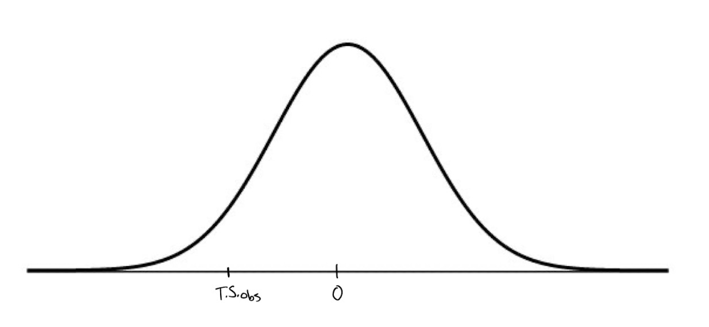

\vspace{4mm}
**Name:** _____________________________________

# Part 1: Multiple Choice

**1.**  A matched pairs experiment is run comparing the answers of 25 married couples. How many degrees of freedom does this t-test have?    

**Solution:** 24 (half credit if answered 49)

\vspace{1cm}
**2.**  Data collected by child development scientists produced the following 90\% confidence interval for the average age (in months) at which children say their first word: $10.6 < \mu_{age} < 13.7$. What is the correct interpretation of these findings?

**Solution:** We are 90% confident that the mean age at which children say their first word is between 10.6 and 13.7 months.

\vspace{1cm}
**3.** The manufacturer of a refrigerator system produces refrigerators that are supposed to maintain a true mean temperature, $\mu$, of 48 F, ideal for certain beverages. The owner of a beverage company does not agree with the refrigerator manufacturer, and will conduct a hypothesis test to determine whether the true mean temperature differs from this value. What type of test is this hypothesis test?

**Solution: two-sided

\vspace{1cm}
**4.** Insurance companies track life expectancy information to assist in determining the cost of life insurance policies. Last year the average life expectancy of all policyholders was 77 years. ABI Insurance wants to determine if their clients now have a longer life expectancy, on average, so they randomly sample some of their recently paid policies. The insurance company will only change their premium structure if there is evidence that people who buy their policies are living longer than before. Which of the following statement is TRUE about this hypothesis test? 

**Solution:** It is a one tailed test about a mean.

\vspace{1cm}
**5.**  At one SAT test site students taking the test for a second time volunteered to inhale supplemental oxygen for 10 minutes before the test. In fact, some received oxygen, but others (randomly assigned) were given just normal air. Test results showed that 42 of 66 students who breathed oxygen improved their SAT scores, compared to only 35 of 63 students who did not get the oxygen. Which procedure should we use to see if there is evidence that breathing extra oxygen can help test-takers think more clearly?

**Solution:** 2-proportion z-test

\vspace{1cm}
**6.**  Assume that 10\% of students at a university wear contact lenses. We randomly pick 400 students. What is the **standard deviation** of the proportion of students in this group who may wear contact lenses?

**Solution:** $\sqrt{\frac{.10(1-.10)}{400}}$

\vspace{1cm}
**7.**  The college daily reported: "300 students living in university housing were polled. 180 said that they were satisfied with their living conditions. Based on this survey we conclude that 60\% of students living in dormitories are satisfied. The margin of error of the study is $\pm 6$ percentage points (with a 95\% degree of confidence). Which statement is correct?

**Solution:** The stated margin of error could have been achieved with a smaller sample size.

\vspace{1cm}
**8.**  Using the t-table, estimate the p-value for a test statistic that is less than or equal to $1.71$ with $23$ degrees of freedom. 

**Solution:** $0.05$

\vspace{1cm}
**9.**  Suppose that a device advertised to increase a car's gas mileage really does not work. (This is the true reality.) Without known the truth, we test this device on a small fleet of cars (with $H_0: \text{not effective}$ and a $0.05$ significance level), and our data results in a p-value of $0.004$. What probably happens as a result of our experiment?

**Solution:** We reject $H_0$, making a Type I error.

\vspace{1cm}
**10.**  What does a p-value indicate? 

**Solution:** The probability of the observed statistic given that the null hypothesis is true

# Part 2: Fill in the blank

**To be eligible for partial credit, your answer must show all of your work and/or explain all of your reasoning.**

**11.** Based on the Z-table, the critical value for a $90\%$ confidence interval for the difference in proportions $p_1 - p_2$ is $\approx 1.645$. Acceptable answers include $1.64$ or $1.65$. 

\vspace{1cm}
**12.** A survey asked people "On what percent of days (in a month) do you get more than 30 minutes of vigorous exercise?" Using their responses we want to estimate the difference in exercise frequency between young adults (between ages $18$ and $35$) and older adults (over age $35$). 

\vspace{1cm}

**Wrong Solution:**

$H_0: p_1 - p_2 = 0$

\vspace{1cm}

$H_A: p_1 - p_2 \neq 0$

where $p_1=$the percent of days young adults get more than 30 mins of exercise and $p_2=$the percent of days older adults get more than 30 mins of exercise.

**Correct Solution:** 

$H_0: \mu_1 - \mu_2 = 0$

\vspace{1cm}

$H_A: \mu_1 - \mu_2 \neq 0$

where $\mu_1=$the average percent of days where young adults get more than 30 mins of exercise and $\mu_2=$the average percent of days where older adults get more than 30 mins of exercise.

**Lesson learned:** 

*Prof Suzy read this problem too quickly and initially wrote the solutions in terms of unknown population proportions. A careful student pointed out her mistake. This mistake is more apparent when we think about what data would we be collecting for each observational unit. The observational units are individual people from two different populations (based on two different age groups). We are asking each individual to quantify the percent of days on which they've gotten more than 30 mins of exercise in the last month. This is a numeric value that also happens to be a percent/proportion. We want to compare the average percents between each of these two populations.* 

*This problem would have been about a difference in proportions if instead of asking people to quantify the amount of time they've spent exercising for more than 30 mins, we just asked each individual "Did you exercise for more than 30 mins for at least 10 days in the last month" (or something similar).*

*The main takeaway from all of this: Rules of thumb (like, "if you see a percent think proportions") are helpful guidelines but are no substitute for careful statistical thought!*

\vspace{1cm}
**13.**  Based on past experience, a bank believes that 4\% of the people who receive loans will not make payments on time. The bank has recently approved 300 loans. Based on the sampling distribution for the

\vspace{2cm}

sample proportion, $\rule{7cm}{0.15mm}$ is the standard deviation of the proportion of clients in this group who may not make timely payments. (Note you do not need to simplify your equation.)

**Solution:** Full credit for $\sqrt{p(1-p)/n} = \sqrt{\frac{0.04(1-0.04)}{300}} = 0.01131$. Partial credit for $\frac{0.04(1-0.04)}{300} = 0.000128$.

\vspace{1cm}
**14.**  A report on the U.S. economy indicates that 28\% of Americans have experienced difficulty in making mortgage payments. A news organization randomly sampled 400 Americans from 10 cities named the "fastest dying cities in the U.S." (Forbes Magazine, August 2008) and found that 136 reported such difficulty. 

To answer the question of whether or not this data indicates that the problem is more severe among these cities, we calculate the test statistic

\vspace{1cm}
**Solution:** 

Full credit for 
$$T.S. = \frac{\frac{136}{400}-0.28}{\sqrt{\frac{0.28(1- 0.28)}{400}}}  = 2.673$$
and partical credit for 
$$T.S. = \frac{\frac{136}{400}-0.28}{\sqrt{\frac{\frac{136}{400}(1- \frac{136}{400})}{400}}}  = 2.533.$$

\vspace{1cm}
**15.**  A manufacturer claims that the mean amount of juice in its 16 ounce bottles are 16.1 ounces. A consumer advocacy group wants to perform a hypothesis test to determine whether the mean amount is actually less than this. Suppose the observed test statistic is calculated and plotted on the Student's t-distribution below. Shade the region that corresponds to the p-value of this test. 

{height=2in}

**Solution:** Everyone got this question correct! 

\pagebreak 

# Part 3: Free response 

**To be eligible for partial credit, your answer must show all of your work and/or explain all of your reasoning.**

**16.** Of 346 items tested, 12 are found to be defective. Construct a $98\%$ confidence interval for the percentage of all such items that are defective. (Note you do not need to simplify your equations.) 

**Solution:** 
$$\frac{12}{346} \pm \left(z^*_{a=0.98} \times \sqrt{\frac{\frac{12}{346}(1-\frac{12}{346})}{346}} \right)$$
where $z^* = 2.325$. (Other valid options for $z^*$ include $2.32$ or $2.33$.) Partial credit if used $z^* = 2.55$ (corresponding to a $94\%$ CI) but got everything else correct. 

\vspace{1cm}

For problems $17$ and $18$ consider the following setting. 

*Managers are considering holding informational workshops to help decrease anxiety levels among employees. They randomly select 20 employees to participate in a pilot workshop. These employees were given a questionnaire to measure anxiety levels before and after participating in the workshop. A test was performed to determine if the workshop was successful in decreasing anxiety levels.* 

**17.**  Assess the necessary assumptions and conditions for conducting a hypothesis test with this data to answer the research question. 

**Solution:** 

* Independence - Because this is a random sample of paired data for the company's employees, it is reasonable to assume that the difference in anxiety scores are all independent of one another. However, this is only the case if this is a large company. if this is a smaller company and these $20$ employees represent more than $10\%$ of all employees, then this is NOT an independent sample of differences in anxiety scores. 

* Sample size or nearly normal - The sample size is too small to justify immediate use of the CLT. Before proceeding, we would need to verify that this sample of 20 differences in anxiety scores is nearly Normal (with say, a histogram or a Normal QQ plot). 

Furthermore, because the employees were randomly selected, if the conditions above hold, then these results are generalizable to the whole population of employees in this company. But, since there is no random assignment of different treatments (all employees take the workshop), we can NOT conclude that the workshop is what CAUSES a decrease in anxiety scores.  

\vspace{1cm}
**18.**   The test results yielded a p-value of $0.008$. Supposing the pre-determined significance level is $0.05$, what is the conclusion of this study (in context)? 

**Solution:** 

We reject the null in favor of the alternative and conclude that participation in the workshop corresponds with decreased employee anxiety. There is no random assignment (no control) but there is random selection. Thus we can generalize but can't infer a cause and effect relationship between the workshop and decreased anxiety. 
