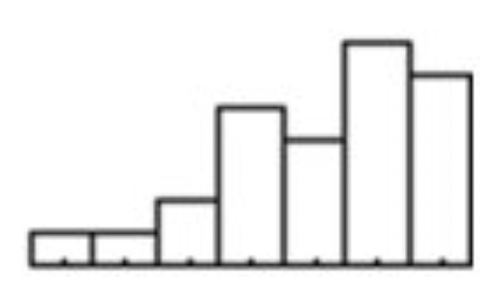
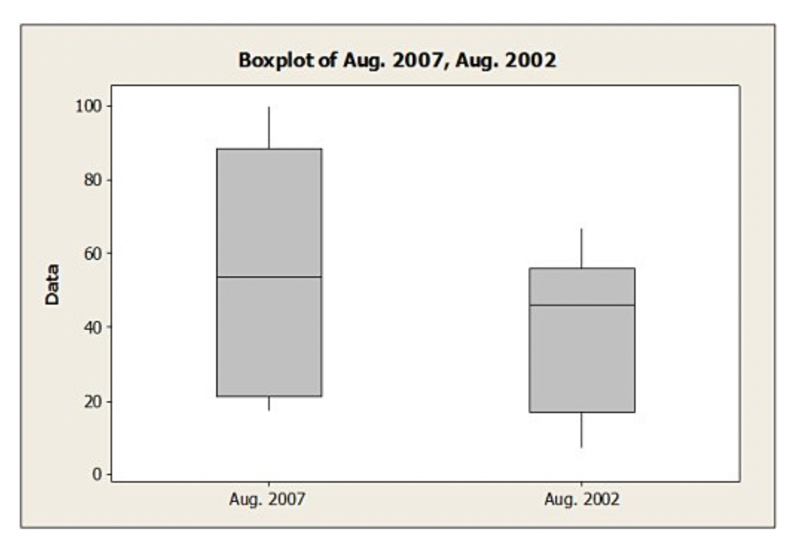
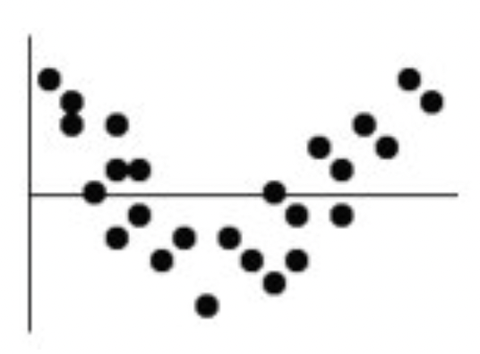
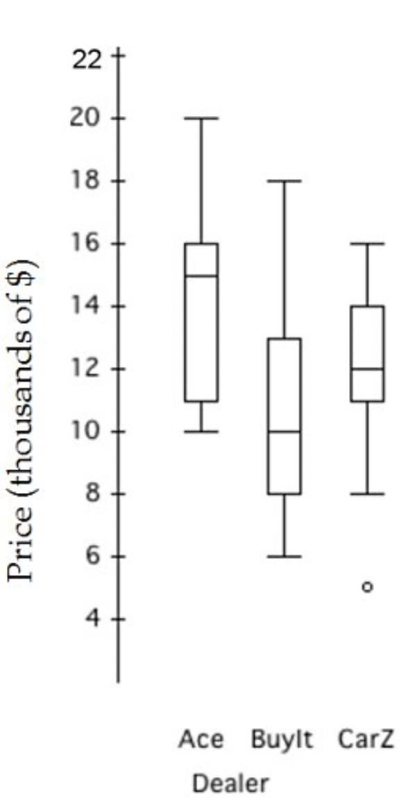
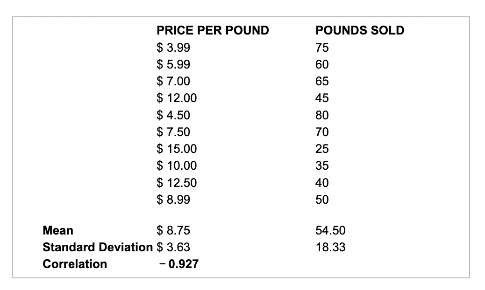

\vspace{4mm}
**Name:** _____________________________________

# Part 1: Multiple Choice

**X.** Which is TRUE of the data shown in the histogram below?

{height=1.2in}

I. The distribution is skewed to the right.
II. The mean is probably smaller than the median.
III. We should use median and IQR to summarize these data.

(a) I only 

(b) II only 

(c) III only 

**(d) II and III only**

(e) I, II, and III

\vspace{1cm}
**X.** The following boxplots show the closing share prices for a sample of technology companies on the first trading days in August 2007 and in August 2002. 

{height=3in}

Which of the following statements is TRUE?

(a) The median closing share price is higher in August 2007 compared to August 2002. 

(b) Closing prices are more variable in August 2007 compared to August 2002.

(c) The distribution of closing prices in August 2007 appears more symmetric than the distribution of closing prices in August 2002.

(d) Both A and B

**(e) All of the above**

\vspace{1cm}
**X.** All but one of the statements below contain a mistake. Which one could be TRUE? 

**(a) The correlation between your golf score and the number of hours you practice is 0.36.** 

(b) The number of apricots on a tree and the amount of fertilizer have a 1.12 correlation. 

(c) There is a strong correlation between type of preferred pet and income level.

(d) The correlation between the height of a bean plant and the day is 0.78 in/day. 

\vspace{1cm}
**X.** A company's sales increase by the same amount each year. This growth is ________

(a) exponential 

(b) logarithmic 

(c) power 

**(d) linear** 

(e) quadratic 

\vspace{1cm}
**X.** A regression analysis of company profits and the amount of money the company spent on advertising found $r^2 =0.72$. Which of these is TRUE? 

I. This model can correctly predict the profit for $72\%$ of companies. 

II. On average, about $72\%$ of a company's profit results from advertising. 

III. On average, companies spend about $72\%$ of their profits on advertising.

**(a) none** 

(b) I only 

(c) II only 

(d) III only 

(e) I and III 

\vspace{1cm}
**X.** The residuals plot for a linear model is shown. Which is TRUE? 

{height=1.5in}

(a) The linear model is no good since some residuals are large. 

(b) The linear model is okay because the association between the two variables is fairly strong.

(c) The linear model is no good since the correlation is near 0.

(d) The linear model is okay because about the same number of points are above and below the it. 

**(e) The linear model is no good because of the curve in the residuals.**

\vspace{1cm}
**X.** A residual plot that has no pattern is a sign of what?

(a) The original data is curved and the regression line is a good model. 

(b) The original data is curved and the regression line is not a good model. 

(c) The model is not a good one, because there is no pattern. 

(d) The original data is straight and the regression line is not a good model. 

**(e) The original data is straight and the regression line is a good model.** 

\vspace{1cm}
**X.** Which of the following is NOT a goal of re-expressing data? 

(a) Make the distribution of a variable more symmetric. 

(b) Make the form of a scatterplot more nearly linear. 

(c) Make the scatter in a scatterplot spread out evenly rather than following a fan shape. 

**(d) Make the spread of several groups more alike.** 

**(e) All of these are goals of re-expressing data.** 

\vspace{1cm}
**X.** A clothing store uses comment cards to get feedback from its customers about newly added items. It recently introduced plus size fashion wear. Customers who purchased the items were asked to fill out an online comment survey giving $10\%$ off the next purchase. The data are summarized in the table below. What percentage of customers were at least satisfied with the item(s) purchased (Satisfied or Very satisfied)?

| Response | Frequency | 
| --- | --- |
| Very satisfied | 15 |
| Satisfied | 30 |
| Less than fully satisfied | 12 |
| Not satisfied | 4 |

(a) $68.9\%$

(b) $73.8\%$

(c) $49.2\%$ 

(d) $26.2\%$ 

**(e) $24.5\%$**

\vspace{1cm}
**X.** A company's manufacturing process uses 500 gallons of water at a time. A "scrubbing" machine then removes most of a chemical pollutant before pumping the water into a nearby lake. To meet federal regulations the treated water must not contain more than 80 parts per million (ppm) of the chemical. Because a fine is charged if regulations are not met, the company sets the machine to attain an average of 75 ppm in the treated water. The machine's output can be described by a normal model with standard deviation 4.2 ppm. 

What percent of the batches of water discharged exceed the 80 ppm standard?

**(a) $3.89\%$**

(b) $11.7\%$ 

(c) $8.83\%$ 

(d) $1.17\%$ 

(e) $88.3\%$ 

# Part 2: Fill in the blank

**X.** A regional survey was carried out to gauge public opinion on the controversial Arizona Immigration Law 

\vspace{.25cm}

(results shown below). $\rule{3cm}{0.15mm}$ percent of the public oppose the law. 

| Response | Democrat | Republican | Independent | 
|:--- |:--- |:--- |:--- |
| Favor | 50 | 93 | 35 |
| Oppose | 85 | 45 | 60 | 
| Don't know | 5 | 7 | 20 | 

**A: $44.5\%$**

**X.** Based on data collected from its production processes, Crosstiles Inc. determines that the breaking strength of its most popular porcelain tile is normally distributed with a mean of 400 pounds per square inch and a standard deviation of 12.5 pounds per square inch. Based on the 68-95-99.7 Rule, about 

\vspace{.25cm}

$\rule{3cm}{0.15mm}$ percent of the popular porcelain tile will have breaking strengths between 375 and 425 pounds per square inch. 

**A: $97.35\%$**

\vspace{1cm}
**X.** The boxplots show prices of used cars (in thousands of dollars) advertised for sale at three different car dealers. 

{height=3.5in}

\vspace{0.25cm}

$\rule{3cm}{0.15mm}$ is the dealer with the smallest price range of approximately $\rule{3cm}{0.15mm}$ dollars.  

**A: Ace, 10,000**

\vspace{1cm}
**X.** At a local manufacturing plant, employees must complete new machine set ups within 30 minutes. Suppose new machine set-up times can be described by a normal model with a mean of 22 minutes and a standard deviation of 4 minutes. 

\vspace{.25cm}

$\rule{3cm}{0.15mm}$ percent of new machine set ups take more than 30 minutes. 

**A: $2.5\%$**

\vspace{1cm}
**X.** Suppose the time it takes to process phone orders in a small florist/gift shop is normally distributed with a 

\vspace{.25cm}

mean of 6 minutes and a standard deviation of 1.24 minutes. An order that processes in $\rule{3cm}{0.15mm}$ minutes separates the 5\% of orders that take the most time to process from the rest of the orders.

**A: 7.8**

# Part 3: Free response 

*A small independent organic food store offers a variety of specialty coffees. To determine whether price has an impact on sales, the managers kept track of how many pounds of each variety of coffee were sold last month.*

{height=3.5in}

**X.** Interpret the correlation within the context of the data. 

\vspace{0.5cm}
$\rule{15cm}{0.15mm}$

\vspace{0.5cm}
$\rule{15cm}{0.15mm}$

\vspace{0.5cm}
$\rule{15cm}{0.15mm}$

**A: strong negative linear, asas price increases, lbs sold decreases, provided association is actually linear (verify with plot)** 

\vspace{1cm}
**X.** Most likely, in a simple linear regression model for this data, $\rule{3cm}{0.15mm}$ is the predictor variable and

\vspace{.5cm}

$\rule{3cm}{0.15mm}$ is the response variable. 

**A: price, lbs sold** 

*Data were collected on monthly sales revenues (in \$1,000s) and monthly advertising expenditures (\$100s) for a sample of drug stores. The regression line relating revenues $(Y)$ to advertising expenditure $(X)$ is estimated to be $\hat{y}_{i} = -48.3 + 9.00x_i$.*

\vspace{1cm}

**X.** Interpret the slope within the context of this data. (Make sure you specify the correct units of measurement.) 

\vspace{0.5cm}

**A: for every \$100 spent on advertising, the expected/ave/predicted sales revenue increases by \$9000** 

