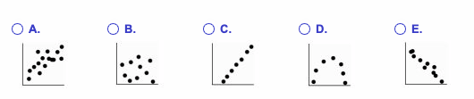
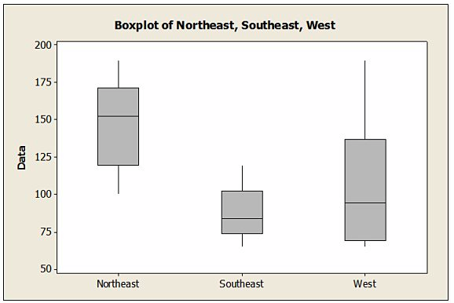
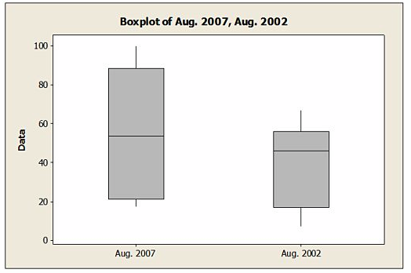
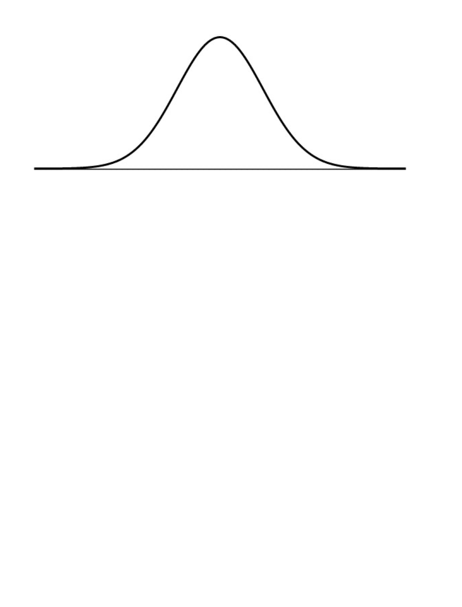

\vspace{4mm}
**Name:** _____________________________________

# Part 1: Multiple Choice

**1.**  A candy company claims that its bags of mixed suckers are $20\%$ strawberry, $30\%$ cherry, $15\%$ apple, $10\%$ lemon, and $25\%$ grape. A bag was purchased, and the number of each type of flavor was recorded in the chart below. Determine which statistical test is appropriate for this situation.

(a) Chi-square test of independence 

(b) Chi-square goodness-of-fit test

(c) Chi-square test of homogeneity 

(d) One sample t-test for an unknown mean

(e) Two sample t-test for a difference in means

\vspace{1cm}
**2.**  Doctors at a technology research facility randomly assigned equal numbers of people to use computer keyboards in two rooms. In one room a group of people typed a manuscript using standard keyboards, while in the other room people typed the same manuscript using ergonomic keyboards to see if those people could type more words per minute. After collecting data for several days the researchers tested the hypothesis $H_0: \mu_1 - \mu_2 =0$ against the one-tail alternative and found a p-value of $0.22$. 

Which of the following statement is TRUE? 

(a) There's a $22\%$ chance that people using ergonomic keyboards type more words per minute.

(b) There's a $22\%$ chance another experiment will give these same results.

(c) There's a $22\%$ chance that there's really no difference in typing speed.

(d) The people using ergonomic keyboards type $22\%$ more words per minute.

(e) None of the above are true. 

\vspace{1cm}
**3.**  An entomologist writes an article in a scientific journal which claims that fewer than $6\%$ of male fireflies are unable to produce light due to a genetic mutation. Identify the Type I error in this context.

(a) The error of failing to accept the claim that the true proportion is at least $6\%$ when it is actually less than $6\%$.

(b) The error of rejecting the claim that the true proportion is at least $6\%$ when it really is at least $6\%$.

(c) The error of failing to reject the claim that the true proportion is at least $6\%$ when it is actually less than $6\%$.

(d) The error of rejecting the claim that the true proportion is less than $6\%$ when it really is less than $6\%$.

(e) The error of accepting the claim that the true proportion is at least $6\%$ when it really is at least $6\%$.

\vspace{1cm}
**4.**  In the past, the mean running time for a certain type of flashlight battery has been 8.4 hours. The manufacturer has introduced a change in the production method and wants to perform a hypothesis test to determine whether the mean running time has increased as a result. The hypotheses are:
$$H_0: \mu = 8.4 \text{ hours}$$

$$H_A: \mu > 8.4 \text{ hours}.$$

Which of the following best explains the result of a Type II error? 

(a) The manufacturer will decide the mean battery life is 8.4 hours when in fact it is 8.4 hours. 

(b) The manufacturer will decide the mean battery life is greater than 8.4 hours when in fact it is greater than 8.4 hours. 

(c) The manufacturer will decide the mean battery life is 8.4 hours when in fact it is greater than 8.4 hours.

(d) The manufacturer will decide the mean battery life is greater than 8.4 hours when in fact it is 8.4 hours.

(e) The manufacturer will decide the mean battery life is less than 8.4 hours when in fact it is greater than 8.4 hours. 

\vspace{1cm}
**5.**  Using a t-table, estimate the p-value for a test statistic of $1.76$ with $24$ degrees of freedom.

(a) $0.9088$ 

(b) $0.0228$ 

(c) $0.0456$ 

(d) $0.9772$

(e) $0.9544$

\vspace{1cm}
**6.** A certain population is strongly skewed to the right. We want to estimate its mean, so we will collect a sample. Which of the following statements should be TRUE if we use a large sample rather than a small one?

\noindent I. The distribution of our sample data will be closer to normal.

\noindent II. The sampling model of the sample means will be closer to normal.

\noindent III. The variability of the sample means will be greater.  

(a) I only 

(b) II only

(c) III only 

(d) I and III only

(e) II and III only 

\vspace{1cm}
**7.** Based on a sample of 30 randomly selected years, a $90\%$ confidence interval for the mean annual precipitation in one city is from 48.7 inches to 51.3 inches. Find the margin of error.    

(a) 0.39 inches 

(b) 1.3 inches

(c) 0.10 inches 

(d) 2.6 inches 

(e) There is not enough information to find the margin of error.

\vspace{1cm}
**8.** A survey found that $79\%$ of a random sample of 1024 American adults approved of cloning endangered animals. Find the margin of error for this survey if we want $90\%$ confidence in our estimate of the percent of American adults who approve of cloning endangered animals.

(a) $5.43\%$

(b) $21.4\%$

(c) $2.09\%$

(d) $4.56\%$

(e) $2.49\%$

\vspace{1cm}
**9.**  A bicycle shop equips $60\%$ of their bikes with a water bottle holder. $55\%$ of the bikes they sell have a kickstand attached to the bike. $34\%$ of the bikes sold have both features.
Given that a randomly selected bike has a kickstand, what are the chances that it also has a water bottle holder?

(a) $26\%$

(b) $56.7\%$

(c) $34\%$

(d) $61.8\%$

(e) $48\%$ 

\vspace{1cm}
**10.** A group of volunteers is recruited to test a new lip balm that prevents chapping in winter. The volunteers are paid $100 to participate. Which of the statements is TRUE?  

(a) The paying of volunteers may indicate that our volunteers are not similar to the general population.

(b) The researcher should instead pick a SRS to experiment upon.

(c) The researcher needs to convince the volunteers to work for free.

(d) The paying of volunteers invalidates the experiment.

(e) There will no randomization in the experiment.

\vspace{1cm}
**11.** A school district administrator sent a survey to all teachers in the district. Only $30\%$ of the teachers responded to the survey. Which of the following is TRUE?

\noindent I. The people that did not responded are likely to be similar to those that did so he should use them as the sample.

\noindent II. This survey design suffered from non-response bias.

\noindent III. Because he sent the survey to everyone, this is a census and the results can be applied to the whole population.   

(a) II only

(b) I and II only 

(c) I, II, and III

(d) II and III only 

(e) I only 

\vspace{1cm}
**12.** Suppose a school district decides to randomly test high school students for attention deficit disorder (ADD). There are three high schools in the district, each with grades 9-12. The school board pools all of the students together and randomly samples 250 students. Is this a simple random sample?  

(a) No, because we can't guarantee that students from each grade in the sample.

(b) No, because we can't guarantee that students from each school in the sample.

(c) Yes, because the students were chosen at random. 

(d) Yes, because they could have chosen any 250 students from the district.

(e) Yes, because each student is equally likely to be chosen.

\vspace{1cm}
**13.** The online MBA director at a large business school surveys a sample of current students to determine their level of satisfaction with the program. She finds that $67\%$ are "very satisfied" with the online program. What is this?  

(a) A parameter

(b) A target population

(c) A statistic

(d) A margin of error 

(e) A sampling frame

\vspace{1cm}
**14.** Shortly after the Sandy Hook Elementary School shooting in December 2012, a local television news program asked viewers to call in with their opinion about gun control. These results were likely biased because of what reason?  

(a) A voluntary response sample

(b) Measurement error

(c) A bad sampling frame

(d) An undefined target population

(e) Leading questions

\vspace{1cm}
**15.** When using midterm exam scores to predict a student's final grade in a class, the student would prefer to have which of the following?  

(a) A positive residual, because that means the student's final grade is lower than we would predict with the model. 

(b) A positive residual, because that means the student's final grade is higher than we would predict with the model.

(c) A negative residual, because that means the student's final grade is lower than we would predict with the model.

(d) A residual equal to zero, because that means the student's final grade is exactly what we would predict with the model.

(e) A negative residual, because that means the students final grade is higher than we would predict with the model.

\vspace{1cm}
**16.** A small independent organic food store offers a variety of specialty coffees. To determine whether price has an impact on sales, the managers kept track of how many pounds of each variety of coffee were sold last month. Based on the summary statistics shown below, what percent of the variability in the number of pounds of coffee sold per week can be accounted for by a linear model on price?

| | Price | Pounds | 
|---|---|---|
| Mean| $\$ 8.75$ | $54.50$ | 
|Standard Deviation | $\$ 3.63$ | $18.33$ |
| Correlation | $0.927$ | |   

(a) $85.9\%$

(b) $100\%$

(c) $92.7\%$

(d) $54.5\%$

(e) $4.68\%$

\vspace{1cm}
**17.**  What are the residuals?

(a) Residuals are variation in the data that is explained by the model.

(b) Residuals are data collected from individuals that is not consistent with the rest of the group. 
(c) None of these statements are correct. 

(d) Residuals are possible models not explored by the researcher. 

(e) Residuals are the difference between observed responses and values predicted by the model.

\pagebreak 
**18.**   For families who live in apartments the correlation between the family's income and the amount of rent they pay is $r=0.60$. Which of the following is/are possibly TRUE about this correlation?

\noindent I. In general, families with higher incomes pay more in rent.

\noindent II. On average, families spend $60\%$ of their income on rent.

\noindent III. The regression line passes through $60\%$ of the data points.

(a) I only

(b) I, II, and III

(c) I and II only 

(d) II only 

(e) I and III only 

\vspace{1cm}
**19.** Which scatterplot shows a strong association between two variables even though the correlation is probably close to zero?  

\vspace{1cm}
**20.** Consider the five number summary of hourly wages ($) for a sample of advertising/promotion managers. 

| Min | Q1 | Median | Q3 | Max |
|---|---|---|---|---|
| 19.64 | 29.36 | 34.18 | 40.86 | 57.26 |

Suppose there had been an error and that the lowest hourly wage is actually $\$15.50$ instead of $\$19.64$. What would be the result caused due to the change?

(a) A decrease in the range

(b) An increase in the mean

(c) A decrease in the IQR

(d) An increase in the standard deviation

(e) An increase in the median

\pagebreak 
# Part 2: Fill in the blank

**To be eligible for partial credit, your answer must show all of your work and/or explain all of your reasoning. (For numeric solutions, writing the correct formula with the correct values is fine, there is no need to simplify your answer.)**

**21.** Vending machines on a college campus offer a variety of snacks. The purchasing agent believes that each type of snack is equally preferred by students and consequently orders equal quantities. The number of snacks sold from vending machines on this campus for the last six months is shown in the following table. 

| Snack Type | Chips | Candy Bars | Crackers | Nuts |
| --- | --- | --- | --- | --- |
| Purchase Frequency | 159 | 198 | 174 | 149 | 

The observed test statistic for determining if the purchasing agent's belief is supported is 
\vspace{1cm}

$\chi^2 = 8.012$.

\vspace{3cm}
**22.**  A manufacturing process has a $70\%$ yield, meaning that $70\%$ of the products are acceptable and $30\%$ are defective. 

If three of the products are randomly selected, the probability that all three of them are acceptable is 

\vspace{1.5cm}
$0.343$

\vspace{3cm}
**23.** A professor divided the students in her business class into three groups: those who have never taken a statistics class, those who have taken only one semester of a statistics class, and those who have taken two or more semesters of statistics. The professor randomly assigns students to groups of three to work on a project for the course. 

If $35\%$ of the students have never taken a statistics class, $25\%$ have taken only one semester of a statistics class, and the rest have taken two or more semesters of statistics, then the probability that neither of the first two

\vspace{1cm}
groupmates you meet has studied any statistics is $0.123$ .   

\vspace{3cm}
**24.**  Ten different families are tested for the number of gallons of water a day they use before and after viewing a conservation video. Given that $\bar{x}_{d} = 4.8$ and $s_d = 5.25$, a $90\%$ confidence interval for the mean of the differences in water usage 

\vspace{1cm}
will be centered at $4.8$ and have a margin of error equal to $3$. 

\vspace{3cm}
**25.**  Suppose the yearly snowfall (in $cm$) in a certain town can be modeled with a Normal distribution with mean $57cm$ and standard deviation $8 cm$. Based on the Z-table, the (lower) 80th percentile 

\vspace{1cm}
is approximately $63.7$ $cm$'s of snow.  

\vspace{3cm}
**26.** The ASQ (American Society for Quality) regularly conducts a salary survey of its membership, primarily quality management professionals. Based on the most recently published mean and standard deviation, a quality control specialist calculated the z-score associated with his own salary and found it to be $2.50$. 

\vspace{1.5cm}

This tells him that his salary is $2.5$ standard deviations $above$ the average salary. 

\vspace{1cm}
**27.** The following boxplots show monthly sales revenue figures (in thousands of dollars) for a discount office supply company with locations in three different regions of the U.S. (Northeast, Southeast, and West).

{height=3in}

\vspace{1cm}

$Southeast$ has the lowest median sales revenue.

\vspace{1cm}
**28.** If we transform a numeric data set by adding the same constant to each data value, 

\vspace{2cm}

the *mean/median/mode* will change but the *range/IQR/variance/standard deviation* will stay the same. 

\vspace{1.5cm}
**29.** In words (not symbols), the parameters of a Binomial distributed random variable are

\vspace{1cm}

$\rule{5cm}{0.15mm}$ and $\rule{5cm}{0.15mm}$. 

\vspace{1cm}
**30.** In words (not symbols), the parameters of a Normally distributed random variable are

\vspace{1cm}

$\rule{5cm}{0.15mm}$ and $\rule{5cm}{0.15mm}$. 

\pagebreak 

# Part 3: Free response 

**To be eligible for partial credit, your answer must show all of your work and/or explain all of your reasoning. (For numeric solutions, writing the correct formula with the correct values is fine, there is no need to simplify your answer.)**

**31.** The following boxplots show the closing share prices for a sample of technology companies on the first trading days in August 2007 and in August 2002. 

{height=4in} 

Describe the story this plot tells about the closing share prices in these two years. Make sure your answer includes comparisons of **variability**, **centrality**, and **the shape** of the two distributions.

\vspace{4cm}
**32.** A survey of randomly selected college students found that 45 of the 99 freshmen and 57 of the 100 sophomores surveyed had purchased used textbooks in the past year. Construct a $98\%$ confidence interval for the difference in the proportions of college freshmen and sophomores who purchased used textbooks.  

\vspace{5cm}

**33.** $5\%$ of trucks of a certain model have needed new engines after being driven between 0 and 100 miles. The manufacturer hopes that the redesign of one of the engine's components has solved this problem. State (with symbols) the hypotheses to test the efficacy of the new design and **define the parameters in your hypotheses with words**. 

$$H_0: \rule{3cm}{0.15mm}$$
\vspace{0.5cm}
$$H_A: \rule{3cm}{0.15mm}$$
 
\vspace{3cm}
**34.** The number of hours per week that high school seniors spend on homework is normally distributed, with a mean of 10 hours and a standard deviation of 3 hours. 60 students are chosen at random. Let $\bar{X}$ represent the mean number of hours spent on homework for this group of 60 students. Plot the probability that $\bar{X}$ is between 9.8 and 10.4 on the Normal curve below (label the center and the standard deviation of the distribution) **and** use the Z-table to approximate this probability. 

{width=5in}

\pagebreak 
**35.** An education researcher was interested in examining the effect of the teaching method and the effect of the particular teacher on students' scores on a reading test. In a study, there are two different teachers (Juliana and Felix) and three different teaching methods (method A, method B, and method C). The number of students participating in the study is 258. Students are randomly assigned to a teaching method and teacher. 

What are the different treatments in this experiment?

\vspace{5cm}
**36.** Write a question that can be answered with a hypothesis test for the difference in means (You do NOT need to perform the test or to create any data.)
 