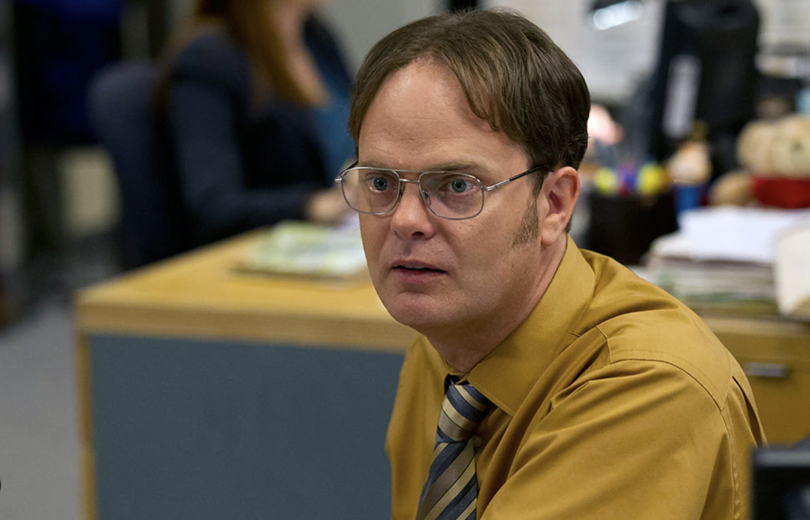
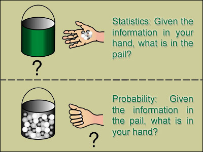

# 1. What is data? 

<span style="color:blue">If not data, what else?</span>


## Structure of data 

**Observational units** - any individual (human or otherwise) upon which we are collecting information in a systematic way. 

In general, we usually say we have a sample of size $n$ observational units, where $n$ can be an integer greater than or equal to one. 

<br>

**Variables** - a measurable or categorizable quality that tends to varies from one observational unit to another.

```{r echo=FALSE}
rows = NULL
for(i in 1:10){
rows = c(rows,paste0("observational unit ", i))
}
set.seed(101)
sample_data <- data.frame(ID = rows,
            Variable1 = rnorm(10, 10, 2),
            Variable2 = rpois(10, 2),
            Variable3 = sample(c("Red", "Green"), size=10, replace=TRUE))

sample_data
```


## Type of variables

   - Numeric/Quantitative variables are *measurable* and typically have some units of measurement associated with them
   - Categorical/Qualitative variables which you may not be able to measure but the outcomes are distinct enough to *label* according to different qualities.   
   - *Context matters* determine what type of variable is being used 

<br> 



  Dwight: We need to talk!
  
  Michael: Not now.
  
  Dwight: Which is higher? Assistant Regional Manager or Regional Director in Charge of Sales?
  
  Michael: I told you the titles are irrelevant. They just relate to pay scale.
  
  Dwight: Okay. So who gets paid more? Me or Andy?
  
  Michael: It is not a matter of more or less. Your pay is just different. Okay?^[Source: NBC's The Office S3E8] 

<br>

E.g. Age, time of day, or satisfaction level could all be treated as numeric or categorical variables depending on the discretion of the data analyst. 

# 2. What is statistics? 

Machine learning, computer science, data science, demography, modeling, mathematics, natural science, liberal art? 

^[Source: www.distilled.net/statistical-significance-for-cro/]


## Models  

<span style="color:blue">What does the concept of a *model* mean to you?</span>

Probability is a mathematical construct which defines a function called a **random variable**. In statistics, we use these mathematical functions (random variables) to model the behavior of a variable in a data set. 

Models (including random variables) exist in the mathematical world. Data exists in the real world. Statistics uses tools from the mathematical world to investigate data that is carefully observed and draw conclusions about huge (but often unobservable) populations that exist in the real world.  


## Exploring vs confirming 

Statistical analyses can be used to explore data or to draw conclusions about the strength of observable evidence in support of (or against) a proposed theory. 

For example...

* An economist wants to determine if there is evidence for a neo-classical business cycle within the global paper industry. 

* A CEO wants to get a sense of which of his store branches are consistently performing well or not. 

* A branch manager needs to determine if the proportion of faulty printers being sold by the company is larger than $5\%$.

* Employees have experienced a lot of changes in management and think that this is related to changes in their productivity.  


<span style="color:blue">What is a question you would like to answer with statistics? Is it exploratory or confirmatory?</span>


# 3. About this class 

The Textbook and Pearson MyLab are required. Attendance is required. 

Everything you need for this class can be found on Moodle! 

## Analyzing data 

You will be using software (either Excel or RStudio) to analyze data. There is an Intro to R (and RStudio) two-part workshop being held by the Stat Clinicians. Bring your own laptop! (Let me know if you need to borrow one from the department.) More details can be found on the [syllabus](https://profsuzy.github.io/Stat11/Stat11_S23_Syllabus.html). 

* Part 1 in SC 104 - Either Jan 18 (W) or Jan 19 (Th) from 8-10pm. 

* Part 2 in SC 105 - Either Jan 22 (Su) or Jan 24 (Tu) from 8-10pm. 


## Syllabus 

<span style="color:purple">By yourself:</span>
Take a few minutes to read over the syllabus. 

- What stands out to you? 

- What do you think is going to be the most important thing you can do to succeed in this class? 

- What do you think will be your biggest obstacle? 

<span style="color:purple">With someone else:</span>

Share your answers with a neighbor. Strategize how to handle what you each expect will be your biggest obstacles. 


**Prof Suzy's Recommendations** 

- *Read* your textbook!

- *Practice* asking and answering questions in class and while you read your textbook or do your homework.

- Attend *Office Hours* as often as possible, this time is for you so use it!

- *Communicate* with your professor. Keep me in the loop! 

- Allow yourself *room to grow*. We learn and live at our own paces. You're not perfect and you don't have to be.


