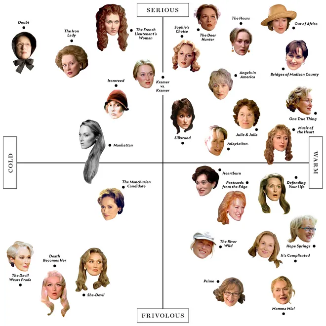

```{r setup, echo=FALSE}
knitr::opts_chunk$set(echo = FALSE, warning = FALSE, message = FALSE)
```


# Quick aside on these notes 

<span style="color:blue">I will use blue text for hypothetical questions.</span> These questions are meant to make you think and the color is a reminder to me to give you some time to consider possible responses. These questions likely don't have one correct answer but if you have a thought you'd like to share with the class, please do so! 

<span style="color:purple">Questions where I want an actual answer from you will be in purple.</span> I will solicit responses from you in various ways. Sometimes your response will be privately recorded on a piece of paper to hand in or written on a worksheet that you complete with your classmates. Often, I will wait for a verbal response if these questions appear in the middle of a lecture. 


# Introduction to exploratory data analysis 

A major objective of statistical analysis is to create reliable, reproducible, and relevant descriptions of carefully collected data. There are many ways to explore and describe different types of data and more yet to be invented. 

<span style="color:blue">What makes an exploratory statistical analysis "objective"?</span>

Although exploratory statistical analyses are incredibly powerful in science and life, the best statistical analyses are ones that tell a story. Data alone can't convince the way stories do.^[For more on this point read, for example, [Data Alone Won't Get You a Standing Ovation](Data Alone Won’t Get You a Standing Ovation) and [“Stories are data with Soul” – lessons from black feminist epistemology](https://www.tandfonline.com/doi/full/10.1080/10130950.2014.871838).] This is worth keeping in mind both when conducting your own exploratory analyses and especially when considering the results of an exploratory analysis by someone else.   


> "Maybe stories are just data with a soul."
>
> `r tufte::quote_footer('-- Brene Brown')`


For now, we will focus on visual ways to explore some different kinds of data. Next class we will discuss common ways to mathematically summarize information from an exploratory analysis. 


# 1. How to explore numeric (or quantitative) data?  

## Histogram 

<span style="color:purple">What are we looking for in a histogram?</span> 


```{r echo=FALSE, verbose=FALSE}
set.seed(101)

library(tidyverse)

samp <- rt(70, 4)
hist(samp, breaks=30, main="Sample of size n=70", xlab="Numeric Data", ylab="Frequency", xlim=c(-4,4))

hist(samp, breaks=10, main="Sample of size n=70", xlab="Numeric Data", ylab="Frequency", xlim=c(-4,4))
```

<span style="color:blue">What kind of story can you tell about this data from the histograms above?</span>

## Boxplot


```{r echo=FALSE}
boxplot(samp, range=0)
```

<span style="color:purple">What's the difference in the information contained in this boxplot and the information contained in a histogram?</span>


## Stem and leaf plot

```{r echo=FALSE}
stem(samp)
```

<span style="color:purple">What's the difference between the information contained in this stem-and-leaf plot and a histogram?</span>


## Other considerations for numeric data 

### Outliers 

```{r echo=FALSE}
boxplot(samp, range=1)
# the whiskers extend to the most extreme data point which is no more than range times the interquartile range from the box
```


### Transformaing or Re-expressing data 

```{r echo=FALSE}
miniscule_samp <- rchisq(60, .2)
log_samp <- log(miniscule_samp)

hist(miniscule_samp, breaks=20, main="Sample of size n=60", xlab="Really Small Numeric Data", ylab="Frequency")
hist(log_samp, breaks=20, main="Sample of size n=70", xlab="Transformed (nat. log) Numeric Data", ylab="Frequency")
```

<span style="color:purple">Is it honest to visualize transformed data?</span>


# 2. How to explore categorical data?  

<span style="color:purple">Poll:</span> How many of you are in your first/second/third/fourth (or more) years at Swarthmore?

```{r}
fi1 = 13; fi2 = 31
s1 = 6; s2 = 2
t1 = 5; t2 = 1
fo1 =  2; fo2 = 0
sec1 <- c(rep("First", fi1), rep("Second", s1), rep("Third", t1), rep("Fourth (or more)", fo1))
sec2 <- c(rep("First", fi2), rep("Second", s2), rep("Third", t2), rep("Fourth (or more)", fo2))
cur_sec <- sec1
```

## Tables of Counts or Proportions 

```{r echo=FALSE}
table(cur_sec)

prop.table(table(cur_sec))
```

## Bar Chart

```{r echo=FALSE}
barplot(table(cur_sec))
```

## Pie Chart 

```{r echo=FALSE}
pie(table(cur_sec))
```


# 3. How to explore relationships among multiple variables? 

<span style="color:purple">By yourself:</span> Take a moment and think about the colloquial meaning of the word "relationship". E.g. How would you describe this word in a dictionary?


<span style="color:purple">With a classmate:</span> What does the word "relationship" entail in a statistical or data science context? Jot down your answers to hand in at the end of class. 


## Scatterplot for at two numerical variables


^[Source: https://www.vulture.com/2012/08/meryl-streep-matrix.html]

<span style="color:blue">How could we incorporate a third categorical variable?</span>


 

## Stacked Boxplot for one numeric and one categorical variable 


^[Source: https://www.r-bloggers.com/2019/12/boss-of-all-plots-box-plots/]


## Contingency Table for Two (or more) Categorical variables


The 2x2 contingency table is a way to visualize data that consists of two categorical variables. Here is an (in)famous example of passengers aboard the ship Titanic categorized by those who survived the wreck and by the class of the passengers.^[Source: https://www.numerade.com/questions/the-contingency-table-below-shows-the-survival-data-for-the-passengers-of-the-titanic-beginarraycccc/]

| Survived | First Class Passenger | Second Class Passenger | Third Class Passenger | Crew Member |
|:--- |:--- |:--- |:--- |:--- |
| **Yes** | 203 | 118 | 178 | 212 |
| **No** | 122 | 167 | 528 | 673 |

Some questions we could answer from this contingency table include:

* What is the probability that a passenger was in X class and did not survive?

* What is the probability that a passenger survived given they were in X class?


<span style="color:blue">What could evidence of a relationship look like in each of the above examples?</span>


You can explore for yourself some of the vast, creative world of data visualization techniques at https://www.data-to-viz.com/.  


# 4. Reminders about this class  

- *Read* your textbook! <span style="color:purple">By next class, you should have read all of chapters 1-3 in your textbook.</span>

- *Practice* asking and answering questions in class and while you read your textbook or do your homework. <span style="color:purple">By next class, you should have attempted Individual Homeworks 1 and 2.</span> 

- Attend *Office Hours* as often as possible, this time is for you so use it! <span style="color:purple">My office hours have been posted on Moodle.</span>

- *Communicate* with your professor. <span style="color:purple">Do you not yet have your textbook? Can you not attend any of my office hours? Let me know ASAP!</span> 

- Allow yourself *room to grow*. We learn and live at our own paces. You're not perfect and you don't have to be.


