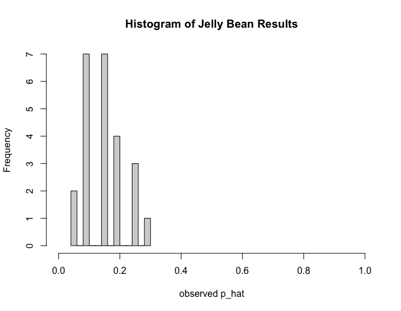
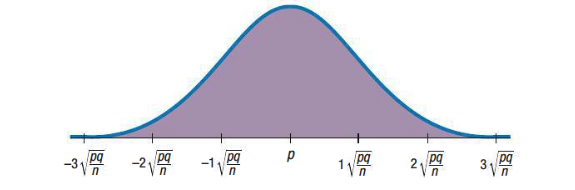
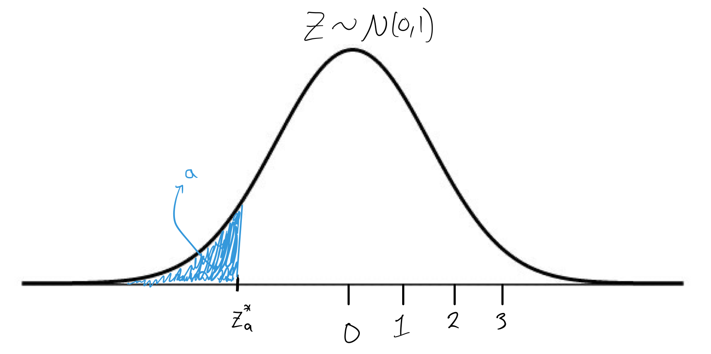

```{r setup, echo=FALSE}
knitr::opts_chunk$set(echo = FALSE, warning = FALSE, message = FALSE)
```


# 1. Sampling Distribution Models 

## Example - Recall our Jelly Bean exercise from Week 7 
$$X \sim Binomial(20, p)$$ 

Where $X=$ number of successes (green jelly beans) out of $n=20$ trials. The (population) parameter here was $p =$ probability of drawing a green jelly bean (or, equivalently, the proportion of green jelly beans in the entire population of the large bowl of jelly beans). 

In class, we observed $24$ different values for $X$, i.e. $x_1, x_2, \dots, x_{24}$, which we plotted in the dot plot below: 


Out of our $24$ samples, we observed $24$ values for the number of successes. We didn't all observe the same number of green jelly beans, there was variability among our different samples (<span style="color:green">sampling variability</span>). 

From this, we could have calculated $24$ estimates for the model parameter, $p$: 
$$\hat{p} = \frac{\text{number of successes}}{20},$$
and visualized these $24$ different values of $\hat{p}$ with a histogram. 



This histogram represents the <span style="color:green">sampling distribution</span> for the sample proportion of green jelly beans. If we could have repeated this exercise at least $80$ more times, we'd have a histogram that looks more symmetric and unimodal. 

***

For now, we are going to focus on methods of statistical inference that a sampling distribution that can be modeled with a Normal distribution. Later on, we may venture into methods that use non-Normal probability models such as a Student's t-distribution or the Chi-square distribution.  


# 2. Confidence Interval for an Unknown Proportion

When we are interested in finding a useful guess (or <span style="color:green">estimate</span>) for an unknown probability of success, $p$, we can often use the Normal model to describe the sampling distribution of $\hat{p}$. From here, we can continue to generate a <span style="color:green">confidence interval</span> for the parameter $p$. 

## Example - Contact Lenses 

I've heard a rumor that Swarthmore students read more than the average college student. Avid reading is a great life-habit but it can be a strain on the eyes. What if we want to estimate the proportion of Swarthmore students who wear glasses or contact lenses to see if this was unusually high? 

Suppose we obtain the necessary permissions to survey a random selection of $100$ Swatties and find that $73$ of these students wear glasses or contact lenses. 

**Step 1)** <span style="color:purple">What is the model for the data and what is the unknown parameter?</span>  

**Step 2)** <span style="color:purple">What is the sample estimate for the unknown parameter?</span>

**Step 3)** Assess the necessary assumptions and conditions and if they seem reasonable, proceed to step 4. 

**Step 4)** Set your confidence level at $a\%$ and find an $a\%$ confidence interval for $p$. 

***

The conditions under which we can use a Normal model to generate an interval estimate for $p$ are:

1. **Independence Assumption**: the observed successes and failures are all independent of one another. This is generally a reasonable assumption if strategic randomization has been used to obtain your sample of data.  

2. **10\% Condition**: our sample represents no more than $10\%$ of the entire population under study. 

3. **Success/Failure Condition**: we have at least $10$ failures and $10$ successes in our sample. 

If these conditions hold, then the sampling distribution of the estimator $\hat{p}$ follows a Normal distribution with expectation $E(\hat{p}) = p$ and variance $Var(\hat{p}) =  \frac{p(1-p)}{n}$ (and standard deviation $sd(\hat{p}) = \sqrt{\frac{p(1-p)}{n}}$).   




The <span style="color:green">standard error</span> of our estimate, $\hat{p}$, is itself an estimate for the standard deviation of $\hat{p}$. In symbols, we write 
$$SE(\hat{p}) = \sqrt{\frac{\hat{p}(1-\hat{p})}{n}} = \sqrt{\frac{\hat{p}\hat{q}}{n}}.$$
Once we have this estimate for the spread of the sampling distribution of $\hat{p}$, we can make an educated guess as to what are some reasonable values for the unknown parameter, $p$. 

In general, we can find an $a\%$ confidence interval for reasonable values of $p$ with the formula
$$\hat{p} \pm [z^*_{a} \times SE(\hat{p})],$$ 
where $z^*_{a}$ is called a <span style="color:green">critical value</span>, which is just a $a\%$ lower quantile of a standard Normal distribution:
 


Because we are using a Normal model to describe the sampling distribution of $\hat{p}$, this procedure is often called the <span style="color:green">procedure for a one-proportion z-interval</span>. 

# 3. Interpreting Confidence Intervals 

Each new sample of data has the potential to generate a new (slightly different) confidence interval (CI) for $p$. The lower bound (LB) and upper bound (UB) of a CI are both functions of the random variable $X \sim Binomial(n,p)$, hence they are random variables as well, that is.... until we observe the data $x$! 


Specific language interpreting confidence intervals: 

  > "I am $a\%$ confident that the interval from LB to UB captures the true probability of success (or the true proportion of successes)." 
  
What this means is that, if our assumptions hold, we can guess the value of $p$ with a guaranteed level of accuracy, in the long run. 


