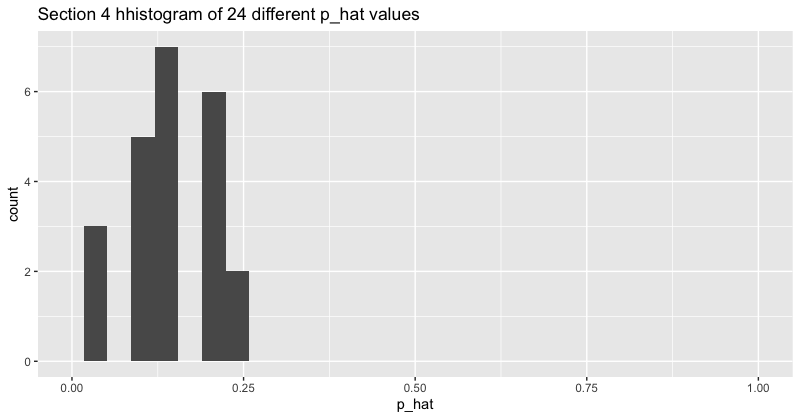
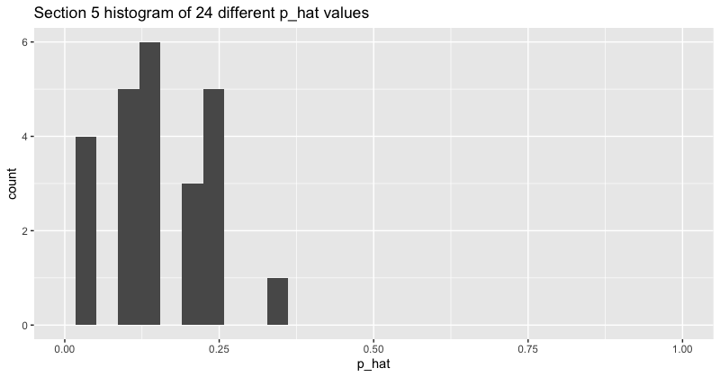
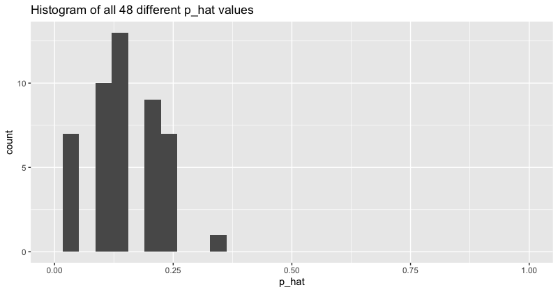

```{r setup, echo=FALSE}
knitr::opts_chunk$set(echo = FALSE, warning = FALSE, message = FALSE)
```


# 1. Sampling Distribution Models 

## Example - Recall the green candy exercize 
$$X \sim Binomial(n, p)$$ 

Where $X=$ number of successes (green jelly beans) out of $n=20$ trials. The (population) parameter here is $p = 0.15$, *the probability* of drawing a green jelly bean (or, equivalently, *the proportion* of green jelly beans in the entire population of the large bowl of jelly beans). 

In class, we observed $24$ different values for $X$, i.e. $x_1, x_2, \dots, x_{24}$, which we plotted in the dot plot below: 

{width=7in}


{width=7in}

Out of our $24$ samples, we observed $24$ values for the sample proportion, $\widehat{p}$. We didn't all observe the same number of green jelly beans, there was variability in the values of $\widehat{p}$ among our samples. We call this the <span style="color:green">sampling variability of $\widehat{p}$ </span>. 

If we didn't know the true (population) proportion was $p=0.15$, we could have used this exercise to calculate $24$ sample proportions to estimate the unknown model parameter, $p$.
$$\widehat{p} = \frac{\text{number of successes}}{20}, \quad p=\begin{cases}\text{the true proportion of successes in the population} \\ \text{the true probability of a success}\end{cases}$$
Although we visualized these $24$ different values of $\widehat{p}$  with a dot plot, we could have also used a histogram. 

{width=5in}


{width=5in}


We're going to combine all the data across both Stat 11 sections. The histogram for this is shown below and we now have $n=48$ observations of $\widehat{p}$ represented. 


{width=5in}

The histogram above represents the <span style="color:green">sampling distribution</span> of the sample proportion $(\widehat{p})$. 


<!--<span style="color:red">If we could have repeated this exercise at least $80$ more times, we'd have a histogram that looks more symmetric and unimodal.</span> -->


For now, we are going to focus on methods of statistical inference that use a Normal probability model to model the sampling distribution. Next class, we'll discuss the <span style="color:green">Central Limit Theorem</span> which helps illustrate the usefulness of the Normal probability model. Later on, we will venture into methods that use non-Normal probability models such as a Student's t-distribution or the Chi-square distribution.  


# 2. Confidence Interval for an Unknown Proportion

When we are interested in finding a useful guess (or <span style="color:green">estimate</span>) for an unknown model parameter, such as the true probability of success, $p$, we can often use the Normal model to describe the sampling distribution of our estimate ($\widehat{p}$ in this case). Once we know the sampling distribution (wich tells us all the possibilities and corresponding probabilities for different values of $\widehat{p}$), we can use this to generate a <span style="color:green">confidence interval</span> for the parameter $p$. Thus rather than estimating $p$ with a single number, we can use the laws of probability to characterize which values of $p$ we think make the most sense based on the data. 

## Example - Contact Lenses 

> I've heard a rumor that Swarthmore students read more than the average college student. Avid reading is a great life-habit but it can be a strain on the eyes. What if we want to estimate the proportion of Swarthmore students who wear glasses or contact lenses to see if this was unusually high? 
Suppose we obtain the necessary permissions to survey a random selection of $100$ Swatties and find that $73$ of these students wear glasses or contact lenses. 

**Step 1)** <span style="color:purple">What is the model for the data and what is the unknown parameter?</span>  

**Step 2)** <span style="color:purple">What is the sample estimate for the unknown parameter?</span>

***

The **conditions and assumptions** under which we can use a Normal model to generate an interval estimate for $p$ are:

**1.** The <span style="color:green">Independence Assumption</span>: the observed successes and failures are all independent of one another. This is generally a reasonable assumption if strategic randomization has been used to obtain your sample of data.  

**2.** The <span style="color:green">10\% Condition</span>: our sample represents no more than $10\%$ of the entire population under study. 

**3.** The <span style="color:green">Success/Failure Condition</span>: we have at least $10$ failures and $10$ successes in our sample. 


If these conditions seem to hold, then we can confidently model the sampling distribution of $\widehat{p}$ with a Normal distribution with expectation $E(\widehat{p}) = p$ and variance $Var(\widehat{p}) =  \frac{p(1-p)}{n}$ (and standard deviation $sd(\widehat{p}) = \sqrt{\frac{p(1-p)}{n}}$).   


{width=4in}

## Example continued - Contact Lenses 

> I've heard a rumor that Swarthmore students read more than the average college student. Avid reading is a great life-habit but it can be a strain on the eyes. What if we want to estimate the proportion of Swarthmore students who wear glasses or contact lenses to see if this was unusually high? 
Suppose we obtain the necessary permissions to survey a random selection of $100$ Swatties and find that $73$ of these students wear glasses or contact lenses. 


**Step 3)** Assess the necessary assumptions and conditions and if they seem reasonable. 


***

The <span style="color:green">standard error</span> of our estimate, $\widehat{p}$, is itself an estimate for the standard deviation of the sampling distribution of $\widehat{p}$. In symbols, we write 
$$SE(\widehat{p}) = \sqrt{\frac{\widehat{p}_{obs}(1-\widehat{p}_{obs})}{n}}.$$
Once we have this estimate for the spread of the sampling distribution of $\widehat{p}$, we can make an educated guess as to what are some reasonable values for the unknown parameter, $p$. 

In general, we can find an $(a\times 100)\%$ confidence interval for reasonable values of $p$ with the formula
$$\widehat{p}_{obs} \pm [z^*_{a} \times SE(\widehat{p})],$$ 
where $z^*_{a}$ is called a <span style="color:green">critical value</span>, which is just a $\frac{1-a}{2}\%$ lower quantile of a standard Normal distribution:
 
{width=4in}

Because we are using a Normal model to describe the sampling distribution of $\widehat{p}$, this procedure is often called the <span style="color:green">procedure for a one-proportion z-interval</span>. 

## Example continued - Contact Lenses 

> I've heard a rumor that Swarthmore students read more than the average college student. Avid reading is a great life-habit but it can be a strain on the eyes. What if we want to estimate the proportion of Swarthmore students who wear glasses or contact lenses to see if this was unusually high? 
Suppose we obtain the necessary permissions to survey a random selection of $100$ Swatties and find that $73$ of these students wear glasses or contact lenses. 

**Step 4)** Set your confidence level at $a\%$ and find an $a\%$ confidence interval for $p$. 

***

# 3. Interpreting Confidence Intervals 

Each new sample of data has the potential to generate a new (slightly different) confidence interval (CI) for $p$. The lower bound (LB) and upper bound (UB) of a CI are both functions of the random variable $X \sim Binomial(n,p)$, hence they are random variables as well, that is.... until we observe the data $x$! 


Specific language interpreting confidence intervals: 

  > "I am $a\%$ confident that the interval from LB to UB captures the true probability of success (or the true proportion of successes)." 
  
What this means is that, if our assumptions hold, we can guess the value of $p$ with a guaranteed level of accuracy, **in the long run**. 


## Example continued - Contact Lenses 

> I've heard a rumor that Swarthmore students read more than the average college student. Avid reading is a great life-habit but it can be a strain on the eyes. What if we want to estimate the proportion of Swarthmore students who wear glasses or contact lenses to see if this was unusually high? 
Suppose we obtain the necessary permissions to survey a random selection of $100$ Swatties and find that $73$ of these students wear glasses or contact lenses. 


**Step 5)** Interpret the confidence level within the context of the problem. 

***