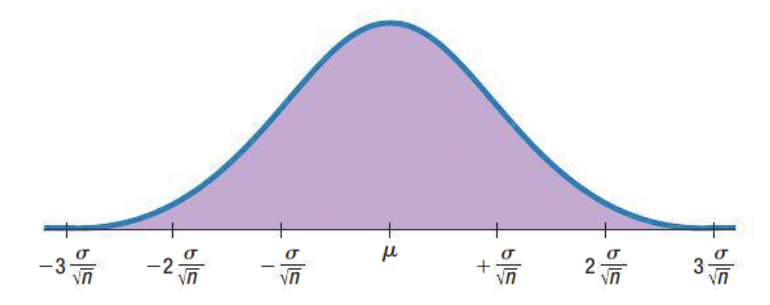
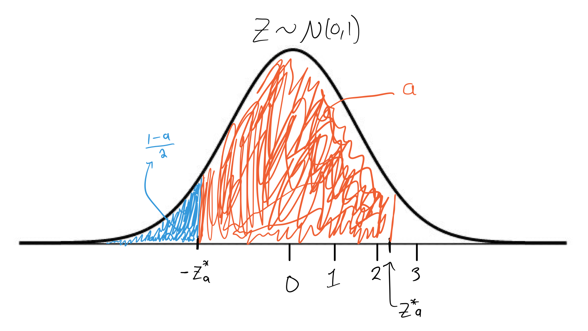

```{r setup, echo=FALSE}
library(rmarkdown)
library(knitr)
knitr::opts_chunk$set(echo = FALSE, warning = FALSE, message = FALSE)
```


# 1. Central Limit Theorem 

Last class, we used the fact that for a large enough sample (with at least $10$ successes and at least $10$ failures, etc.), the histogram of the sampling distribution of $\widehat{p}$ becomes symmetric and unimodal and in fact can be approximated by a $N\left(p, \frac{p(1-p)}{n}\right)$ density curve. This is actually a result of an incredibly influential theorem in statistics called the <span style="color:green">Central Limit Theorem (CLT)</span>. 


> If we have $n$ independent random variables, $X_1, X_2, \dots, X_n$, that all follow the same probability distribution with expectation $\mu$ and variance $\sigma^2$, then (almost always) the sampling distribution of the sample mean, $\bar{X}$ follows a Normal distribution with expectation $\mu$ and variance $\frac{\sigma^2}{n}$.

That is, under certain conditions, we have that 

$$\bar{X} \sim N\left(\mu, \frac{\sigma}{n} \right).$$

<center>{width=4in}</center>


The amazing part of this theorem is that the data ($x_1, x_2, \dots, x_n$) can come from ANY probability distribution... including the $Binomial(n,p)$ distribution! 

<!-- <br> 

<span style="color:purple">Q) How is $\widehat{p}$ a sample mean?</span>

<br> --> 

# 2. Confidence Interval for an Unknown Mean 

In theory, we could find an $a\%$ confidence interval for the most plausible values of $\mu$ with the formula
$$\bar{x} \pm \left[z^*_{a} \times \frac{\sigma}{\sqrt{n}}\right],$$ 
where $z^*_{a}$ is, again, the $a\%$ lower quantile of a standard Normal distribution. In practice however, we are unlikely to know what the standard deviation of the population, $\sigma$, is and so, just as before, we must come up with an estimate for the spread of the sampling distribution of $\bar{x}$. 


Fortunately, there is another really useful theorem in statistics that tells us exactly what is the sampling distribution for a linear transformation of $\bar{X}$, and this transformation is a function of the <span style="color:green">standard error</span> $SE\left(\bar{X}\right)$. Once again, the standard error is itself an estimate for the standard deviation of the sampling distribution for $\bar{X}$.

In practice, we find an $(a\times 100)\%$ confidence interval for the most plausible values of $\mu$ with the formula


$$\bar{x} \pm \left[t^*_{a} \times SE(\bar{x})\right],\quad (*)$$

where 
$$SE(\bar{x}) = \sqrt{\frac{s^2}{n}}$$
and $t^*_{a}$ is a critical value representing the lower $\frac{1-a}{2}\%$ quantile of a different symmetric, unimodal probability distribution called the <span style="color:green">Student's t-distribution</span>. 

This procedure is often called the <span style="color:green">one-sample t-procedure for a mean</span>. 

## Student's t-distribution 

A Student's t-distribution is really similar to a Standard Normal distribution. It is unimodal and symmetric about the center which is zero. However, a Student's t-distribution may or may not follow the $68/95/99.7\%$ rule. Whether or not this rule applies depends on the model parameter of the t-distribution, often denoted with another Greek letter, $\nu$. In the one-sample t-procedure for a mean, mathematical statistics theory says the t-distribution we need to use is one where $\nu = n-1$; i.e. the model parameter depends on the size of the sample! 


<center>{width=6in}</center>

Because of this, we don't actually need to estimate the model parameter $\nu$, but we can still characterize the spread of the sampling distribution of $\bar{x}$ because 
$$\sqrt{\frac{n}{s^2}} \cdot \left( \bar{X} - \mu \right) \sim t_{(n-1)}.$$

Provided $n >2$, the variance of this transformed random variable that follows a Student's $t_{(n-1)}$ distribution is $\frac{n-1}{n-3}$. (You don't need to know this really, I'm just including it here to give you a fuller picture of what's going on.) If $n\rightarrow \infty$, then this variance approaches one and the Student's t-distribution merges into the Standard Normal distribution! 

## Assumptions and conditions for a one-sample t-interval for a mean 

**1.** <span style="color:green">The Independence assumption:</span> The observed values of the data, $x_1, x_2, \dots, x_n$ must all be independent of one another. This assumption cannot be proved but its reasonableness can be assessed on a case-by-case basis. Usually, if randomness is strategically employed in the study (whether observational or experimental) then this assumption is deemed reasonable enough to use this procedure. 

**2.** <span style="color:green">Not too small or skewed/Nearly Normal Condition:</span> If we have a smaller sample of data (say $n<30$), then we need to check to see if the *population distribution* is at least approximately unimodal and symmetric. We generally check this by examining a histogram of the observed data, $x_1, \dots, x_n$. 


## Interpretation of a CI for an unknown mean 

If the independence assumption seems reasonable and the nearly Normal condition holds, then the formula in $(*)$ produces a lower bound (LB) and an upper bound (UB) for the most plausible values of the unknown population mean, $\mu$. 

Specific language interpreting confidence intervals for a population mean: 

  > "I am $a\%$ confident that the interval from LB to UB captures the true population mean (or expectation)." 
  
Again, what this means is that, if our assumptions hold, we can guess the value of $\mu$ with a guaranteed level of accuracy, *in the long run*. 


# 3. Calculating Confidence Intervals with Software 

## Example: CI for a population proportion 

Suppose the FDA has tested a random selection of a big-brand's fish products. In their sample of $n=22$ "red snapper" packages, they found that $x = 12$ of these packages actually contained another type of fish. Find a **$90\%$** confidence interval for $p=$ the proportion of this brand's red snapper packages that are mislabeled. 


### In R
```{r echo=TRUE}
n = 22 
x = 12
prop.test(x, n, conf.level=0.90)$conf.int
```

### In Excel 


Therefore, provided the necessary assumptions and conditions hold, we are $90\%$ confident that the true proportion of mislabeled red snapper packages from this brand is between $0.355$ and $0.725$. 

***

## Example: CI for a population mean 

In a random sample of $n=50$ cars manufactured by the same company, a quality control expert measures the stopping distance of each vehicle. This data in contained in the second column of the data set [cars](). Find a **$95\%$** confidence interval for the average stopping distance (in ft) of these cars. 


### In R 

```{r echo=TRUE}
data = cars[,2]
t.test(data, conf.level=0.95)$conf.int
```


### In Excel 


Therefore, provided the necessary assumptions and conditions hold, we are $95\%$ confident that the average stopping distance of these cars is between $35.656$ feet and $50.304$ feet. 

***

Once you have finished the assigned reading for this week, please take a look at this [reference sheet for confidence intervals](https://dr-suz.github.io/Stat11/Cheat-sheet-4.html). It has been uploaded to our Moodle page. 


<!-- ## CIs for a population proportion/probability of success

{width=4in} -->

## Example: Critical value for an unknown proportion (with 95% confidence level)

### In R

```{r echo=TRUE, eval = FALSE}
qnorm((1-0.95)/2, 0, 1)
```

### In Excel 

```{r echo=TRUE, eval = FALSE}
NORM.INV((1-0.95)/2, 0, 1)
```

### By hand

Using a [Standard Normal Z Table](https://dr-suz.github.io/Stat11/Standard-Normal-Ztable.pdf) we first we first must set our confidence level to some value between $0$ and $1$, let's call this value $a$. Then, we evaluate $\frac{1-a}{2}$. This is the probability that we must find on the inside of the Z table. When we've found the value that is closest to $\frac{1-a}{2}$, we find the corresponding critical value by following the row and column margins. 

## Example: Critical value for an unknown mean (with 95% confidence level)

<!--## CIs for a population mean/expectation

{width=6in} -->

### In R 

```{r echo=TRUE, eval = FALSE}
qt((1-0.95)/2, n-1)
```

### In Excel 

```{r echo=TRUE, eval = FALSE}
T.INV((1-0.95)/2, n-1)
```

### By hand

Using a [t-distribution table](https://dr-suz.github.io/Stat11/t-distribution-table.pdf) we first must set our confidence level to some value between $0$ and $1$, let's call this value $a$. This is the probability (labeled as "A" in this table) that we must find at the top row of the t-distribution table. Second, we must find the degrees of freedom for our specific problem, i.e. $n-1$, along the first column. We then follow the row and column to find the corresponding critical t-value in the middle of the table. 

