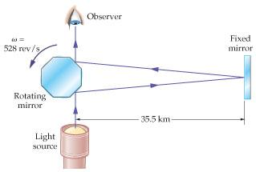

```{r setup, echo=FALSE}
knitr::opts_chunk$set(echo = FALSE, warning = FALSE, message = FALSE)
```


# 1. Data Introduction 

The [in-class worksheet for this week](https://dr-suz.github.io/Stat11/wk10-wksheet.html) is related to two different data sets. The first data set consists of adults between ages $25$ and $30$ who were asked if they had graduated from high school. The second data set we will work with is data from experiments in 1882 that attempted to measure the speed of light.

{height=3in} {height=3in}


# 2. Analysis Goal  

The purpose of these exercises is to practice working with confidence intervals for proportions and means. Specifically, these questions allow us to explore the role of the <span style="color:green">margin of error</span>, which can help us plan for future studies, and encourage us to think about the actual meaning of a confidence interval. 


# 3. Summary of Results  

* There is a trade-off between certainty and precision with confidence intervals. For higher level confidence intervals, we either need a larger margin of error (i.e. a wider interval) or larger sample sizes. 

* A confidence interval has an empirical interpretation related to (often) hypothetical replications of the study from which the data is drawn. 


