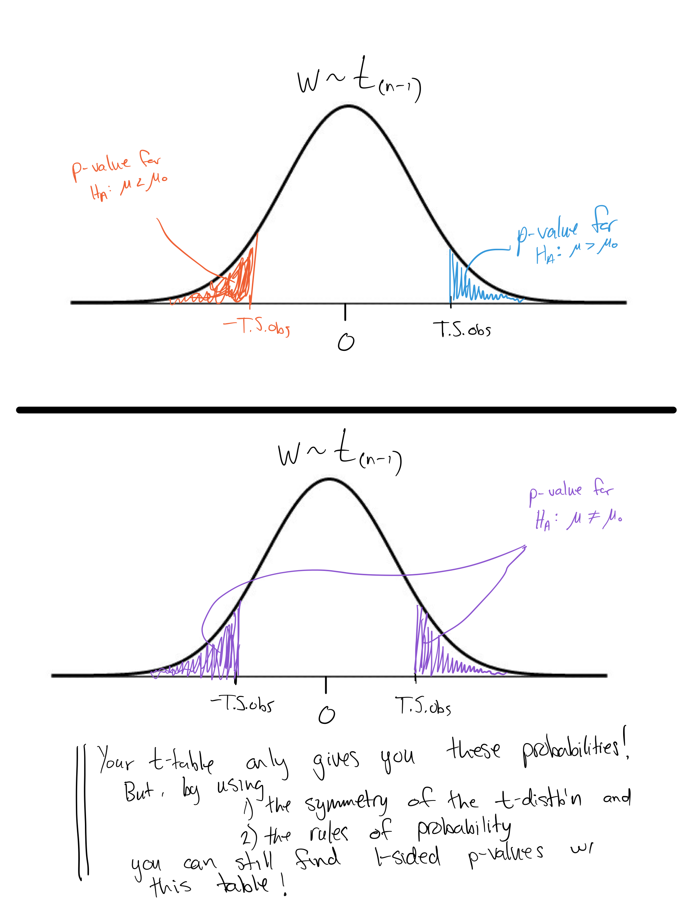

```{r setup, echo=FALSE}
knitr::opts_chunk$set(echo = FALSE, warning = FALSE, message = FALSE)
```


# 1. Data Introduction 

The [in-class worksheet for this week](https://dr-suz.github.io/Stat11/wk11-wksheet.html) is all about practicing with one-sample hypothesis tests!

The image below shows the region corresponding to the p-value for different alternative hypotheses. Recall, p-values characterize how unusual or unexpected our observed value of the test statistic (or something even more extreme) is - given the assumption that $H_0$ is correct. What "more extreme" means depends on the direction of $H_A$.   

{height=5in} 

Image source: https://towardsdatascience.com/everything-you-need-to-know-about-hypothesis-testing-part-i-4de9abebbc8a 

# 2. Analysis Goals  

* Realize the differences between finding a confidence interval for an unknown proportion $p$ and conducting a hypothesis test about $p$. 

* Practice calculating p-values for one and two sided alternative tests. 

* Consider the different types of errors possible when conducting a hypothesis test. 


# 3. Summary of Results  

* For hypothesis tests about $p$, we do not use $SE(\hat{p})$ and we check the *Success/Failure Condition* with $np_0$ (not  $n\hat{p}$). 

* For two-sided alternatives we find the p-value by calculating 
$$Pr(Z > |T.S._{obs}|), \text{ where $Z\sim N(0,1)$}$$
for tests of a proportion, $p$, or
$$Pr(W > |T.S._{obs}|), \text{ where $W \sim t_{(n-1)}$},$$
for tests of a mean, $\mu$. 

* <span style="color:green">Type I Error</span> is the probability that we incorrectly reject $H_0$. This chance is controlled by whatever significance level we choose. 
  
* <span style="color:green">Type II Error</span> is the probability that we incorrectly fail to reject $H_0$. The converse of a Type II error is called the <span style="color:green">power</span> of a hypothesis test.   



***


# 1. Data Introduction 

The [in-class worksheet for Week 13](https://dr-suz.github.io/Stat11/wk13-wksheet.html) proposes ten different research questions. First you will familiarize yourself with each research question. Then you will work with your group mates to determine an analysis plan to answer each question.


# 2. Analysis Goals  

* Apply your understanding of the inference methods we've covered thus far including 

  * One sample inference for a proportion or mean 
  
  * Two sample inference for proportions or means of independent groups 
  
  * Two paired samples inference for a mean  
  
* Recognize the important role of statistical analysis that does not involve any mathematical or computational calculations.  

# 3. Summary of Results  

* For various research questions, you can design a careful statistical inference procedure that can provide a relevant answer. 
