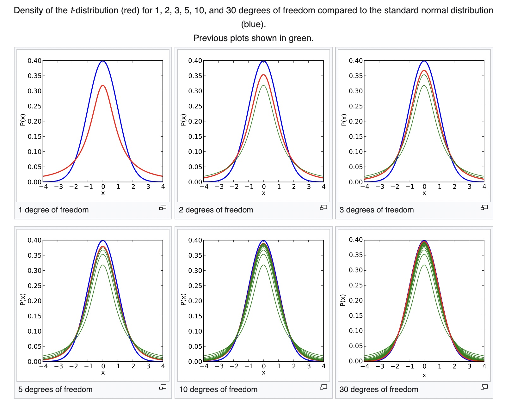

  

```{r setup_pres, include=FALSE, echo=FALSE}
#devtools::install_github("ropenscilabs/icon")
#devtools::session_info('rmarkdown')


# knitr settings to control how R chunks work.
require(knitr)
opts_chunk$set(
  tidy = FALSE, # display code as typed
  size = "small" # slightly smaller font for code
)

knitr::opts_chunk$set(message = FALSE) # include this if you don't want markdown to knit messages
knitr::opts_chunk$set(warning = FALSE) # include this if you don't want markdown to knit warnings

rm(list=ls())
library(tidyverse)
#library('gridExtra')
#library(broom)
data <- read_csv("Data/global_wealth_and_health.csv")
data2 <- data  %>% filter(!is.na(Value)) %>% 
               filter(Time=="2018") %>% 
               select(-c('Flag Codes', Flags, LOCATION, TIME, Time, DEMO_IND)) 
data3 <- pivot_wider(data2, id_cols=Country, names_from = Indicator, values_from = Value)
global_wealth_and_health <- data3[,-c(4,9,13)]
colnames(global_wealth_and_health) = c("Country", "FertRate", "LifeExpect", "MortRate", 
      "HIVPrev", "RuralPop", "GDP", "TotalExpenditure", "TotalPop", "SrPop", "YoungPop", "PovertyCount")
```

```{css, echo=FALSE}
pre {
  background: #FFBB33;
  max-width: 100%;
  overflow-x: scroll;
}

.scroll-output {
  height: 70%;
  overflow-y: scroll;
}

.scroll-small {
  height: 50%;
  overflow-y: scroll;
}

.scroll-large {
  height: 90%;
  overflow-y: scroll;
}

   
.red{color: #ce151e;}
.green{color: #26b421;}
.blue{color: #426EF0;}
```
     
## Today 

1. Lecturette introducing the t-distribution 

2. Group work on HW 7 Problem 1 followed by class discussion 

3. Reflection prompt 

4. Looking ahead  

---
## Introducing the t-distribution 


**Central Limit Theorem**
If (1) a sample is random and independently drawn from some population and (2) the number of observations $n$ is large (but not more than $10\%$ of the size of the population) then... the sampling distribution of the sample means (or sample proportions) follows a Normal distribution. 


--
More specifically, 

* the sampling distribution of the sample proportions is: $\hat{p} \sim N\left(p, \frac{p(1-p)}{n} \right)$ and

* the sampling distribution of the sample means is: $\bar{X} \sim N\left(\mu, \frac{\sigma^2}{n} \right)$. 

---
## Introducing the t-distribution 


**Central Limit Theorem**
If (1) a sample is random and independently drawn from some population and (2) the number of observations $n$ is large (but not more than $10\%$ of the size of the population) then... the sampling distribution of the sample means (or sample proportions) follows a Normal distribution. 


More specifically, 

* the sampling distribution of the sample proportions is: $\hat{p} \sim N\left(p, \frac{p(1-p)}{n} \right)$ and

* the sampling distribution of the sample means is: $\bar{X} \sim N\left(\mu, \frac{\sigma^2}{n} \right)$. $\leftarrow$ .blue[There are two unknown population parameters here!] 


---
## Introducing the t-distribution 

The standard error of a sample estimate (such as a mean or proportion) is an approximation to the standard deviation of it's sampling distribution. 

For proportions: $sd(\hat{p}) = \sqrt{\frac{p(1-p)}{n}} \approx \sqrt{\frac{\hat{p}_{obs}(1-\hat{p}_{obs})}{n}} = SE(\hat{p})$

For means: $sd(\bar{X}) = \sqrt{\frac{\sigma^2}{n}} \approx \sqrt{\frac{s^2}{n}} = SE(\bar{X})$


--
Because there are *two* unknown population parameters in the sampling distribution of the sample means, we have to use the same data set .blue[twice] to estimate the sampling distribution of the sample mean. This implies that we have more uncertainty in the accuracy of estimating the sampling distribution of $\bar{X}$ with a Normal distribution - especially for smaller sample sizes. 

Former head brewer of Guinness and self-taught data scientist William Sealy Gosset, realized this discrepancy when studying the chemical properties of barley for samples that could be as small as $n=3$.   


---
## Introducing the t-distribution 

In the context of hypothesis tests, recall that for tests about a population proportion, the test statistic is 

$$T.S. = \frac{\hat{p}-p_0}{\sqrt{\frac{p_0(1-p_0)}{n}}} \hspace{.2cm} \widetilde{\tiny H_{0}} \hspace{.2cm} N(0,1).$$ 


For tests about a population mean, the test statistic is similar but instead follows a t-distribution with $n-1$ degrees of freedom

$$T.S. = \frac{\bar{X} - \mu_0}{\sqrt{\frac{s^2}{n}}} \hspace{.2cm} \widetilde{\tiny H_{0}} \hspace{.2cm} t_{(n-1)}.$$

---
## Introducing the t-distribution 

.scroll-large[

]
```{r echo=FALSE, fig.align="center"}

#knitr::include_graphics("~/Desktop/wikipedia_tdist.jpg")
```

---
## Introducing the t-distribution 

In R, the same functions for generating a random sample or calculating a quantile or a probability for a Normal RV exist for a *Student's t* RV. The only difference is that now we need only to specify the *degrees of freedom* parameter rather than the distribution mean and standard deviation. 
```{r}
#rt(n = sample size, df = degrees of freedom parameter)
#qt(p = probability, df = degrees of freedom parameter, lower.tail=TRUE)
#pt(q = quantile, df = degrees of freedom parameter, lower.tail=TRUE)
```

Since the *t-distribution* is similar to the standard Normal distribution (i.e. symmetric, unimodal, centered at zero), the probability and quantile calculations are done in the same manner as they are for Normally distributed RVs. 


---
## When to use the t-distribution or the Normal distribution 

* For inference about proportions, always use the Normal distribution (but make sure you have enough observed "success" and "failures"!).

* For inference about means, if the sample size is large, use the Normal distribution. 

* For inference about means, if the sample size is small, use the t-distribution. 


---
## Group work
### HW 7 Problem 1 

**Instructions:** Spend the next $20$ minutes working with your group to answer the questions on the worksheet for Class 19. 

Use the internet to do a search to help you find your answers. We will go over these answers in class either today or Thursday. 

As I walk around, feel free to ask me questions. I may listen in to your group discussion for a bit to guide your discussions. 

<br> 

<br> 

**Hint:** There may not be any parameters for some of the chi-squared tests! 


---
## Looking ahead 

Your last HW assignment, HW 9, will be different from the others in that you won't be deriving solutions to particular problems, rather you will be constructing a road map for evaluating the quality of a statistical analysis. This HW assignment will be graded entirely for completion.

