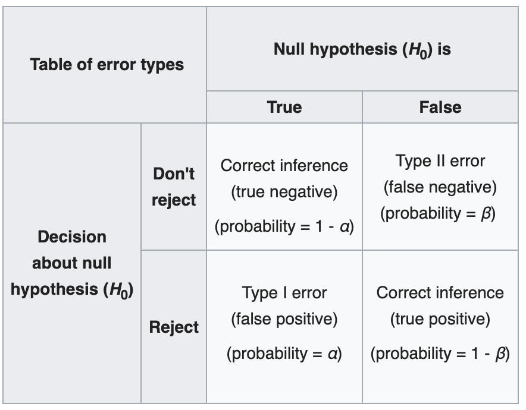

```{r setup, echo=FALSE}
knitr::opts_chunk$set(echo = FALSE, warning = FALSE, message = FALSE)
```


# Unit 3 topics  

* Using the CLT to estimate probabilities and quantiles 

* Statistical inference from a single sample of data 

* Statistical inference from two samples of data 

* Statistical inference for categorical variables 

## Example using the CLT to estimate a probability 

(Note: This is the old version of Problem 1 from the in-class worksheet for week 13.)

The Centers for Disease Control and Prevention reports that $9.3\%$ of surveyed high school students reported in 2015 that they had smoked cigarettes in the past 30 days. A college has $522$ students in its freshman class. How likely is it that more than $10\%$ of them are smokers?

**Step 1)** Define the probability model. 

**Step 2)** Determine the sampling distribution for the sample statistic and draw the density plot.

**Step 3)** Plot the observed sample statistic and shade the region of interest on the density plot. 

**Step 4)** Use software or a table to find the answer. 

# Sampling distributions and confidence intervals

* Sampling distributions of sample estimates are (often) determined using the Central Limit Theorem 

* Standard error as an estimate for the standard deviation of a sampling distribution 

* Margin of error

* Critical values corresponding to particular confidence levels 

## Steps for finding a confidence interval 

**Step 1)** Identify and define the population parameter and choose your confidence level. 

**Step 2)** Calculate the sample estimate for the population parameter. 

**Step 3)** Assess the required assumptions and conditions. 

**Step 4)** Find the critical value corresponding to your confidence level. 

**Step 5)** Calculate the standard error of your sample estimate. 

**Step 6)** Calculate the lower and upper bounds of your confidence interval. 

<!--## Effect size 
 
Confidence intervals provide an (interval) estimate for the effect of interest. Hence, confidence intervals, and not hypothesis tests, can inform us about the effect size. This makes it easier for us to compare the results of our statistical analysis to a practical understanding of what kind of "effect" would be important in a particular problem setting. 

Practical significance is not determined by statistical significance! Statistical significance is not determined by practical significance! --> 


# Hypothesis tests 

Hypotheses are typically designed so that what we want to prove is expressed in the alternative. For all of the methods that we've covered thus far, the null hypothesis is always going to be of the form
$$H_0: \text{<parameter> } = \text{ some number}$$


## Types of conclusions 

Below is a table showing all possible conclusions we can make from a hypothesis test and all possible mistakes we could make. We will cover the different types of mistakes (or errors) next class. 

{height=500px}

The only way to reduce both types of error is to collect more evidence or, in statistical terms, to collect more data.

* $\alpha = Pr(\text{Type I error})$: If $H_0$ is true, this is the probability that we (incorrectly) reject it.

* $\beta = Pr(\text{Type II error})$: If $H_0$ is false, this is the probability that we (incorrectly) fail to reject it. 

* $1-\beta = Power$ If $H_0$ is false, this is the probability that we (correctly) reject it.  

<!--The logic of hypothesis tests is similar to the logic behind inter-universe travel in the movie Everything Everywhere All at Once...

-->


## Steps for conducting a hypothesis test 

**Step 1)** Identify and define the population parameter and choose your significance level.

**Step 2)** State the null and alternative hypotheses.

**Step 3)** Assess the required assumptions and conditions.

**Step 4)** Calculate the test statistic and plot it.

**Step 5)** Shade the area under the curve that corresponds to your p-value and then calculate it. State your conclusion. 


# Student Requested Examples 

## Two-tailed hypothesis test for an unknown mean 

A technology committee wants to perform a test to see if the mean amount of time students are spending in the lab has changed from a historical average of 55 minutes. The sample of data recorded below are the lab times for $12$ students. 

```{r echo=TRUE}
lab_time <-c(52, 57,54, 76,62,52,74, 53, 136, 73, 8, 62)
mean(lab_time)
sd(lab_time)
```


**Question:** What is the result of a type I error? What is the result of a type II error? Which error is more consequential? 

**Answer:** A type I error would mean that the committee concludes the average time in labs has changed from 55 minutes when it has not in reality changed. A type II error however would be the committee concluding that the average time in labs is not significantly different from 55 minutes when in fact it really has increased or decreased. It isn't clear which error is more consequential here. Perhaps a type I error is more consequential for students (as this could lead to procedural changes in lab fees for example), but a type II error is probably more consequential for the school as this erroneous conclusion may mean that necessary procedural changes aren't implemented and that faculty and staff are doing more work with limited resourses. 

## Upper-tailed hypothesis test for paired means

Having done poorly on their Biology final exams in June, six students repeat the course in summer school and take another exam in August. Here are the exam scores:

\begin{align*}
\text{June }\quad& 54 \quad  49 \quad 68 \quad 66 \quad 62 \quad 62  \\
\text{Aug }\quad& 50 \quad 65 \quad 74  \quad 64 \quad 68 \quad 72  \\  
\text{Aug - June }\quad& -4 \quad 16 \quad 6  \quad -2 \quad 6 \quad 10  
\end{align*}

If we consider these students to be representative of all students who might attend this summer school in other years, do 
these results provide evidence that the program is worthwhile?

```{r echo=TRUE}
d <- c(-4, 16, 6, -2, 6, 10)
mean(d)
sd(d)
```

**Question:** What is the result of a type I error? What is the result of a type II error? Which error is more consequential? 

**Answer:** A type I error means that we conclude the summer school program is worthwhile (and improves student learning) when it does not actually do so. A type II error means we conclude the summer school program is not useful when in fact it really is. In this case, a type I error is probably more consequential because this would impact future students who may be forced to take a summer class that is actually a waste of their time. The consequence of a type II error however would probably be additional work done to improve the summer school program which, although costly, would benefit students who take the summer course anyway. 

<!--## Example: Confidence interval for a mean difference of paired data (from Week 13)

On average, how large is the difference in car insurance prices for customers of an online insurance company versus customers of a local insurance company? 

Find a $95\%$ confidence interval for the mean difference in insurance prices based on the data given below. The data below represents randomly selected insurance profiles  (type of car, coverage, driving record, etc.) for 10 clients at a local provider and the corresponding quote from another online provider given their policy information. 

```{r echo=FALSE}
insurance_diff = data.frame(local = c(568,872,451,1229,605,1021,783,844,907,712),
                            online = c(391,602,488,903,677,1270,703,789,1008,702),
                            PriceDiff = c(177,270,-37,326,-72,-249,80,55,-101,10))
insurance_diff
```

```{r echo=TRUE}
mean(insurance_diff$PriceDiff)
sd(insurance_diff$PriceDiff)
```
-->

  
<!--*** 

# Partial Solutions 


## Example: Confidence interval for a difference in means (from Week 12)

**Step 1)** $\mu_1 - \mu_2 =$ mean amount spent at Target minus mean amount spent at Walmart. We'll use a 95\% confidence level.

**Step 2)** $\bar{x}_1 - \bar{x}_2 = 8$ 

**Step 3)** Assess the required assumptions and conditions - done in class. 

**Step 4)** We need the critical $t^*$ value corresponding to a 0.95 confidence level from a Student's t distribution with $162.75$ degrees of freedom. We can find this exactly using R and this value should be similar to the approximate critical value which you can read off the t-table. 

```{r echo=TRUE}
qt(0.025, df = 162.75, lower.tail=TRUE)
```

**Step 5)** $SE(\bar{x}_1 - \bar{x}_2) = \sqrt(\frac{19^2}{80} + \frac{21^2}{85}) = 3.115$

**Step 6)** $ 8 \pm \left(1.975 \times 3.115 \right) = [\$1.848, \$14.152]$ with interpretation given in class.

<br>

## Example: Confidence interval for a mean difference of paired data (from Week 13)

**Step 1)** Identify and define the population parameter and choose your confidence level. 

$\mu_{Diff} =$ the mean difference in insurance prices between online and local providers (local minus online)

Let's use a 90\% confidence level to mix things up.

**Step 2)** Calculate the sample estimate for the population parameter. 

$\bar{d} = \$45.9$

**Step 3)** Assess the required assumptions and conditions. 

* Independence 

    * 10\% condition 
    
    * Randomization condition

* Sample size (or nearly Normal) condition 

```{r}
hist(insurance_diff$PriceDiff)
```
The data is representative of the local insurance company because these 10 profiles were randomly selected. It's not clear how large the local insurance company is but it's pretty likely that the company has more than 100 customers. Therefore, there isn't any strong indicator that the difference data is not independent. (I.e. we can assume within sample independence.) However, the sample size is rather small so in order to use the CLT, we need to check a histogram of the difference data. This histogram is symmetric and unimodal so it seems reasonable that the larger population of all possible differences between process for customers of this local company is approximately Normally distributed. There aren't any major red flags against any of the necessary assumptions for this method. 

**Step 4)** Find the critical value corresponding to your confidence level. 

$t^*_{0.90, dff=10-1}=1.833$ (note this is also the value you'd find using the t-table)

```{r}
qt(0.05, df=9, lower.tail=TRUE)
```

**Step 5)** Calculate the standard error of your sample estimate. 

$SE(\bar{d}) = \frac{175.66}{\sqrt{10}} = 55.549$

**Step 6)** Calculate the lower and upper bounds of your confidence interval. 

$45.9 \pm \left(1.833 \times 55.549 \right) = [-55.928,147.728]$

Thus, we are $90\%$ confident that the true mean difference in insurance prices between this online and this local provider (local minus online) is between -\$55.928 and \$147.728. In other words, the local provider is anywhere from \$55.98 cheaper to \$147.73 more expensive than the online provider. 

We can check our answer in R using the following code:  
```{r}
t.test(insurance_diff$PriceDiff, conf.level = 0.9)
```
--> 