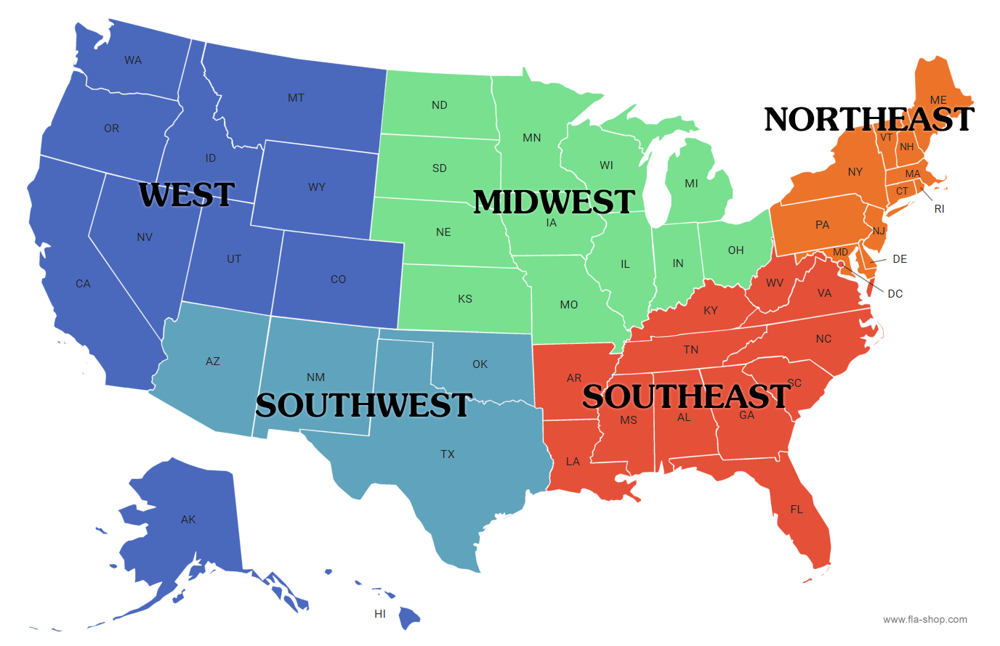

```{r setup, echo=FALSE}
knitr::opts_chunk$set(echo = FALSE, warning = FALSE, message = FALSE)
```


# 1. Introducing Chi-square procedures for categorical (count) data  

## Example: Testing a scientific theory 

"Darwin's finches (also known as the Galápagos finches) are a group of about 18 species of passerine birds. They are well known for their remarkable diversity in beak form and function." (Wikipedia article on Darwin's finishes)

Suppose Darwin had surveyed and categorized the types of finches on (what is now known as) the Pinta island. He found that four different beak types could be found on this island the first occurring most frequently at around $56\%$, the second occurring around $30\%$ and the third and fourth types occurring around $7\%$ of the time each. A chi-square goodness of fit test could help Darwin test whether or not the distribution of these four beak types is the same on another island of the Galápagos, say San Cristobal. 


* Chi-square goodness of fit 

  * $H_0: p_{1} = 0.56, p_{2} = 0.3, p_{3} = 0.07, p_{4}=0.07$, where $p_1$, $p_2$, $p_3$, $p_4$ are the proportions of each type of bird in the San Cristobal island.  


## Example: Jelly bean flavors 

Are all the flavors of jelly beans evenly distributed in the packages sold at a supermarket? 

* Chi-square test of homogeneity 

  * $H_0: p_{1} = p_{2} = p_{3} =  \cdots = p_{50}$, where each $p_j$, for $j=1,\dots,50$ corresponds to one of the $50$ different flavors of jelly beans. 
  
## Example: Race and ethinic composition of the USA 

The US Census collects detailed race and ethnicity information about people living in different regions of the USA. Suppose we wish to know whether the racial and ethnic composition of people living in the USA is distributed the same across five different regions of the country (shown below).

{height=200px}

* Chi-square test of homogeneity 

  * $H_0: p_{1,w} = p_{1,mw} = p_{1,sw} =  p_{1,s} = p_{1,ne};\text{ }p_{2,w} = p_{2,mw} = p_{2,sw} =  p_{2,s} = p_{2,ne};\text{ etc.}$ for each $p_{j,\cdot}$ corresponds to one of $j$ different categorizations of race and ethnicity. 
  
  * $H_0$: The distribution of the categorical variable race and ethnicity is the same across each of the five regions. 


## Example revisited: Titanic data 

For passengers of the Titanic, we have some natural categorical variables of interest: whether or not a passenger survived and what kind of ticket did passengers board the ship with. 

We have already looked into this question using tables and the mathematical definition of independent events but, it turns out there is another way for us to test whether or not survival was independent of a passenger's class. 


* Chi-square test for independence 

  * $H_0:$ The categorical variable survival is independent of the categorical variable class. 

# 2.  Performing Chi-square tests

## Assumptions and conditions 

### Goodness of fit test and test of homogeneity 

1. **Counted data condition** - the data consists of counts of the levels of some categorical variable. Often times, the data is presented with the counts presented in a frequency table. 

2. **Independence assumption** - the counts in each cell of a table summarizing the data should all be independent of each other. This is typically assessed through the randomization condition. 

3. **Sample size assumption** - the *expected* number of counts in each possible cell of a frequency table of the data is large enough (typically, at least $5$). These tests are all asymptotic, just like the Central Limit Theorem. This means that they work in theory as our sample size increases infinitely. 

### Test of independence

1. **Counted data condition** - the data consists of counts of the levels of some categorical variable. Often times, the data is presented with the counts presented in a two-way contingency table/  

2. **Representative sample** - often this means assessing the randomization condition. If we want to generalize our conclusions to a larger population, then we must be sure that our sample is representative of this population. 

3. **Sample size assumption** - the *expected* number of counts in each possible cell of a frequency table of the data is large enough (typically, at least $5$). These tests are all asymptotic, just like the Central Limit Theorem. This means that they work in theory as our sample size increases infinitely. 


## Test statistic 

$$T.S. = \sum_{\text{all cells}}\frac{(Obs-Exp)^2}{Exp}$$

## P-value 

For all of these procedures, the p-value corresponds to the upper tail probability of a $\chi^2$ distribution with however many degrees of freedom 

* Goodness of fit degrees of freedom are the number of categories/levels ($k$) minus one 

* Homogeneity degrees of freedom are the number of categories/levels ($k$) minus one 

* Independence degrees of freedom are $(R-1)(C-1)$ where $R$ is the number of categories/levels in the first categorical variable and $C$ is the number of categories/levels in the second categorical variable  

The alternative hypothesis is always the negation of the null. I.e. $H_A:$ Not $H_0$. 

## Using software 

See pgs 696 and 697 of your textbook for instructions on how to perform any of these chi-square procedures in Excel or R. 
