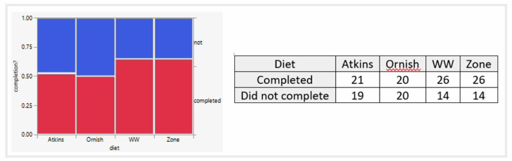
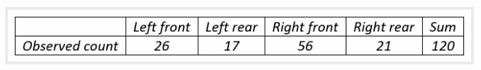
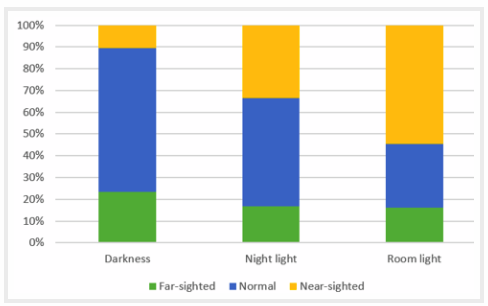
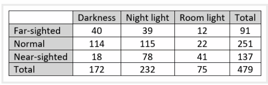

```{r setup, echo=FALSE}
knitr::opts_chunk$set(echo = FALSE, warning = FALSE, message = FALSE)
```


<span style="color:purple">notecard</span>
<span style="color:blue">hypothetical</span>
<span style="color:green">new terms</span>


[find more problems from back of book for determining if we have count data]

# 1.  Practice problems  

## A. 

An article* reported on a study in which 160 volunteers were randomly assigned to one of four popular diet plans: Atkins, Ornish, Weight Watchers, and Zone (40 subjects per diet).  These subjects were recruited through newspaper and television advertisements in the greater Boston area; all were overweight or obese with body mass index values between 27 and 42. Among the variables recorded were:

which diet the subject was assigned to
whether or not the subject completed the twelve-month study
the subject’s initial weight (in kilograms)
the degree to which the subject adhered to the assigned diet, taken as the average of 12 monthly ratings, each on a 1-10 scale (with 1 indicating complete non-adherence and 10 indicating full adherence)
the subject’s weight after 12 months (in kilograms)
the subject’s weight loss after twelve months (in kilograms, with a negative value indicating weight gain)


* For each of the six variables (in the bullet points above), indicate whether the variable is categorical (also binary?) or numerical.

* Was this an observational study or an experiment?  Did this study make use of random sampling, random assignment, both, or neither? 


Let's investigate whether subjects were more or less likely to complete the study depending on which diet they had been assigned.

* Identify the name of the appropriate test to investigate this question.




* Which diet group(s) had the largest percentage of subjects who completed the study?  What was the value for that percentage?

* Report the null hypothesis being tested.  Also report the value of the test statistic and p-value.  Would you reject the null hypothesis at the $\alpha = 0.10$ significance level?  Summarize your conclusion from this test.

### A solutions 

Chi-square test of independence or of equal/homogeneous proportions

The answer to (i) is that the Weight Watchers and Zone diets both had the largest completion percentages: 26/40 = 0.65, so 65% of those assigned to one of these diets completed the study.

The usual chi-square statistic is the Pearson value 3.158, with a p-value of 0.3678.  Once again the sample data do not provide evidence to conclude that the four diets differ, this time with regard to likelihood of completion.


## B

Perhaps you and your students have heard the campus legend* about two students who miss an exam due to excessive partying, but they tell their professor that they had a flat tire.  They realize that this sounds like a flimsy excuse, so they are pleasantly surprised when the professor accepts their explanation and offers a make-up exam on the following morning.  When they arrive for the make-up exam, they are sent to two separate rooms.  They find question 1, worth 5 points, to be quite straight-forward.  Then they turn the page to find question 2, worth 95 points: Which tire was it?

I ask my students to imagine themselves in this nerve-wracking situation, even though I know that none of them would ever tell a lie to a professor.  I ask them to think about which tire they would say – left front, left rear, right front, or right rear – and write down their answer.  Before I continue with this post, let me ask you to decide on your answer.

Then I predict that one particular tire tends to be selected more often than random chance would expect – the right front tire.  Next we gather data on their response with a simple show of hands.  Telling the story and collecting the data takes less than five minutes of class time.

Consider testing the null hypothesis that students are equally likely to select any of the four tires.  Here are the responses (counts) for my 120 students in the Winter quarter of 2017.




* Determine the expected counts for testing this hypothesis.

* Calculate the value of the test statistic.

* Determine the p-value.

* Summarize your conclusion.

* Identify the category (tire) with the largest contribution to test statistic, and comment on what the data reveal about this tire.

### B solutions 

(Goodness-of-fit)

The expected counts, under the null hypothesis of equal likeliness, are 120×(1/4) = 30 for each tire.  The chi-square test statistic turns out to be 0.533 + 5.633 + 22.533 + 2.700 = 31.4.  The p-value, based on 3 degrees of freedom, is 0.0000007.  With such a very small p-value, we conclude that the sample data provide overwhelming evidence to reject the hypothesis that students are equally likely to select among the four tire choices.  Not surprisingly, the largest contribution to the test statistic comes from the right front tire, where the observed count (56) considerably exceeds the expected count (30).  This reveals that the popularity of the right front tire is the biggest contributor to rejecting the null hypothesis of equal likeliness.


## C 

Researchers interviewed parents of 479 children who were seen at a university pediatric ophthalmology clinic.  They asked parents whether the child slept primarily in room light, darkness, or with a night light before age 2.  They also asked about the child’s eyesight diagnosis (near-sighted, far-sighted, or normal vision) from their most recent examination. 

a) What are the observational units and variables in this study?  Which is explanatory, and which is response?  What kind of variables are they?

You knew this question was coming first, right?  The observational units are the 479 children.  The explanatory variable is the amount of lighting in the child’s room before age 2.  The response variable is the child’s eyesight diagnosis.  Both variables are categorical, but neither is binary.

b) Is this an observational study or a randomized experiment?  Explain how you can tell.

Students also know to expect this question at this point.  This is an observational study.  Researchers did not assign the children to the amount of light in their rooms.  They merely recorded this information.

The article describing this study (here) included a graph similar to this:


c) Does the graph reveal an association between amount of lighting and eyesight diagnosis?  If so, describe the association.

Yes, the percentage of children who are near-sighted increases as the amount of lighting increases.  Among children who slept in darkness, about 10% were near-sighted, compared to about 34% among those who slept with a night light and about 55% among those who slept with room light.  On the other hand, the percentage with normal vision decreases as the amount of light increases, from approximately 65% to 50% to 30%.

Here is the two-way table of counts:


d) Were most children who slept in room light near-sighted?  Did most near-sighted children sleep in room light?  For each of these questions, provide a calculation to support your answer. 

Some students struggle to recognize how these questions differ.  The answer is yes to the first question, because 41/75 ≈ 0.547 of those who slept in room light were near-sighted.  For the second question, the answer is no, because only 41/137 ≈ 0.299 of those who were near-sighted slept in room light.

e) Is it appropriate to conclude that light in a child’s room causes near-sightedness?  Explain your answer. 

No.  Some students reflexively say observational study for their explanation.  Others simply say confounding variables.  These responses are fine, as far as they go, but the next question prompts students to think harder and explain more fully.

f) Some have proposed that parents’ eyesight might be a confounding variable in this study.  How would that explain the observed association between the bedroom lighting condition and the child’s eyesight? 

Asking about this specific confounding variable frees students to concentrate on how to explain the confounding.  Most students point out that eyesight is hereditary, so near-sighted parents tend to have near-sighted children.  Unfortunately, many students stop there.  But this falls short of explaining the observed association, because it says nothing about the lighting in the child’s room.  Completing the explanation requires adding that near-sighted parents may tend to use more light in the child’s room than other parents, perhaps so they can more easily check on the child during the night.

The next set of questions continues this example by asking about how one could (potentially) draw a cause-and-effect conclusion on this topic.

g) What would conducting a randomized experiment to study this issue entail?

Children would need to be randomly assigned to have a certain amount of light (none, night light, or full room light) in their bedroom before the age of 2.

h) How would a randomized experiment control for parents’ eyesight? 

This question tries to help students focus on the goal of random assignment: to balance out all other characteristics of the children among the three groups.  For example, children with near-sighted parents should be (approximately) distributed equally among the three groups, as should children of far-sighted parents and children of parents with normal vision.  Even better, we also expect random assignment to balance out factors that we might not think of in advance, or might not be able to observe or measure, that might be related to the child’s eyesight.

i) What would be the advantage of conducting a randomized experiment to study this issue?

If data from a randomized experiment show strong evidence of an association between a child’s bedroom light and near-sightedness, then we can legitimately conclude that the light causes an increased likelihood of near-sightedness.  This cause-and-effect conclusion would be warranted because random assignment would (in principle) account for other potential explanations.

j) Would conducting such a randomized experiment be feasible in this situation?  Would it be ethical?

To make this feasible, parents would need to be recruited who would agree to allow random assignment to determine how much light (if any) to use in their child’s bedroom.  It might be hard to recruit parents who would give up this control over their child’s environment.  This experiment would be ethical as long as parents were fully informed and consented to this agreement.

***

 



You can return to this example, and the observational data from above, later in the course to give students practice with conducting a chi-square test.  This provides another opportunity to ask them about the scope of conclusions they can draw.

l) Conduct a chi-square test.  Report the test statistic and p-value.  Summarize your conclusion.  The test statistic turns out to be approximately 56.5.  With 4 degrees of freedom, the p-value is extremely close to zero, about 7.6×10^(-12).  The data provide overwhelming evidence against the null hypothesis of no association, in favor of the alternative that there is an association between amount of light in the child’s room before age 2 and eyesight diagnosis later in childhood.

m) In light of the very large test statistic and extremely small p-value, is it reasonable to conclude that light in a child’s room causes an increased chance of the child becoming near-sighted?  I think it’s very important to ask this again after conducting the hypothesis test.  Some students mistakenly think that hypothesis tests are so advanced that they can override what they learned earlier in the course.  The extremely small p-value in no way compensates for the observational nature of these data and the possibility of confounding variables.  A cause-and-effect conclusion between bedroom light and near-sightedness still cannot be drawn.

n) Why do you think the researchers bothered to collect and analyze these data, considering that no causal conclusion can be drawn?

Some students believe that a cause-and-effect conclusion is the only kind worth drawing. I ask this question to help them realize that establishing evidence of association can be a worthy goal in its own right, apart from the question of causation.

o) Is it reasonable to generalize this study’s finding about an association between room lighting and near-sightedness to the population of all children in the United States?  Explain.

Most students realize that the correct answer is no, but many mistakenly attribute this to the observational nature of the data.  With regard to generalizability, the key point is that the children in this study were not randomly selected from any population.  They were all patients at a university pediatric ophthalmology clinic, so they are not likely to be representative of all U.S. children with regard to issues involving eyesight.  The finding of an association between increased bedroom light and near-sightedness may or may not hold in the larger population of U.S. children in general.

Asking this question can help students who confuse bias and confounding, or who believe that bias and confounding are the same idea.

# 2. 


# 3.  