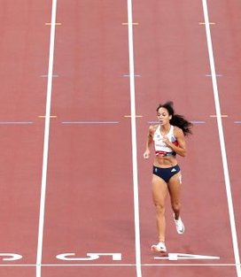

# Exploratory data analysis - Numeric Variables

## Recap

Last week we discussed the structure of statistical data and the kinds of questions we can answer from a statistical analysis. 

Data consists of observational units (rows) and variables (columns). We covered a few ways to conduct an exploratory data analysis for numeric and/or categorical variables. 

For the next couple of weeks we are going to focus specifically on exploring numeric data. 

## The structure of numeric data

For a set of $n$ numeric data points, $x_1, x_2, \dots, x_{n-1}, x_n$, that correspond to the same variable but different observational units, the best way to understand numerical data is to create a histogram with a reasonable number of bins. The next best way to understand numerical data is to consider numerical summaries of the data (i.e. **sample statistics**) that describe the **center** and the **spread** of the data values.

## Examples

<span style="color:purple">Example 1:</span> The time it takes Olympic runners to complete a race in seconds. 

<span style="color:purple">Example 2:</span> The length of Olympic long jumps in meters. 


# 1. Numerical measures of centrality 

* Mean: $\bar{x} = \frac{1}{n}\sum_{i=1}^{n}x_i = \frac{1}{n}\left(x_1 + x_2 + x_3 + \dots + x_{n-1} + x_{n} \right)$

* Mode: the highest peak(s)

* Median: 50\% of the data is larger and 50\% of the data is smaller than this value 

<span style="color:purple">Suppose the numeric data is measuring centimeters. What are the units of measurement for the mean? For the median? For the mode?</span>  

## When to use which? 

For data that is 

- unimodal <span style="color:green">(exactly one peak)</span>

- symmetric about the mode <span style="color:green">(mirrored at the mode)</span>

the mode, the mean, and the median are all the same value! 


For data that is unimodal but not symmetric...


For data that is not unimodal but is symmetric...


For data that is not unimodal and not symmetric... 


# 2. Numerical measures of spread 

* Range: $(x_{min}, x_{max})$ 

* Interquartile range: the range of two values where 25\% of the data are smaller than the lower number and 75\% of the data are smaller than the higher number  

* Variance (or standard deviation): Average distance from the mean (or square root of this average distance)

## When to use which? 

For data that is 

- unimodal 

- symmetric about the mode 

we use variance (or standard deviation) because these represent average distances from the mean. 


For data that is unimodal but not symmetric, i.e. skewed, the inter-quartile range or the range are more realistically informative about the spread of the data than the standard deviation. 


For data that is not unimodal but is symmetric... or for data that is not unimodal and not symmetric... there isn't necessarily a preferable way to numerically summarize the spread. But in general, the more information (e.g. plots, ranges, etc) the better our description of the numeric data! 


# 3. What is variance (or standard deviation)? 


Variance of a sample (more commonly called "sample variance"): $\frac{1}{n-1}\sum_{i=1}^{n}(x_i - \bar{x})^2 = \frac{1}{n-1}\left((x_1 - \bar{x})^2 + (x_2 - \bar{x})^2 + \dots + (x_{n-1} - \bar{x})^2 + (x_n - \bar{x})^2 \right)$

Standard deviation of a sample (more commonly called sample standard deviation): $\sqrt{\frac{1}{n-1}\sum_{i=1}^{n}(x_i - \bar{x})^2}$

<span style="color:purple">Suppose the numeric data is measuring centimeters. What are the units of measurement for the variance? For standard deviation?</span>  


## Example 

{width=300px}{width=200px}

Thiam took the gold in the Olympics with a long jump of $6.58 m$ which was $0.41 m$ longer than the average jump. Johnson-Thompson won the $200 m$ race with a time of $23.26 s$ which was $1.32 s$ faster than the average run. Whose performance are you most impressed by? 

A statistician would answer this question by comparing how many standard deviations away from the mean Thiam's jump distance was vs how many standard deviations away from the mean  Johnson-Thompson's run time was. 

Standard deviation is called the "statistician's ruler" because it allows us to compare the spread of data relative to it's own mean. In other words, standard deviation is a measure that allows us to compare apples to oranges! 


# 4. What is the Normal model? 

Normal/Gaussian model 

- unimodal

- symmetric about the mode 

- not too spread out from the mode <span style="color:green">(almost no data points lie really far away from the mode)</span>

The first two conditions can be assessed visually by looking at a histogram of the data. The last condition can be assessed mathematically using what is called the **68/95/99.7 Rule**.


The Normal model has two model parameters: $\mu$, the mean, and $\sigma$, the standard deviation. These two parameters correspond directly to a measure of centrality and a measure of spread. (This isn't the case with other probability models and their model parameters.)


## Example 

Let's check to see if the data plotted in the histogram and stemplots below could plausibly com from a Normal distribution.

```{r echo=FALSE}
set.seed(101)
data <- rt(n=18, 3)
hist(data, xlab="Example Data")
stem(data)
```

The mean of this data is `r round(mean(data),2)` and the standard deviation is `r round(sd(data),2)`.


<span style="color:purple">What proportion of the data lies within one/two/three standard deviations of the mean?</span> 


# 5. Re-expressing Data: Standardization 

When comparing many variables that are all measured in different units, we might decide that we want to convert each variable into the same units so that the different data sets are easier to compare. To do this, we first must compute the mean and standard deviation of each data set, relative to its own units of measurement (e.g. average length in $m$ or average run in $s$). Then, we standardize each data set relative to their respective means and standard deviations by converting them into **z-scores**:


Shift the data point according to the value of the mean of the data, then scale the data point according to the standard deviation of the data. 


$$z_i = \frac{x_i - \bar{x}}{st.dev.(x_1, x_2, \dots, x_n)}$$ 

<span style="color:purple">What are the units of measurement for standardized numeric data points?</span> 

If the data appears to follow a Normal/Gaussian model, then the standardized version of the data follows what is called a **Standard Normal/Gaussian Model**. 

<span style="color:purple">Does a shift up or down affect the spread of the data? Does a scale affect the spread?</span>  

Therefore the standardization process makes it so that $\bar{z} = \frac{1}{n}(z_1+ \dots + z_n) = 0$ and $st.dev.(z_1, z_2, \dots, z_n) = 1$. 

## Example

If we standardize the race time for all Olympic $200 m$ runners, then we get a set of times that are not measured in seconds or minutes, but are unitless! Similarly, we can standardize the jump distance for all Olympic long jumpers and make this distance unitless. 

The magnitude and order still are meaningful but now it is much easier to answer questions like "whose performance was more impressive, Thiam or Johnson-Thompson?" because both sets of data are measured on the same (unitless) scale. 

