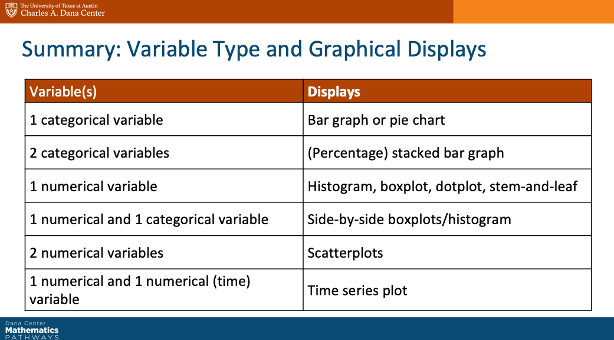
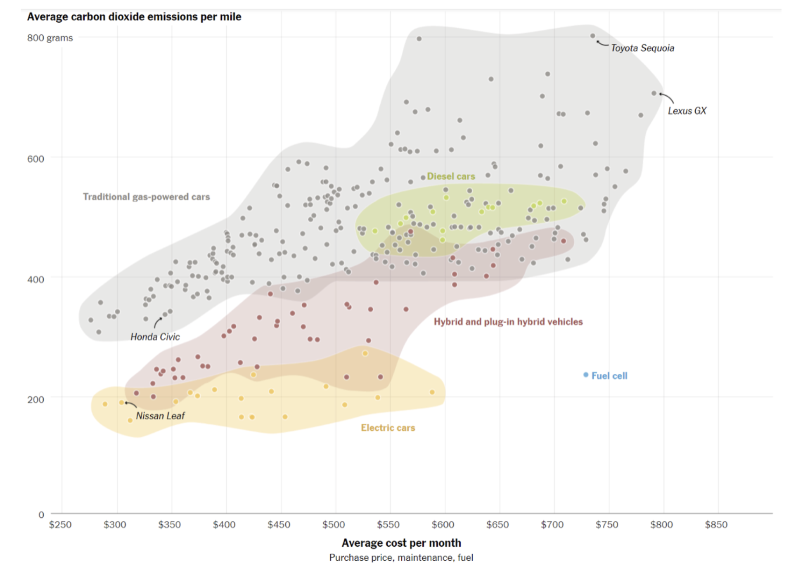

  
```{r setup_pres, include=FALSE, echo=FALSE}
#devtools::install_github("ropenscilabs/icon")
#devtools::session_info('rmarkdown')

knitr::opts_chunk$set(fig.path='Figs/',echo=TRUE, warning=FALSE, message=FALSE)

rm(list=ls())
library('tidyverse')
#library('gridExtra')
library('broom')
#library('cowplot')
#library("RefManageR")
#library("DT")

library(tidyverse)

df <- read_csv("Data/global_wealth_and_health.csv")
#class(df)
#glimpse(df)

#extract only complete data points from the year 2018 
#df %>% distinct(Indicator)

df2 = df  %>% filter(!is.na(Value)) %>% filter(Time=="2018") %>% select(-c('Flag Codes', Flags, LOCATION, TIME, Time, DEMO_IND)) 

df3 = pivot_wider(df2, id_cols=Country, names_from = Indicator, values_from = Value)

#dim(df3)

global_health_and_wealth = df3[,-c(4,9,13)]

colnames(global_health_and_wealth) = c("Country", "FertRate", "LifeExpect", "MortRate", "HIVPrev", "RuralPop", "GDP", "TotalExpenditure", "TotalPop", "SrPop", "YoungPop", "PovertyCount")

#df3

```

```{css, echo=FALSE}
pre {
  background: #FFBB33;
    max-width: 100%;
  overflow-x: scroll;
}

.scroll-output {
  height: 70%;
  overflow-y: scroll;
}

.scroll-small {
  height: 50%;
  overflow-y: scroll;
}

.red{color: #ce151e;}
.green{color: #26b421;}
.blue{color: #426EF0;}
```
          
## Today 

1. Recap from last week (5 mins)

2. Exploring categorical variables (10 mins)

3. Exploring more than one variable (15 mins) 

4. Group discussion on comparing distributions (20 mins) 

5. Reflection prompt (10 mins)
    
---
## Recap from last week
### Global data on health and wealth 


The data we are going to analyse today (and in future classes) involves $233$ different countries (the __observational units__) and $11$ different __variables__ as reported in the year $2018$:

.pull-left[
* Fertility rate in total births per woman: FertRate

* Life expectancy at birth in total years: LifeExpect

* Mortality rate, infant (per 1,000 live births): MortRate

* Prevalence of HIV, total (as a percent of the population ages 15-49): HIVPrev  

* Rural population (as a percent of the total population): RuralPop     ]

.push-right[
* GDP per capita (in current US dollars): GDP 

* General government total expenditure: TotalExpenditure

* Total population (thousands): TotalPop 

* Population aged 65 years or older (thousands): SrPop      

* Population aged 14 years or younger (thousands): YoungPop        

* Poverty headcount ratio at $3.20 a day (as a percent of the total population): PovertyCount ]


---
## Global data on health and wealth concept questions 
### Describing a quantitative variable 


The two most useful metrics for describing a quantitative variable are ones that describe both 

* the location or center of the bulk of the data and
   
   - mean  

   - median  

   - mode  

* how spread out the different values of the data are. 

  - range  

  - quantiles  

  - variance  

  - standard deviation  

---
## Global data on health and wealth concept questions 
### Describing a quantitative variable 

__Q:__ How to we choose which descriptor (of location or spread) to use for a particular data set? 

---
## Exploring a quantitative variable


When describing the location and scale of a quantitative variable, it is useful to keep in mind the following properties:

- Shifts in location do not change the scale.

- Multiplication and division will change both the location and the scale.

---
## Exploring a quantitative variable

In particular, for any fixed number (pick your favorite), $a$, and set of $n$ quantitative data points, $\{x_1, x_2, \dots, x_n\}$ with mean $\bar{x}$ and variance $s^2 = \frac{1}{n-1}\sum_{i=1}^{n}(x_i - \bar{x})^2$ we have that 

* for $\{x_1 + a, x_2 + a, \dots, x_n + a\}$ 

  - the mean is $\bar{x}+a$  

  - the variance is $s^2 = \frac{1}{n-1}\sum_{i=1}^{n}((x_i + a) - (\bar{x} + a))^2 = \frac{1}{n-1}\sum_{i=1}^{n}(x_i - \bar{x})^2$ 

* but for $\{ax_1, ax_2, \dots, ax_n\}$ 

  - the mean is $a\bar{x}$ and

  - the variance is $\frac{1}{n-1}\sum_{i=1}^{n}(ax_i - a\bar{x})^2 = \frac{1}{n-1}\sum_{i=1}^{n}a^2(x_i - \bar{x})^2$. 


---
## Describing a categorical variable 

A categorical variable can take on the value of one of a handful of different __levels__ (typically less than $10$). 


Often it is more informative to describe such data with mathematical summaries of the different values of the categorical variable. 

__Q:__ What are some ways we might mathematically summarize the data above? 


--
The most useful ways to mathematically summarize categorical data are to 

* calculate sample proportions (or percentages) and 

* to tabulate the data based on the number of observed counts (or frequencies). 

To visualize a single categorical variable we really only have one option which is to create a __bar chart__ or frequency plot of the different levels represented in the sample.  


__Q:__ What's the difference between a bar chart and a histogram? 


---
## Describing a categorical variable 

Consider the global health and wealth data from $2018$ again. Are there any categorical variables in this data set? 

```{r}
head(global_health_and_wealth)
```


__Q:__ What are some categorical variables we could create for this data set? Why might we want to treat some of these variables as categorical instead of quantitative? 

---
## Visualizing data 


```{r, echo=FALSE, fig.align='center', out.width=800}

```


---
## Exploring more than one variable

Most often, when we collect a sample of $n$ different __observational units__, we are interested in more than one __variable__ and possibly more than one variable type. 


The plots and mathematical summaries we have reviewed for single variable exploratory data analysis can be creatively combined to help us explore more than one variable at a time. 


For example, a __box plot__ is often a useful way to visualize the values of a quantitative variable over the levels of a categorical variable.


```{r echo=FALSE, eval=FALSE}
golbal_health_and_wealth <- golbal_health_and_wealth %>% mutate( RuralPop_Categorical = ifelse(golbal_health_and_wealth$RuralPop >= 50, 1, 0))
 golbal_health_and_wealth %>% ggplot(aes(x=FertRate, y=factor(RuralPop_Categorical))) + geom_histogram()
## boxplot for RuralPop binary and FertRate 
```


---
## Exploring more than one variable

Another more creative plot may include more than two variables! Consider this visualization of a sample of roller coaster in the US. 


```{r, echo=FALSE, fig.align='center', out.width=800}
knitr::include_graphics("Figs/coasters_viz.png")
```


---
### Group discussion 


```{r, echo=FALSE, fig.align='center', out.width=800}

```


---
## Reflection prompt 

Complete the survey question on Moodle first and then complete the reflection prompt. 

You won't be able to submit your response past 12pm today so try to finish this now! 


## Prepare for Thursday's class 


Next class we will explore relationships specifically between two quantitative variables and study the most useful statistical model, the Normal model. 


