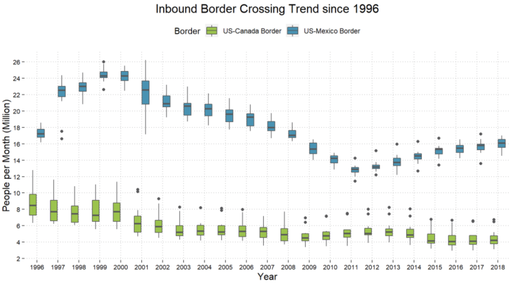

<span style="color:purple">answer</span>
<span style="color:blue">rhetorical</span>
<span style="color:green">definition</span>


# 1. What is a (probability) distribution? 

The (probability) distribution of a random variable must supply information about all possible values the variable can take on and how frequently (or infrequently) the random variable will take on these values. 

In short, a distribution specifies the **possibilities** and corresponding **probabilities** of a random variable. A **density plot** can reflect this information graphically. 

## Recal: Normal/Gaussian Distribution 

Last class we introduced the Normal (probability) model. A special feature of the Normal model is the **68/95/99.7** rule that describes how common (or rare) certain number values around the mean are. This rule applies to the *density plot* of the Normal model below.


We also discussed how for a sample of numeric data, it is helpful to have a sense of the **center** value(s) and the **spread** of the values. The same is true for numeric random variables, i.e. numeric variables that live in the math world and are used as **models** for observable samples of numeric data. 

When talking about a distribution of a sample of data (from the real world), we can refer to the distribution of the sample as the **sampling distribution**. When referring to a probability distribution (that exists in the mathematical modeling world), we just call this a distribution for a random variable. 


## Examples of more distributions

You can get as creative as you want with defining distributions, there are infinitely many and you can make up new ones too! (These distributions do have to follow some mathematical rules though as we will discuss later in Unit 2.)

However, there are a dozen common probability distributions that a frequently used to *model* real world phenomena. These common distributions (like the Normal distribution) are named for convenience. 

The Uniform$(a,b)$ distribution evenly divides the range of the possible values of numbers from $a$ to $b$ so that any number (even infinite decimals) have an equal chance of occurring. The density plot is show below. 

```{r echo=FALSE, message=FALSE}
set.seed(101)
unif_dat <- runif(4000, -2, 4)
plot(density(unif_dat, bw=.6), main="Uniform Density", xlab = " ")
```

The Chi-square distribution is a bit different in that it is a skewed left distribution that describes the probabilities associated with only positive possible numbers. 

```{r echo=FALSE, message=FALSE}
chi_dat <- rchisq(4000, 2)
plot(density(chi_dat, bw=.6), main="Chi Square Density", xlab = " ")
```


# 2. Comparing distributions of numeric variables 

When we have two or more different samples of data (for the same variable), an exploratory analysis of this data will include describing any similarities or differences between/among the sample distributions.  

A useful mathematical summary of a (sample or random variable) distribution is the **five number summary**. 

* Smallest value possible (minimum)

* First quartile (where $25\%$ of the data is smaller than this value)

* Median (where $50\%$ of the data is smaller than this value and the other $50\%$ of the data is larger than this value)

* Third quartile (where $75\%$ of the data is smaller than this value)

* Largest value possible (maximum)


<span style="color:purple">For the sample of data pictured below, what can you tell from its histogram that you can't tell from its five number summary?</span>

```{r}
set.seed(102)
my_samp <- round(rnorm(12, 8, 1), 2)
summary(my_samp)
hist(my_samp)
```

If we have less than a handful of different samples of data (for the same variable), then we can compare their histograms sided-by-side or overlapped.

[insert interesting ex of 2-3 histograms]


But, there there are over a dozen or so samples of data, comparing histograms is pretty messy to look at so we'll typically visualize the different sample distributions with side-by-side boxplots. Recall the following plot from last class:



# 3. Quantiles and percentiles  

Another notable descriptive feature of a distribution are its quantiles and percentiles, although this is just a somewhat fancier way of saying its possibilities (quantiles) and probabilities (percentiles)! The five number summary of a distribution is actually a list of the five quantiles that corresponding to $0\%$, $25\%$, $50\%$, $75\%$, and $100\%$ percentiles (often called quartiles since they break the data values into fourths). 

We can often assess whether or not a sample of data seems to follow a Normal distribution by investigating the quantiles of the sample distribution. In a **Normal probability plot** each sample quantile (vertical axis below) is plotted against its corresponding standarized value (its z-score - horizontal axis below). A straight line relating these values indicates a strong match with the Normal model. 

```{r message=FALSE}
qqnorm(my_samp)
```

## Standard Normal distribution

[draw pic]

## General Normal distribution

[draw pic]


# 4. Re-expressing (transforming) data 

Last week, we discussed a common way to re-express numerical data to get rid of any units of measurement. The transformation of a data point into its z-score is called the **standardization transformation** and it involves both **shifting** the data values (to the left or right according to their mean) and **scaling** the data values according to their standard deviation (scaling up if the standard deviation is $>1$ or scaling down if the standard deviation is $<1$).

We could shift or scale data by any amount we'd like and it would be helpful to know if and how these transformations affect the sample distribution, including descriptors of the distribution such as the five number summary or quantiles and percentiles. 

## Shifted and/or scaled mean and standard deviation 

```{r}
mean(my_samp); sd(my_samp)
mean(my_samp+30); sd(my_samp + 30)
mean(15*my_samp); sd(15*my_samp)
```


## Shfited and/or scaled Normal distributions 

```{r}
## use GGplot2 here to show shift and scaling effects on a normal distribution 
my_norm <- rnorm(1e6, 10, 2)

plot(density(my_norm))
plot(density(15*my_norm))
plot(density(my_norm+30))
plot(density(15*my_norm+30))
```

