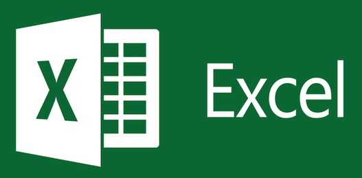

# Intro to Excel and RStudio with  

Most of the data sets you will work with in this class are formatted as comma separated files (.csv). Although cleaning, wrangling, and formatting data is no small task in applications of Statistics and Data Science, this will not be the main focus of our class. All group homework assignments will involve data that is already cleaned and formatted. The only time you may need to clean data yourself is for your final project at the end of the semester. (This is something I will help you with so you won't be on your own unless you want to be!) 

{width=100px}{width=200px}{width=200px}

The choice to use Excel or RStudio is entirely up to you. You can find short, helpful tutorial videos on using Excel or RStudio for data analysis through the MyLab Multimedia Library link at the top of our Moodle page. If you are thinking about taking any computer science courses or if you would like a gently introduction into the world of programming, then I recommend that you use RStudio for all project homework assignments and your final project. If you are decidedly not at all interested in developing programming skills then you can use Excel for all project homework assignments and your final project. If you're not sure and would like a slower introduction to programming, then you may wish to use Excel for the first 1-2 project homework assignments and RStudio for the rest. Then you can decide which you prefer for your final project. These are only suggestions and I am here to help you along the way no matter which program you prefer to use. 

Excel (or Google Sheets) are commonly used for basic statistical analysis across many disciplines and professions. R is an open-source statistically programming software that is used predominantly by statisticians and data scientists. RStudio is a friendlier user interface from which you can do R programming since the R software by itself has a bare-bones display that isn't as informative for new users. If you decide to major or minor in Statistics at Swarthmore, then you will need to know how to work with R (or RStudio). 

## Opening data in Excel

Since the majority of the data you'll encounter in this class is already in .csv format, opening the data file in Excel is pretty easy once you have Microsoft Excel downloaded on your computer. Simply download the data file and once the download is complete, right-click on the file and navigate to "Open With" and select "Excel". You may need to save the file as a .xlxs document after you've done some data analysis within the document. 

## Reading data into RStudio

There are a couple of ways to input data into RStudio. Either way, you'll want to open up a blank R script file (ending in the extension .R) so you can keep track of your coding work. For all project homework assignments, you will **not** need to download the (.csv) data file. Simply copy and paste the data-import code (provided to you in the assignment) into your R script file. Run this code and verify that the name of the data object is displayed in the "Environment" tab in the upper right-hand corner of your window. 

 