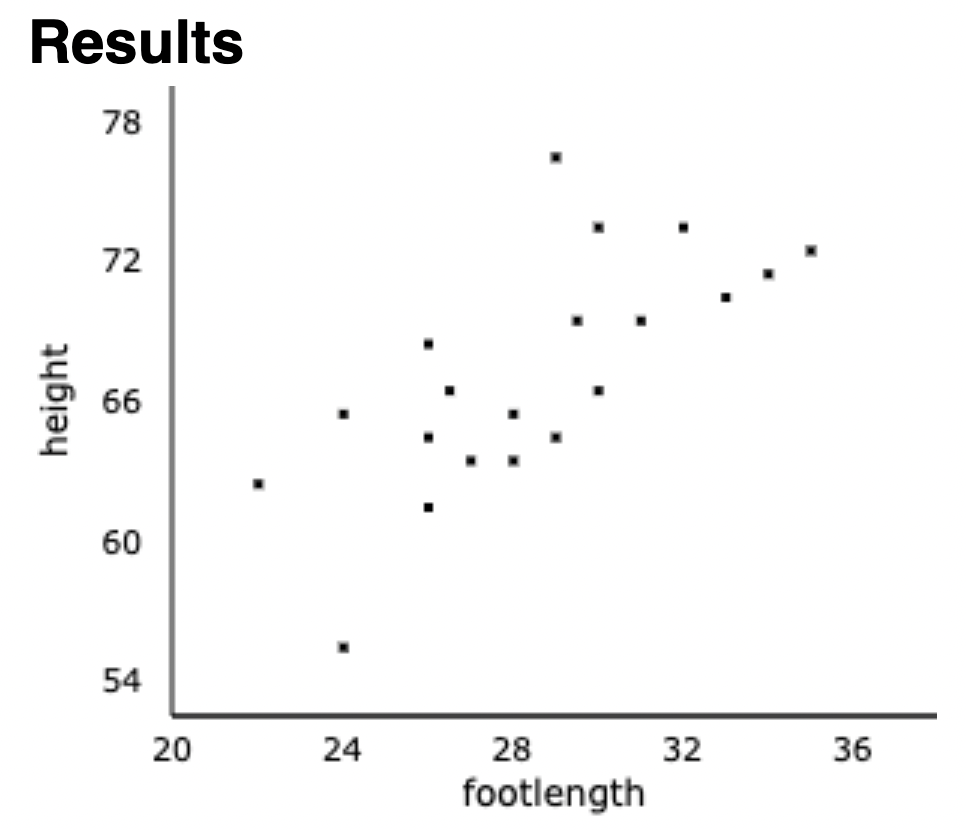

# 1. Analyzing Two Numeric Variables

## Scatterplots 

When viewing a scatterplot, we are looking for different types of association present between at least two numeric variables. Descriptions of an association between two numeric variables should mention:

- Direction, 

- Form, and  

- Strength.  

{width=4in}

## Correlation 

If the association/relationship between two numeric variables seems to follow a *linear* trend, then we can describe the strength of the linear trend with the sample correlation (AKA the correlation coefficient).

[Guess the correlation](http://www.rossmanchance.com/applets/2021/guesscorrelation/GuessCorrelation.html) to get an intuitive sense of what different correlation values can look like in a scatterplot. 

Q: Can we still report the correlation if the relationship between the two variables is **not** linear? 

# 2. Modeling Two Numeric Variables with the Line of Best Fit 

## Sum of squares notation

Because it can quickly become tiring (and quite frankly, look pretty ugly) we will use the following abbreviations extensively:

$$s_x = \sum_{i=1}^{n}(x_i - \bar{x})^2, \quad s_y = \sum_{i=1}^{n}(y_i - \bar{y})^2, \quad s_{xy} = \sum_{i=1}^{n}(x_i - \bar{x})(y_i-\bar{y})$$
Q: Using the abbreviations above, how could you write the formula for the variance of a sample of numeric data, $(y_1, y_2, \dots, y_n)$?

## Line of best fit: minimizes the sum of the squared residuals

The idea behind a simple linear regression (SLR) model is to *model* a linear association between two numeric variables with the equation for a line. Recall the equation for a line is $y = f(x) = mx +b$ where $b$ is the y-intercept and $m$ is the slope, or, $m$ is the constant (non-changing) amount that $y$ changes for a single unit increase in $x$. 

When fitting a SLR model, one numeric variable plays the role of a predictor and the other variable plays the role of the response. This is a statistical model because we are assuming that the equation of a line can explain the relationship between the predictor and response except for some tiny random error, $\epsilon$:
$$y_i = b + m x_i + \epsilon.$$ 
The SLR model is also called the line of best fit. It is *best* in the sense that the y-intercept and slope of the regression equation minimize the sum of the distances between each response data point ($y$) and the corresponding estimate, or fitted value of $y$ based on the regression line ($\hat{y}$).   

The fitted regression model is then a regular equation for a line 
$$\hat{y}_i = b_0 + b_1 x_i$$
where the y-intercept is $b_0 = \bar{y} - b_1 \bar{x}$ and the slope is $b_1 = \frac{s_{xy}}{\sqrt{s_x s_y}} \cdot \frac{s_y}{s_x}$

## Assessing the residuals 

The error associated with our linear model is the difference between what the SLR model predicts will be the $y$-value, given some input, $x$, and what the actual observed $y$-value is from the original data set. Analyzing this error, called the residual error, gives us a sense of how well we can predict the response variable based on the predictor/explanatory variable.

$$\text{Residual} = e = y - \hat{y} = \text{observed value} - \text{predicted value}$$
Informally, you can think of the residuals, $(e_1, e_2, \dots, e_n)$, as possible values for the tiny random error, or random noise, $\epsilon$.  

The SLR model assumes that the random noise, $\epsilon$ follows a Normal probability distribution (so the 68/95/99.7 rule applies). We investigate properties of the residuals in order to help us assess whether or not this assumption seems reasonable. First, we need to describe the center and spread of the residuals. 

* Due to the formula for the fitted regression model, the mean of the residuals is always zero, i.e. $\bar{e}=0$.

* We call the standard deviation of the residuals the standard error which is denoted as $s_e = \sqrt{\frac{\sum_{i=1}^{n} e_i^2 }{n-2}}$. (Note, the special terminology helps remind us that the formula for the standard deviation is a little bit different. We divide by $n-2$ instead of $n-1$.)

## Example 

[Data consisting of foot length and height for 20 individuals](http://www.rossmanchance.com/applets/2021/regshuffle/regshuffle.htm)

# 3. Summary Statistics for Simple Linear Regression

## Correlation coefficient 

The correlation coefficient in a SLR model is just the sample correlation between $(x_1, \dots, x_n)$ and $(y_1, dots, y_n)$.

In the context of a SLR model, the correlation coefficient represents the number of standard deviations by which the $y$ variable is expected to change for a one standard deviation change in the $x$ variable. 

The correlation coefficient, $r$, is found by

$$r = \frac{s_{xy}}{\sqrt{s_x s_y}}.$$
Q: What are the units of the correlation coefficient?

## Slope 

Note that $b_1 = \frac{s_{xy}}{\sqrt{s_x s_y}} \cdot \frac{s_y}{s_x} = r \frac{s_y}{s_x}$. Just as in any mathematical linear equation, $b_1$ represents the (constant) amount of change we expect in $y$ if we increase $x$ by one unit. 

{width=4in}

Q: In the example above, if foot length is measured in centemeters and height is measured in meters, what would be the units for the slope?

## Coefficient of determination

For simple linear regression $R^2 = r^2$, is called the coefficient of determination, or R-squared for short. 

Although this is just the square of the correlation coefficient, $R^2$ actually has a useful interpretation. 

$R^2 = \left(\frac{s_{xy}}{\sqrt{s_x s_y}}\right)^2 = \frac{s_{xy}^2}{s_x s_y}$ represents the fraction/proportion of the variation in the observed $y$-values that is ``accounted for" by a linear function of $x$.  

$R^2$ is what statisticians refer to as a ``goodness of fit" measure because in some sense, the value of $R^2$ reflects the successfullness of the model at relating $y$ to $x$.

