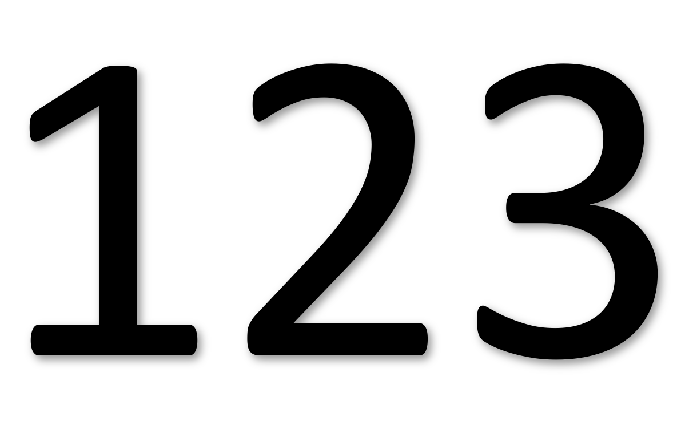

# Review Quiz 1 

{height=3in}

Source: https://www.bloglovin.com/blogs/drawing-on-math-6712237/grades-2067306239

{height=3in}

**Source**: https://sketchplanations.com/sneaky-averages

* [Key assumptions of linear regression models in practice](https://statmodeling.stat.columbia.edu/2013/08/04/19470/)

* Understanding the Normal model with pictures - let's go over problems 10-15 together on the board...

# Main Ideas 

* Examine part (sample) of the whole (population)

* Randomize to avoid bias 

* Sample size need not be relative to population size  

# 1. Populations and Their Parameters 

Q: What is the difference between *variance* and variability/variation?

# 2. The elusive Simple Random Sample (SRS)

**Important:** Random $\neq$ Arbitrary 

# 3. Practical Sampling Designs 

**Goal:** Representative and (somehow) random sample 

* Stratified random sampling

* Cluster and multistage sampling 

* Systematic sampling 

