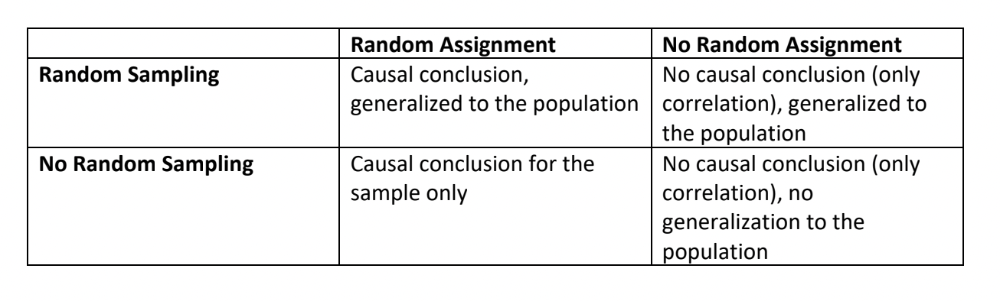

# 1. Observational Studies 

When the researcher or data-collector is unable to exert control (for ethical and/or practical reasons) over relevant features of the observational units, the collection and analysis of data is designed in what is referred to as an observational study. There are two main types of observational studies, those that analyze previously collected data, retrospective studies, and those that collect data in the present and in the future, prospective studies. 

Observational studies are the most common types of statistical studies because this data is much much easier to obtain. However, the statistical conclusions drawn from an observational study are not as powerful as those drawn from a carefully designed experiment. In particular, it is impossible to determine any kind of *causal* relationship through a single observational study, even if the sample is a simple random sample. 

 
 

# Pop attendance quiz: What is your favorite kind of bias and why? 

[Wikipedia has a nice collection of common types of sampling biases.](https://en.wikipedia.org/wiki/Sampling_bias)

This is also a friendly reminder that your attendance in class is required and repeated unexcused absences will negatively impact your course grade. 

 
 

# 2. Randomized, Comparative Experiments 

In contrast to observational studies, an experiment is a study where the research is able to exert some amount of control over the observational units (usually called experimental units in this context), and, as you might expect by now, the most powerfully informative experiments are those where the researcher employs true randomness in the assignment of different experimental treatments. Mainly for ethical reasons, not all experiments can employ random assignment of treatment levels. For example, medical experiments designed to test the effectiveness of a drug that treats a fatal disease may not randomly assign no or low doses of a promising medication to individuals whose disease is rapidly progressing. In these cases, it is also unlikely that the experimental units can be randomly selected from a larger population. However, there are adaptable experimental designs that can be employed to address these kinds of complicated research questions. 

Experiments are typically oriented in a way similar to linear regression models. There is a main variable of interest that is being measured for all experimental units, called response variable. Unlike SLR however, the response variable could be categorical or numerical. The response variable is one that the researchers want to compare across different groups or answer a question about. The other variables in the study are called explanatory variables. When an explanatory variables is categorical, it is often referred to as a factor. Factors with levels that are randomly assigned to different experimental units are called treatments. 

## Example 

Below is the abstract for an article about [massage-like stroking boosting the immune system in mice](https://doi.org/10.1038/srep10913). (Recall, this is the study that the Women's' Health magazine wrote about in a misleading way.)

  > Recent clinical evidence suggests that the therapeutic effect of massage involves the immune system and that this can be exploited as an adjunct therapy together with standard drug-based approaches. In this study, we investigated the mechanisms behind these effects exploring the immunomodulatory function of stroking as a surrogate of massage-like therapy in mice. C57/BL6 mice were stroked daily for 8 days either with a soft brush or directly with a gloved hand and then analysed for differences in their immune repertoire compared to control non-stroked mice. Our results show that hand- but not brush-stroked mice demonstrated a significant increase in thymic and splenic T cell number ($p<0.05$; $p<0.01$). These effects were not associated with significant changes in CD4/CD8 lineage commitment or activation profile. The boosting effects on T cell repertoire of massage-like therapy were associated with a decreased noradrenergic innervation of lymphoid organs and counteracted the immunosuppressive effect of hydrocortisone in vivo. Together our results in mice support the hypothesis that massage-like therapies might be of therapeutic value in the treatment of immunodeficiencies and related disorders and suggest a reduction of the inhibitory noradrenergic tone in lymphoid organs as one of the possible explanations for their immunomodulatory function.

Answer the following questions about this study:

(a) Are the conclusions of this study generalizable and if so to which population? 

(b) Does this study provide evidence of a cause and effect relationship between the treatment and the response variable? 

(c) What factors are being considered and how many levels are there of each? 

(d) How many treatments are there? 

(e) What is the response variable?

(f) Which of the following apply to this experiment: completely randomized, blocked, matched design, blind? 

## Four principles of experimental design 

1. **Control** for extraneous sources of variation (besides the main comparative grouping(s)).

This could mean incorporating a control group to compare to other treatment groups. Also, blinding wherever possible - subjects, technicians, data collector, doctor, surveyor - can protect against sources of variation due to bias. 

2. **Randomize** the assignment of treatment levels (including a control level).

The purpose of random assignment is to be able to draw cause and effect conclusions about a particular treatment. Randomization (in sample selection and in treatment assignment) helps to correct for unknown confounding variables (AKA lurking variables).

[Simpson's paradox ex]

3. **Replicate** treatment to several observational units (to get a sense of variation within a treatment level) and replicate a study on a new sample of experimental units to validate the results. 

4. **Blocking** participants into homogeneous groups whenever possible and randomly assigning treatment levels within each block helps to correct for the impact of known confounders. 

# 3. Putting it all together: Designing a Good Study 

* Often it isn't possible (for ethical, monetary, or practical) reasons to design and implement an experiment. In these cases, researchers instead aim to implement a carefully designed observational study. This means thinking about what representativeness means in the research context and considering if there is any way to incorporate randomness.

If you continue to study the life sciences, you will become familiar with the *Belmont Report: Ethical Principles and Guidelines for the Protection of Human Subjects of Research, Report of the National Commission for the Protection of Human Subjects of Biomedical and Behavioral Research*. This report was issued in $1978$ in response to the Nuremberg Trials following WW2 and, more immediately, to the Tuskegee Study of 1972 where Black men were denied life-saving medical treatment in Alabama. Here is a brief article on [the history of the Belmont Report](https://www.tc.columbia.edu/institutional-review-board/irb-blog/the-history-of-the-belmont-report/). You can find additional details on the [Wikipedia page for the Belmont Report](https://en.wikipedia.org/wiki/Belmont_Report).

The American Statistical Association has also developed [Ethical Guidelines for Statistical Practice](https://www.amstat.org/your-career/ethical-guidelines-for-statistical-practice). These guidelines are intended for anyone who will ever contribute to data collection and/or analysis. That means you! Take a look at Principle D in particular. These 11 standards for practice cover our responsibilities to research subjects, data subjects, and/or those directly affected by statistical practices. 

Which of these 11 standards do you think you are most likely to encounter in your own practice of statistics?

* Generally we need to strike a balance between collecting enough data (for different variables in our data set) to help in case of <natural disasters> or missing information but not so much data that it's unlikely to get many willing participants 

* Experiments control for confounders (known and unknown ) *on average* and known confounders can be further controlled by blocking. In an observational study, we can only control for known confounders via stratifying.  

* Take to heart the most common statistical advice: you're gonna need more data to answer your question. Budget for the reality that humans aren't perfect. Pre-test a survey method. Run a pilot study before conducting an entire randomized, controlled experiment. 

## Reference Sheet 

As there is a lot of new terminology that we have covered, I've put together a brief [reference sheet for the Unit 1 material](https://profsuzy.github.io/Stat11/Cheat-sheet-1.html). If you notice any typos or mistakes in this sheet please let me know. It is meant as an additional reference for you to use while you study the Unit 1 material.   

# Reminder: GHW #2 is due in one week (Feb 15)