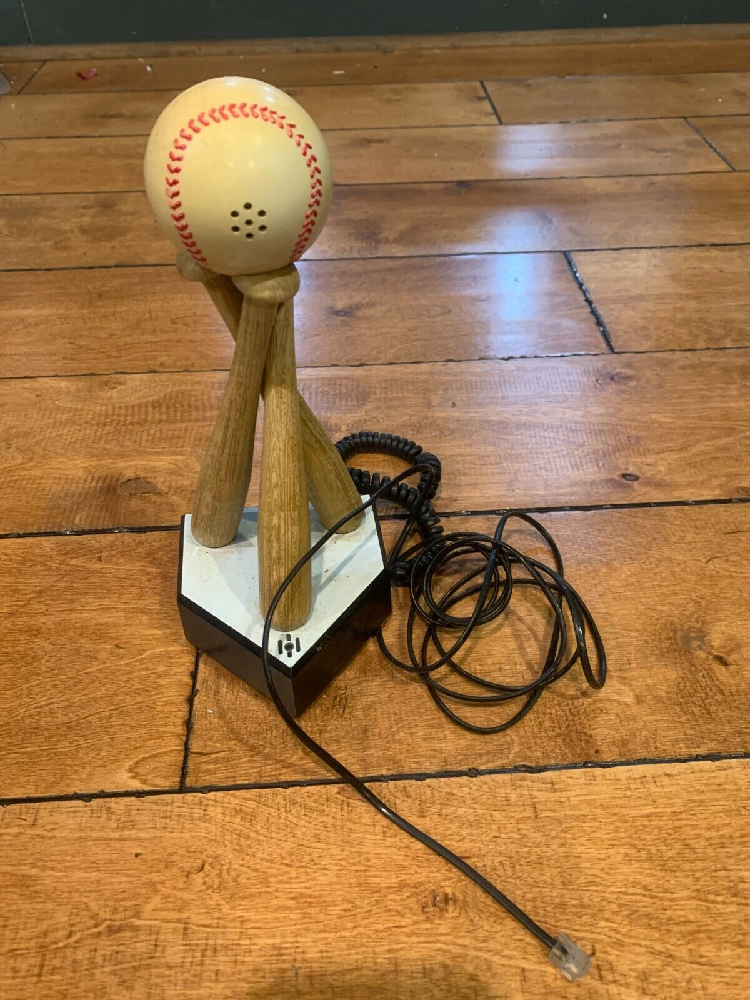

# 1. Data Introduction 

* First, we are going to consider (hypothetical) data collected from a phone survey. 

* Second, we'll consider a question related to baseball bats and their hitting distance. 

# 2. Analysis Goal  

* For the phone survey data we will critique and try to improve upon a proposed sampling design. 

* For the baseball data we are going to design an experiment to answer a statistical question. 

# 3. Summary of Results  

* Ideally, much of the statistical work to answer a research question will occur before the data has even been collected! 

* If the data quality is poor, no statistical analysis, no matter how sophisticated, can make sense of it! 

# Reminder: GHW #2 is due in one week (Feb 15)

