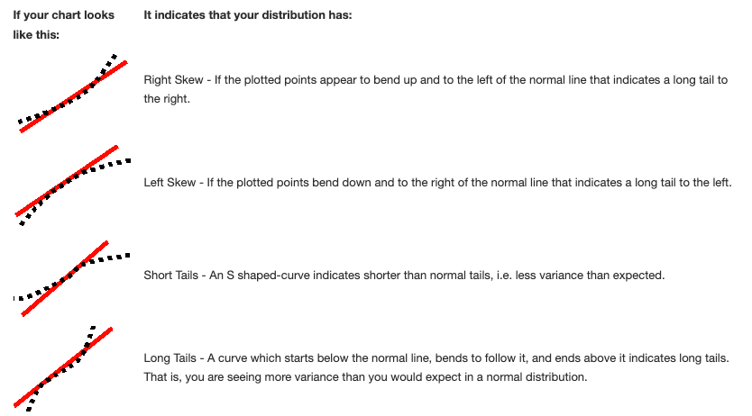
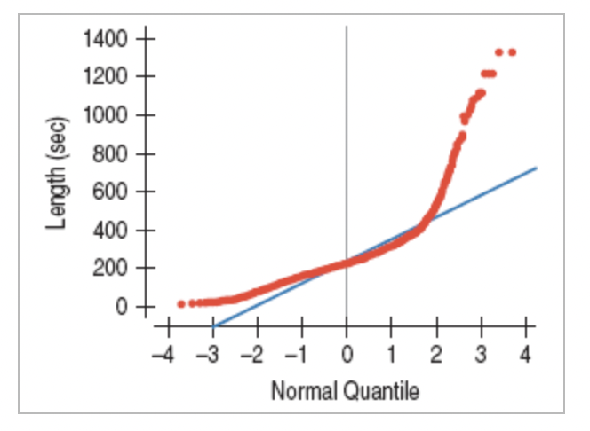

# Unit 1 topics 

* Exploring and understanding data

* Exploring and understanding relationships between variables


# Week 1 - Visualizing and summarizing data 

* Data 

  * Observational units 

  * Variables - categorical or numeric - and their distributions 

* Analysis 

  * Confirmatory or exploratory 

  * Sample statistics 
  
## For categorical variables 

* Contingency tables and independence 

* <span style="color:green">Simpson's Paradox and lurking variables</span> 

## Example 

Below are the batting averages for Derek Jeter and David Justice for the 1995 and 1996 seasons, as well as their combined batting averages across the two seasons. Derek Jeter has a lower batting average in both 1995 and 1996, but a higher combined average. <span style="color:blue">What’s going on here?</span>


|  | 1995 | 1996 | Combined | 
|:--- |:--- |:--- |:--- |
| Derek Jeter | $0.250$ | $0.314$ | $0.310$ | 
| David Justice | $0.253$ | $0.321$ | $0.270$ | 


Simpson’s paradox - the imbalance of the groups that makes it possible for the overall average to be weighted differently then the trend in each subgroup. The lurking variable that we couldn't see if we just reported the proportions as in the table above is the number of times each player went up to bat in each year.


|  | 1995 | 1996 | Combined | 
|:--- |:--- |:--- |:--- |
| Derek Jeter | $0.250 = 12/48$ | $0.314=183/582$ | $0.310 = 195/630$ | 
| David Justice | $0.253=104/411$ | $0.321=45/140$ | $0.270=149/551$ | 


# Week 2 - Describing distributions of numeric variables with variance 


* Shape and measures of center and spread 

  * Mean vs median 
  
  * Variance vs IQR 

* Normal model and the 68/95/99.7 rule 

* Transforming variables 

  * Shifts and scales 
  
  * Standardization 

* Quantiles and quartiles  

  * Normal QQ Plots - vertical axis plots the sample quantiles (that is, the sample arranged from smallest to largest), the horizontal axis plots the standardized z-scores for each of the sample quantiles. If the data are from a Normal distribution, then the standardized z-scores should follow a Standard Normal distribution. A strong, positive linear relationship between the z-score quantiles (that is, the theoretical quantiles from a N(0,1) distribution) and the sample quantiles indicates that your sample is from a Normal distribution.  




<small>Source: https://www.skymark.com/resources/tools/normal_test_plot.asp#:~:text=Right%20Skew%20%2D%20If%20the%20plotted,long%20tail%20to%20the%20left.</small>

## Example 

Corey has 4929 songs in his computer's music library. The lengths of the songs have a mean of 242.4 seconds and standard deviation of 114.51 seconds with the accompanying Normal probability plot of song lengths.

{height=300}

<span style="color:purple">Q: Is this distribution Normal? If not, how does it differ from a Normal model?</span>


For additional practice, see the plots on pg 145 of your textbook and the [examples at the bottom of this webpage](https://www.itl.nist.gov/div898/handbook/eda/section3/normprpl.htm).


# Week 3 - Describing relationships between two numeric variables 

* Simple linear regression model 

  * Predicted/fitted values and residuals 

  * Standard error of the residuals 

* Correlation and the coefficient of determination 

* Variable roles 

* Variable transformations - transforming a numeric variable can change its shape and spread 

* <span style="color:green">Regression to the mean</span> 

## Example 

A CEO complains that the winners of his "rookie junior executive of the year" award often turn out to have less impressive performance the following year. He wonders whether the award actually encourages them to slack off. 

<span style="color:purple">Q: What is a better explanation for why the winners of the "rookie junior executive of the year" award often turn out to have less impressive performance the following year?</span>


## Example 

<span style="color:purple">Q: An online investment blogger advises investing in mutual funds that have performed badly the past year because "regression to the mean tells us that they will do well next year." Is she correct?</span> 


## Watch out for 

* <span style="color:green"><span style="color:green">Extrapolation</span> 

* Outliers, <span style="color:green">leverage</span>, and <span style="color:green">influence</span> 

  * Outliers don't seem to follow the trend of the majority of the data points. 
  
  * Leverage points are outliers with respect to the $x$-axis only  
  
  * Influential points are those data points that can drastically change the slope or intercept of the regression equation 

* Model assumptions met  

  * Linearity between the predictor and response 
  
  * No outliers 
  
  * No thickening or thinning in the residuals plot


<!--  Student Requested Examples -->

<!-- ## Contingency tables for two categorical variables 

### 1. Determining independence 

From pg 82 of your textbook: "variables are said to be independent if the conditional distribution of one variables is the same for each category of the other. We'll show how to check for independence in a later chapter." -->


<!--## Interpreting results of transformed data -->

<!-- ### 1. Comparing athletes' performance 

**200 $m$ race** $(x_1, \dots x_n)$

$\bar{x} =24.58s , \quad sd(x_1, \dots, x_n) = 0.654s$

Johnson-Thompson's time: $23.26s$

**Long jump** $(y_1, \dots, y_m)$ 

$\bar{y} = 6.17m , \quad sd(y_1, \dots, y_m) = 0.247m$ 

Thiam's distance: $6.58m$-->


```{r echo=FALSE}
gators = read.csv("https://raw.githubusercontent.com/dr-suz/Stat11/main/Data/Gators.csv")

mod1 = lm(Weight.lbs. ~ Length.in., gators) 
mod2 = lm(log(Weight.lbs.) ~ Length.in., gators)
```


## Questions about SLR modeling 

### 1. Transformations  

In SLR, transforming a variable can help with finding a **linear relationship** and it can help **stabilize the variance** of the residuals, both key assumptions for using a SLR model. 

Refer to the solutions for our in-class worksheet on fitting a SLR model to predict gator weight based on the length of alligators in areal photographs. 

### 2. When to use $r$ vs $R^2$? 

* The only difference between $r$ and $R^2$ for SLR models is that $r$ indicates not only the strength of a linear trend but also the direction of the trend. 

* $R^2$ has a convenient interpretation as the proportion of variability in the response, $Y$, that is explained (or "accounted for") by the predictor, $X$. 

* Both $r$ and $R^2$ are numerical summaries of strength of a relationship between two numeric variables; however, these summaries are only appropriate if the trend between the variables is **linear**. 

* In the gator model above, the regression model for the original data has a correlation coefficient of `r cor(gators$Length.in., gators$Weight.lbs.)` and an $R^2$ value of `r summary(mod1)$r.squared`. The regression model for the transformed data has a correlation coefficient of `r cor(gators$Length.in., log(gators$Weight.lbs.))` and an $R^2$ value of `r summary(mod2)$r.squared`. 

<!-- ### 2. Formula for the slope of a SLR 

In the gator model above, the slope of the regression model for the original data is $5.90$ which means that, based on this model, each additional inch of length (in the areal photograph), corresponds to an additional weight of $5.9 lbs$.  


The slope of the regression model for the transformed data is a little more complicated to interpret. The slope of $0.04$ means that, based on this model, each additional inch of length (in the areal photograph) corresponds to an average increase in log(weight) of $0.04 \ln (lbs)$. (Note that since it is difficult to think in terms of logarithm of $lbs$, we would most likely want to report the interpretation of the slope within the context of the original units of the data. That is, each additional inch corresponds to a multiplicative increase in weight by `r exp(0.04)` $lbs$.)  --> 


### 3. Residual plots 

In a SLR model, we can use residual plots to help us asses both the assumption of a linear association between our predictor and response **and** the assumption that the variance of our noise, $\varepsilon$, is a single, constant number (that we can estimate with the standard error, $SE = \sqrt{(\sum_{i=1}^{n} e_i^2)/(n-2)}$). 

For SLR models, a residual plot may have the predictor, $x$, on the horizontal axis or it may have the fitted values, $\hat{y}$, on the horizontal axis. The vertical axis of a residual plot is always the residuals, $e$. In either case, we are hoping to see an amorphous blob of points in this scatter plot without any discernible patterns. You can find a few examples of "good" and "bad" residual plots [on this website](https://www.statology.org/good-vs-bad-residual-plot/).


<!-- Normal QQ Plots to assess the distribution of the residuals 

A Normal QQ plot of the residuals for the regression model of the original gator data is shown below. 

```{r}
qqnorm(mod1$residuals)
qqline(mod1$residuals)
```

A Normal QQ plot of the residuals for the regression model of the transformed gator data is shown next.  

```{r}
qqnorm(mod2$residuals)
qqline(mod2$residuals)
```

Ideally, we'd see an rather strong linear trend between the sample quantiles of the residuals and the theoretical residuals from a standard Normal distribution. -->


