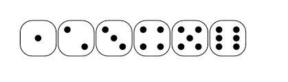
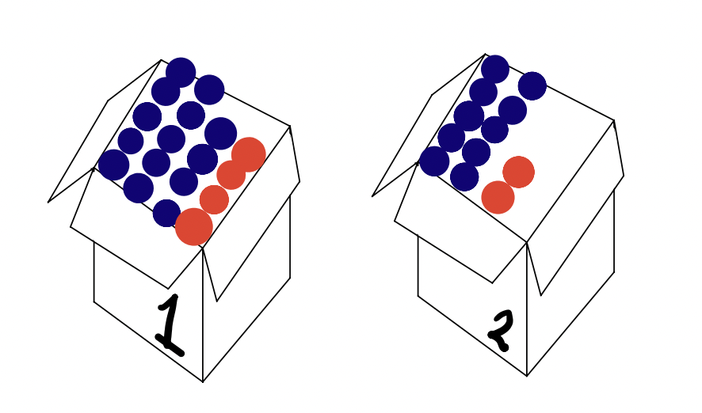

```{r setup, echo=FALSE}
knitr::opts_chunk$set(echo = FALSE, warning = FALSE, message = FALSE)
```


# 1. Random Phenomena
  
Random variables result in random events. Each random variable has a sample space of outcome events. A trials results in an observed event.  


## Example: Rolling a six-sided die



* The random event is the face of the die that lands upward. 

* The sample space of outcomes is this six faces of the die. 

* A trial represents the act of physically rolling a six-sided die and producing an observation of this random phenomena. 

## Example: Flipping an unfair coin


* <span style="color:purple">What is the random event?</span>

* <span style="color:purple">What is the sample space of outcomes?</span>

* A trial represents the act of physically flipping the coin and producing an observation of this random phenomena. 

  
# 2. Law of Large Numbers 

As we repeat a random process over and over again, the proportion of times that an event occurs eventually settles down to a single probability that describes the relative frequency with which this event occurs. In short, the Law of Large Numbers (LLN) asserts that relative frequencies settle down to a single value in the long run.  

<span style="color:green">Empirical probability</span> - uses the laws of probability to describe the long-run behavior of repeated observations of a random event. 


## Example: Rolling a six-sided die


```{r echo=FALSE}
set.seed(102)
```

```{r echo=TRUE}
# Consider a six sided die 
S = c(1,2,3,4,5,6)

# Roll the die once 
sample(S, size=1, replace=TRUE)
```

<span style="color:blue">Q) What's the probability that the die lands on a "six"?</span>

A) $1/6=$ `r 1/6`


<span style="color:purple">Q) What's the probability that we roll the dice again and it lands on a "six" again?<\span>


**Note:** There is no such thing as a "law of averages". This is also known as "the gambler's fallacy".  


```{r echo=TRUE}
# Roll the die 10000 times 
trials = 10000
observations = sample(S, size=trials, replace=TRUE)
observations
```

<span style="color:blue">Q) How frequently did the die land on a "six"?</span> 

A) `r sum(observations == 6)/trials`


FYI you can find this probability with the R code: 
```{r eval=FALSE, echo=TRUE}
sum(obbservations == 6)/trials
```

## Example: Flipping an unfair coin

<span style="color:blue">Q) How could we figure out the probability that our unfair coin lands on a "heads"?</span>


**Note:** There is another way to use the laws of probability. For example, perhaps I'm a magician and I'm flipping a coin and you don't know whether or not the coin is fair. You could express your doubts with a subjective probability. 

<span style="color:green">Subjective probability</span> - uses the laws of probability to describe a personal degree of (un)certainty, unrelated to any kind of long-run behavior.

  
# 3. Laws of Probability 


## 1) A probability is a number between 0 and 1. 

$$0 \leq Pr(A) \leq 1, \quad\text{for $A \in S$}$$ 

## 2) The probability of the set of all possible outcomes of a trial is 1. 

$$Pr(S)=1$$

## 3) The probability of an event not occuring is equal to 1 minus the probability the event does occur. 

$$Pr(A^{C}) = 1 - Pr(A)$$

## 4) If an event $A$ is disjoint from another event $B$, then the probability that one event or the other event occurs is the sum of their two individual probabilities.

$$Pr(A\text{ or }B) = Pr(A) + Pr(B), \quad\text{when }Pr(A\text{ and }B) = 0$$ 

## 5) If an event $A$ is independent of another event $B$, then the probability that both events occur is the product of the probabilities of the two individual events. 

$$Pr(A\text{ and } B) = Pr(A)\times Pr(B), \quad\text{when $A$ and $B$ are independent events}$$ 


## Example: Selecting colored balls from a box 



*Two boxes contain red and blue balls. Box 1 has 14 blue balls and 4 red balls. Box 2 has 10 blue balls and 2 red balls.*

The random phenomena we are considering is drawing a single ball from each of the two boxes without looking. 

* <span style="color:purple">What is the sample space for this random phenomena?</span>

* <span style="color:purple">Are you more likely to choose a blue ball from Box 1 or Box 2?</span>

* <span style="color:purple">What is the probability that you select a blue ball from Box 1 and a blue ball from Box 2</span>
