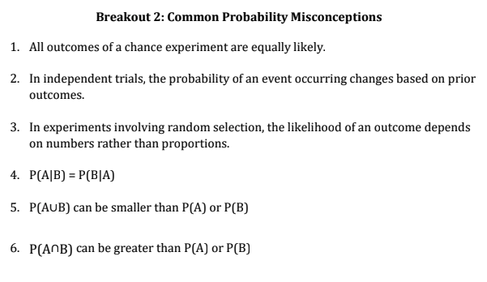

  
```{r setup, echo=FALSE}
knitr::opts_chunk$set(echo = FALSE, warning = FALSE, message = FALSE)
```


<span style="color:purple">notecard</span>
<span style="color:blue">hypothetical</span>
<span style="color:green">new terms</span>
  
Ch13 material  
  
# 1. 
  
  
# 2. 
  
  
# 3. 


##Example 1 - discrete random variable 
population <- c(3,3,3,2,2,2)  ## this is our box containing 6 labeled balls

## Let X represents a single random draw from the population. 
## So X is random variable whose distribution is defined by the population (box)
## The (theoretical) expectation of the random variable X is:
(3*(3/6)) + (2*(3/6))   

## Now we are going to SRS of size n and calculate the sample mean/expectation
n=10000
SRS_discrete_pop <- sample(population, size=n, replace=TRUE)
mean(SRS_discrete_pop)  

## Why are these two values slightly different? 

## Similarly, the (theoretical) variance of the random variable X is:
(  (( (3-2.5) ^2) * (3/6) ) + 
    (( (2-2.5) ^2) * (3/6) )   )

## and the sample variance is 
n=10000
SRS_discrete_pop <- sample(population, size=n, replace=TRUE)
var(SRS_discrete_pop)

## These two values are slightly different for the exact same reason as the mean calculations.


##----------------------

R4.8, R4.10, R4.19 practical example with insurance deductibles [good examples to include in class notes]


# Example: The Drake Equation 

In 1961 astronomer Frank Drake developed an equation to try to estimate the number of extraterrestrial civilizations in our galaxy that might be able to communicate with us via radio transmissions. Now largely accepted by the scientific community, the Drake equation has helped spur efforts by radio astronomers to search for extraterrestrial intelligence. Here is the equation:
$$N_{C} = N \cdot f_p \cdot n_e\cdot f_l \cdot f_i \cdot f_{c} \cdot f_{L}.$$
OK, it looks a little messy, but here’s what it means:

!()[./images/wk6-drake-eqn.png]


So, how many ETs are out there? That depends; values chosen for the many factors in the equation depend on ever-evolving scientific knowledge and one’s personal guesses. But now, some questions.

What quantity is calculated by 
(a) the first product, $N \cdot f_p$?

(b) the product, $N \cdot f_p \cdot n_e \cdot f_l$?

What probability is calculated by the product $f_l \cdot f_i$? 

Which of the factors in the formula are conditional probabilities? Restate each in a way that makes the condition clear.


# Probability Misconceptions




5.	Think about the following two probabilities:
The probability that a man that is over 6 feet tall is a professional basketball player
The probability that a man is over 6 feet tall given that he is a professional basketball player
Which of the following most likely to be true?

a)	Probability 1 is greater than probability 2.
b)	Probability 2 is greater than probability 1.
c)	The two probabilities are equal.
d)	It is impossible to tell.

6.	Think about the following two probabilities:
The probability that a randomly selected adult American likes to surf
The probability that a randomly selected adult American lives in California and likes to 
surf
Which of the following is most likely to be true?

a)	Probability 1 is greater than probability 2.
b)	Probability 2 is greater than probability 1.
c)	The two probabilities are equal.
d)	It is impossible to tell. 


7. Suppose that 78% of the students at a particular college have a Facebook account and 43%
have a Twitter account.

a) Using only this information, what is the largest possible value for the percentage who
have both a Facebook account and a Twitter account? Describe the (unrealistic)
situation in which this occurs.

b) Using only this information, what is the smallest possible value for the percentage who
have both a Facebook account and a Twitter account? Describe the (unrealistic)
situation in which this occurs.

If a fair die is rolled five times, which of the following sequences is most likely to result?

a. 2 6 1 5 3
b. 6 4 2 1 5
c. 2 4 4 4 4
d. 2 6 1 5 3 and 6 4 2 1 5 are equally likely and they are more likely than 2 4 4 4 4
e. 2 6 1 5 3, 6 4 2 1 5, and 2 4 4 4 4 are all equally likely


Have every individual student flip a coin 4 times. Find someone who gets 4 heads in a row. Ask students what is the chance that that student gets a tail on the next flip.

Have groups flip a coin 3 times and record the results. Then determine of any of the results are more rare than the others. 


3. Two boxes contain red and blue balls. Box 1 has 14 blue balls and 4 red balls. Box 2 has 10
blue balls and 2 red balls. There are more blue balls in Box 1 than Box 2. If you pick one ball
at random from each box, are you more likely to choose a blue ball from Box 1 or Box 2?

