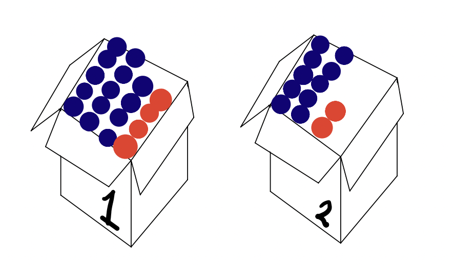
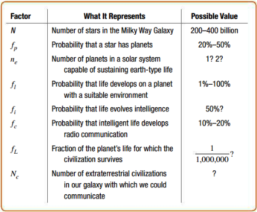

  
```{r setup, echo=FALSE}
knitr::opts_chunk$set(echo = FALSE, warning = FALSE, message = FALSE)
```

  
  
# 1. The general addition rule 
  
For any events in the sample space of a random variable, say, $A$ and $B$, we compute the probability of event A or event B or both events A and B occurring with the  formula:

$$Pr(A \text{ or } B) = Pr(A) + Pr(B) - Pr(A \text{ and } B)$$
In mathematics and statistics, when we use the word *or*, we typically mean the inclusive version of this word. That is either option or both are possibilities. This is called a logical <span style="color:green">union</span>. On the other hand, the word *and* is what we call an <span style="color:green">intersection</span> and is used to refer to two things co-occurring. 


## Independent vs. disjoint 

* If two events are independent, this means that the results of the first event are in no way related to the results of the second. The probability of the intersection of two independent events is always equal to the product of the individual (marginal) probabilities of each event occurring by itself: $Pr(A \text{ and }B) = Pr(A)\times Pr(B)$.

* If two events are disjoint, this means that they cannot co-occur. That is, the probability of their intersection is zero: $Pr( A \text{ and } B) = 0$.


## Example: Selecting colored balls from a box 



*Two boxes contain red and blue balls. Box 1 has 14 blue balls and 4 red balls. Box 2 has 10 blue balls and 2 red balls.*

The random phenomena we are considering is drawing (without looking) a single ball from Box 1 with our right hand and a single ball from Box 2 with our left hand. The sample space for this random phenomena is $S = \{RB, BR, BB, RR\}$.

Define event $A$ as the event that we draw at least one red ball; define event $B$ as the event that we draw at least one blue ball.

* <span style="color:purple">Are events $A$ and $B$ disjoint?</span> 

* <span style="color:purple">What is the probability that event $A$ or event $B$ or both events $A$ and $B$ occur?</span>

Now define event $A$ as the event that we draw exactly two red balls; define event $B$ as the event that we draw exactly two blue balls. 

* <span style="color:purple">Are events $A$ and $B$ disjoint?</span>

## Example: Social media probabilities 

Suppose that, upon beginning their work at the college, $78\%$ of Swarthmore students, faculty, and staff have a Twitter account and $43\%$ have a Facebook account. Consider the possibilities for the percentage of people at Swarthmore who have both a Twitter account and a Facebook account.

* <span style="color:purple">What is the largest possible value for this intersection?</span> 

* <span style="color:purple">What is the smallest possible value for this intersection?</span> 

<span style="color:blue">Are the events $A$, that a Swattie has a Twitter account and $B$, that a Swattie has a Facebook account disjoint?</span> 
  
# 2. Conditional probability 

When two random events are not disjoint (i.e. they can co-occur), we may want to consider whether knowing the outcome of one event, say $A$, impacts the outcome of the other event, say $B$. We can do this with a <span style="color:green">conditional probability</span> of event $B$ given that we know (or observe) event $A$:  

$$P(B \text{ given } A) = Pr(B \mid A) = \frac{Pr(A \text{ and } B)}{Pr(A)}.$$

As you might expect, if events $A$ and $B$ are independent, then conditioning on $A$ won't give us any information at all on the outcome of $B$. We can see this property mathematically by applying the multiplication rule for independent events:
$$P(B \mid A) = \frac{Pr(A \text{ and } B)}{Pr(A)} = \frac{Pr(A) \times Pr(B)}{Pr(A)} = Pr(B).$$ 

  
  
# 3. The multiplication rule 

Just as there is a general version of the addition rule (that applies even if events are not disjoint), there is a general version of the multiplication rule (that applies even when events are not independent). This rule is actually just an artifact of rearranging the definition of conditional probability above. 

For any events $A$ and $B$ (they may or may not be independent), $Pr(A \text{ and }B) = Pr(A) \times Pr(B \mid A)$. If these events are independent, then we can substitute $Pr(B)$ for $Pr(B \mid A)$ and this simplifies to the multiplication rule we saw last class: $Pr(A \text{ and }B) = Pr(A) \times Pr(B)$. 


## Example: The Drake Equation 

In 1961 astronomer Frank Drake developed an equation to try to estimate the number of extraterrestrial civilizations in our galaxy that might be able to communicate with us via radio transmissions. Now largely accepted by the scientific community, the *Drake equation* has helped spur efforts by radio astronomers to search for extraterrestrial intelligence. Here is the equation:

$$N_{C} = N \cdot f_p \cdot n_e\cdot f_l \cdot f_i \cdot f_{c} \cdot f_{L}.$$
And here’s what it means:




So, how many ETs are out there? Unfortunately, I don't have an answer for you. The answer depends on values chosen for the many factors in the equation and on our ever-evolving scientific knowledge and our own personal guesses. But we can now make sense of this equation and answer the following questions.

* <span style="color:purple">What quantity is calculated by</span> 

<span style="color:purple">(a) the first product, $N \cdot f_p$?</span> 

<span style="color:purple">(b) the product, $N \cdot f_p \cdot n_e \cdot f_l$?</span> 

* <span style="color:purple">What probability is calculated by the product $f_l \cdot f_i$?</span>  

* <span style="color:purple">Which of the factors in the formula are conditional probabilities?</span> 

