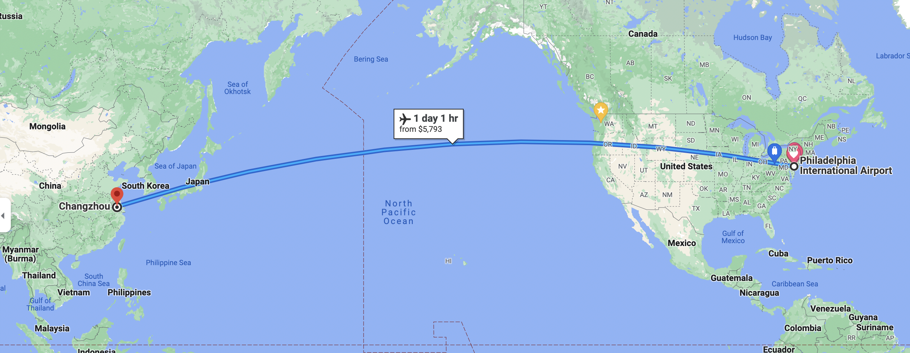
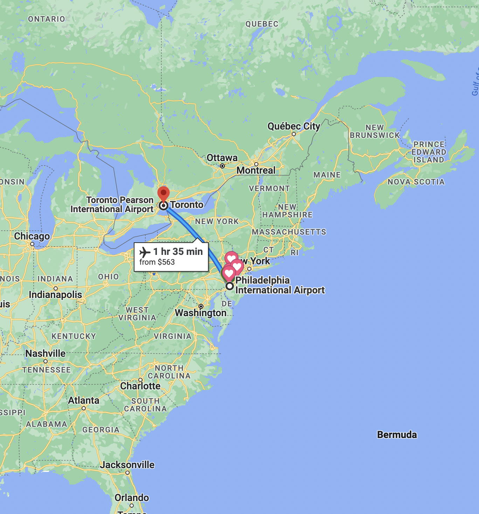

# 1. Data Introduction 

We are going to use the laws of probability and properties of random variables to plan a trip. We will warm up by considering how conditional probabilities differ from marginal probabilities. 

{width=8in} {height=3in}

# 2. Analysis Goal  

Ultimately, the goal of this analysis is the estimate the cost to fly several of us across the globe for a statistics conference. We will do this by using random variables to model the airline ticket prices of two different destinations. 

Click this link to view the [worksheet for experiments with random variables](https://dr-suz.github.io/Stat11/wk6-wksheet.html). 

# 3. Summary of Results  

* It's not easy to predict the outcome of a random phenomena but the mean and standard deviation are helpful in this regard. 

* Consider two **independent** random variables, $X$ and $Y$. Suppose the theoretical mean and standard deviation of $X$ are $E(X)$ and $\sqrt{Var(X)}$, respectively. Suppose something similar holds for $Y$. We can consider a new random variable $W = X + Y$ and compute it's theoretical mean and standard deviation using the fact that

$$E(W) = E(X) + E(Y), \quad\text{and } Var(W) = Var(X) + Var(Y).$$ 

 
 
 
 

## Solutions

4. Define two random variables and use them to express the total amount of funding we will need to request to fly to both of these statistics conferences.

 
 

One possible solution is to let $X$ represent the random cost of an airline ticket from Philadelphia to Toronto, and let $Y$ represent the random cost of an airline ticket from Philadelphia to Chengdu: 

$$X = \text{ cost of a flight from Philadelphia to Toronto} \\ Y = \text{ cost of a flight from Philadelphia to Chendu}$$

Then, according to the information above, we have that 

$$E(X) = 563, \quad Var(X) = 70^2 \\ E(Y) = 5400, \quad Var(Y) = 750^2.$$

We can model the total cost of airfare to these conferences as a function of these two random variables: $3X + 5Y$.

 
 
 
How could we interpret the covariance between the price of a ticket from PHL to Toronto and the price of a ticket from PHL to Chengdu? 

 

5. Find the expected value and standard deviation of the total cost of the one-way-trip to our destinations. Do we need to make any assumptions in calculating these means or standard deviations?

