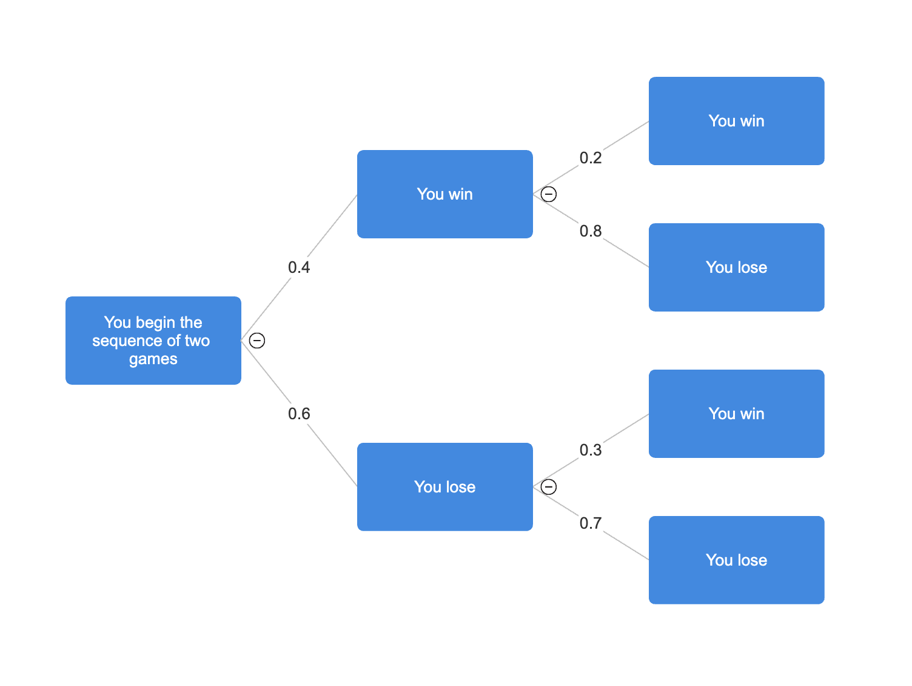

```{r setup, echo=FALSE}
knitr::opts_chunk$set(echo = TRUE, warning = FALSE, message = FALSE)
```


# Recap 

Last class we learned how to calculate the expected value of a random variable, say, $X$: 

$$E(X) = \sum_{x\in S} \left[ x \times Pr(x) \right]$$  
and its variance
$$Var(X) = \sum_{x\in S} \left[ (x-E(X))^2 \times Pr(x) \right].$$  

For another random variable, say, $Y$ we can also calculate the covariance between $X$ and $Y$:  

$$Cov(X,Y) = E\left[(X-E(X))\cdot(Y-E(Y)) \right] = \sum_{(x,y) \in S} \left[(x-E(X)(y-E(Y))\times Pr(x \text{ and }y)) \right].$$

**Note:** You are NOT expected to know how to calculate the covariance of two random variables, but, if you would like to see an example, see section 4 at the bottom of these notes. 


**Recall** problem 5c from PHW 3 which gave this distribution of $X$ below and also asked us to consider another random variable $Y = 3X-2$. Now that we know the formulas for expectation and variance of a random variable, you can solve this question! 

| x | 0 | 1 | 2 |
|:---|:---|:---|:---|
| Pr(X = x) | 0.2 | 0.4 | 0.4 |

<br>

# 1. Independent Random Variables 

Independence is a complicated concept in probability and statistics. We're going to dig into the nitty gritty details to make sure we [really understand what independence means](https://youtu.be/jCUiGArhW2M?start=1).

Q1) <span style="color:blue">What does it mean for two *random events*, say, $A$ and $B$, to be independent?</span>

<br>

A1) For any two random events, $A$ and $B$, to be independent, they must satisfy $Pr(A \text{ and } B) = Pr(A) \times Pr(B)$ or, equivalently, $Pr(A \mid B) = Pr(A)$. **The reverse is also true!** That is, if $Pr(A \text{ and } B) = Pr(A) \times Pr(B)$ (or, equivalently, if $Pr(A \mid B) = Pr(A)$) then $A$ and $B$ are independent events. 

<br>

<br>

## Example 1 - Determining if two *random events* are independent

You play two games against the same opponent. The probability you win the first game is $0.4$. If you win the first game, the probability you also win the second is $0.2$. If you lose the first game, the probability that you win the second is $0.3$. Let $A$ be the event that you win the first game and let $B$ be the event that you win the second game. Answer the following questions about the results of this game. 

First, let's determine which of the probabilities in this problem are conditional. Then we'll construct a tree-diagram to help us answer the questions below. (Note, in tree diagrams, we start with unconditional probabilities but all other probabilities are conditional. You can check that your probabilities make sense by ensuring that (1) the sum of all branches coming from the same node is one and that (2) the sum of the product of all probabilities along each path to the end of the diagram is also one.)

{height=300px}

<span style="color:purple">a) What is the probability that you win both games?</span> 

<br> 

<span style="color:purple">b) What is the probability that you win the second game?</span> 

<br> 

<span style="color:purple">c) Are the outcomes of these two games independent?</span> 

<br> 

<span style="color:red">Annotated solutions to this example question are provided at the end of these notes.</span>
<br>

**Mote:** There is a law of probability that we haven't covered yet called <span style="color:green">the law of total probability</span>. This law can be proved given the five laws of probability we have covered and it states that, for any events $A$ and $B$, 
$$Pr(B) = Pr(B\text{ and }A) + Pr(B \text{ and } A^C).$$ 
This law isn't mentioned by name in your textbook but it is used implicitly in <span style="color:green">Bayes' Rule</span> which you will read about. 


***


Q2) <span style="color:blue">What does it mean for two *random variables*, say, $X$ and $Y$, to be independent?</span> 

<br> 

A2) We say that two random variables, $X$ and $Y$, are independent if the values that $X$ takes on are in no way related the values that $Y$ takes on. In terms of random events, this means that *any random event in the sample space of $X$ is independent (by one of the formulas above) of any random event in the sample space of $Y$*. 

<br> 

## Example 2 - Determining if two *variables* are independent

<span style="color:purple">Based on the table below, are the two (categorical) variables independent of each other? (Hint: It may be helpful to list out all the elements of the sample space for each variable.)</span>

<br> 

|     | Drug A | Drug B | Placebo | Row totals |
|:--- |:--- |:--- |:--- |:--- |
| **Seizure(s)**    | 7 | 2 | 9  | **18** |
| **No seizure(s)** | 5 | 10  | 3 | **18** |
| **Column totals** | **12** | **12** | **12** | **36** |


<br> 

<span style="color:red">This problem is similar to a question from PHW 3 and is left as an exercise. (We can go over this problem during the review classes if someone requests it.)</span>

 
# 2. Properties of Expectation and Variance 

## Linear transformations of a random Variable 

Suppose $a$ is some deterministic (non-random) number between $-\infty$ and $+\infty$. The following are properties of expectation and variance for linear transformations of a random variable $X$. 

* $E(aX) = aE(X), \quad E(a \pm X) = a \pm E(X)$ 

* $Var(aX) = a^2 Var(X), \quad Var(a \pm X) = Var(X)$
  
## Linear transformations of two random variables 

Suppose both $X$ and $Y$ are random variables that may or may not be related to one another. The following are properties of expectation and variance for linear transformations involving both random variables.   
  
* $E(X \pm Y) = E(X) \pm E(Y)$

* $Var(X \pm Y) = Var(X) + Var(Y) \pm 2Cov(X,Y)$

* If $X$ and $Y$ are independent random variables, then $Cov(X,Y)=0$. (Note, **the reverse is NOT true!** Just because $Cov(X,Y) = 0$ does not necessarily mean $X$ and $Y$ are independent random variables.)


***

# 3. Review: Calculations with Common Probability Distribution Functions 

## Normal distribution 

$$X \sim N(\mu, \sigma^2)$$
**Model parameters**: $E(X) = \mu$ and $Var(X) = \sigma^2$


For a sample of data from this Normal distribution, we observe the values of $x_1, x_2, \dots, x_n$.

**Sample estimates**: $\bar{x} = \frac{1}{n} \sum_{i = 1}^{n} x_i$ and $s^2 = \frac{1}{n-1}\sum_{i=1}^{n} (x_i - \bar{x})$ 


### Example - Quantiles and probabilities for flights

For the sake of this exercise, let's assume that the cost of airline tickets can be modeled with a $N(563, 70)$ distribution.  

<span style="color:purple">What's the probability that the cost of a flight from PHL to Toronto exceeds $\$700$?</span>  

<br>

 
```{r}
myQuantile = 700
pnorm(myQuantile, mean = 563, sd = 70, lower.tail=TRUE)
```

On your own, try answering this question using only a Z-table. The answers may have some rounding error but should be very close.

<br>

<span style="color:purple">$80\%$ of flights from PHL to Toronto cost less than how much?</span> 

<br>

```{r}
myProbability = .8
qnorm(myProbability, mean = 563, sd = 70, lower.tail=TRUE)
```

On your own, try answering this question using only a Z-table. The answers may have some rounding error but should be very close.

<br>

If we'd rather not use R for these questions, we can still find approximate answers for both questions above by reading a [Z-table](https://www.z-table.com/) consisting of probabilities and quantiles for a standard Normal distribution. (Note: This requires a little bit of additional work since we first have to transform our Normally distributed random variable to a standard Normal random variable.)  
$$Z = \frac{X - \mu}{\sigma} = \frac{X - 563}{70}\sim N(0, 1)$$


# Time permitting: Example calculating the covariance between two discrete random variables 

Suppose we have two discrete random variables, $X$ and $Y$, that follow the distributions below:

| Possibilities for $X$ | Probabilities |
|:--- |:--- |
| $1$ | $0.4$ |
| $7$ | $0.6$ |

(therefore $E(x) = 0.4 + 7(0.6) = 4.6$)

| Possibilities for $Y$ | Probabilities |
|:--- |:--- |
| $-3$ | $0.3\bar{3}$ |
| $-1$ | $0.3\bar{3}$ |
| $0$ | $0.3\bar{3}$ |

(therefore $E(Y) = -3(1/3) + -1(1/3) + 0(1/3) = -1.3\bar{3}$).

Suppose further that we have the following joint probabilities:

| Possibilities for $(X,Y)$ | Probabilities |
|:--- |:--- |
| $(1,-3)$ | $0.1$ |
| $(1,-1)$ | $0.2$ |
| $(1, 0)$ | $0.1$ |
| $(7,-3)$ | $0.3$ |
| $(7,-1)$ | $0.2$ |
| $(7, 0)$ | $0.1$ |

Then,
\begin{align*}
Cov(X,Y) &= (1 - 4.6)(-3 + 1.3\bar{3})(0.1) +
(1 - 4.6)(-1 + 1.3\bar{3})(0.2) +
(1 - 4.6)(0 + 1.3\bar{3})(0.1)  \\
&\quad + (7 - 4.6)(-3 + 1.3\bar{3})(0.3) +
(7 - 4.6)(-1 + 1.3\bar{3})(0.2) +
(7 - 4.6)(0 + 1.3\bar{3})(0.1) \\
&= -0.84
\end{align*}


#  Solutions for Example 1

Let $A=$ event that you win Game 1, $B=$ event that you win Game 2. Based on the tree diagram above, we have the following probabilities:
$$Pr(A) = 0.4, \quad Pr(B|A) = 0.2, \quad Pr(B|A^{C}) = 0.3.$$

<span style="color:purple">a) What is the probability that you win both games?</span> 

We can answer this question using the general multiplication rule, which does not require us to assume anything about whether or not $A$ and $B$ are independent: 
$$Pr(A \cap B) = Pr(A) Pr(B|A) = (0.4)(0.2) = 0.08.$$
<br>

<span style="color:purple">b) What is the probability that you win the second game?</span> 

We have to consider all possible ways in which we could win Game 2. To answer this we need both the law of total probability (first equals sign below) and the general multiplication rule (second equals sign below): 
$$Pr(B) = Pr(B \cap A) + Pr(B \cap A^C) = Pr(A)Pr(B|A) + Pr(A^C)Pr(B|A^C) = (0.4)(0.2) + (0.6)(0.3) = 0.26.$$


<br> 

<span style="color:purple">c) Are the outcomes of these two games independent?</span> 

Now, we can use the probabilities we've calculate in (a) and (b) to help us assess whether or not $Pr(A\cap B) = Pr(A)Pr(B)$ (or equivalently, if $Pr(B|A) = Pr(B)$). Since $0.08 \neq 0.4 \times 0.26$ (or equivalently, since $0.26 \neq 0.2$), these events are NOT independent. 
