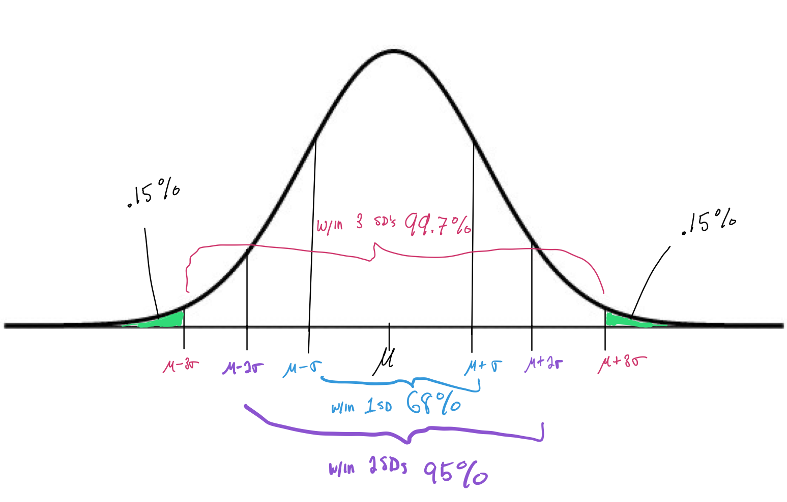

```{r setup, echo=FALSE}
knitr::opts_chunk$set(echo = TRUE, warning = FALSE, message = FALSE)
```


# Recap 

Last class we learned how to calculate the expected value of a random variable, say, $X$: 

$$E(X) = \sum_{x\in S} \left[ x \times Pr(x) \right].$$   

From this, we can also derive ways to compute $Var(X)$, $stdev(X)$, and, for another random variable, say, $Y$ we can also derive $Cov(X,Y)$ and $Cor(X,Y)$ with the following: 

$$Cov(X,Y) = E\left[(X-E(X))\cdot(Y-E(Y)) \right] = \sum_{(x,y) \in S} \left[(x-E(X)(y-E(Y))\times Pr(x \text{ and }y)) \right]$$
$$\text{and}$$

$$Cor(X,Y) = \frac{Cov(X,Y)}{\sqrt{Var(X)Var(Y)}}.$$

## Student Question - How to calculate covariance 

Note: This isn't something you'll be asked to do on Quiz 2 or on the Final. If we have time, at the end of class today I will cover an example on how to calculate the covariance between two discrete random variables. 


# 1. Independent Random Variables 

Independence is a complicated concept in probability and statistics. We're going to dig into the nitty gritty details to make sure we [really understand what independence means](https://youtu.be/jCUiGArhW2M?start=1).

<span style="color:blue">Q1) What does it mean for two *random events*, say, $A$ and $B$, to be independent?</span>

<br>

A1) For any two random events, $A$ and $B$, to be independent, they must satisfy $Pr(A \text{ and } B) = Pr(A) \times Pr(B)$ or, equivalently, $Pr(A \mid B) = Pr(A)$. 

<br>

## Example 1 - Determining if two events are independent

You play two games against the same opponent. The probability you win the first game is $0.4$. If you win the first game, the probability you also win the second is $0.2$. If you lose the first game, the probability that you win the second is $0.3$. Let $A$ be the event that you win the first game and let $B$ be the event that you win the second game. 

<span style="color:purple">a) What is the probability that you win the second game?</span> 

<br> 

<span style="color:purple">b) What is the probability that you win both games?</span> 

<br> 

<span style="color:purple">c) Are the outcomes of these two games independent?</span> 

<br> 
<br>

**Note:** There is a law of probability that we haven't covered yet called *the law of total probability*. This law can be proved given the five laws of probability we have covered and it states that, for any events $A$ and $B$, 
$$Pr(B) = Pr(B\text{ and }A) + Pr(B \text{ and } A^C).$$ 
This law isn't mentioned by name in your textbook but it is used implicitly in Bayes' Rule which you will read about. 


***


<span style="color:blue">Q2) What does it mean for two *random variables*, say, $X$ and $Y$ to be independent?</span> 

<br> 

A2) We say that two random variables, $X$ and $Y$, are independent if the values that $X$ takes on are in no way related the values that $Y$ takes on. In terms of events, this means that any random event in the sample space of $X$ is independent (by one of the formulas above) of any random event in the sample space of $Y$. 

<br> 

## Example 2 - Determining if two variables are independent

|     | Drug A | Drug B | Placebo | Row totals |
|:--- |:--- |:--- |:--- |:--- |
| **Seizure(s)**    | 7 | 2 | 9  | **18** |
| **No seizure(s)** | 5 | 10  | 3 | **18** |
| **Column totals** | **12** | **12** | **12** | **36** |

<br> 
 
***
 
# 2. Properties of Expectation and Variance 

## Linear transformations of a random Variable 

Suppose $a$ is some deterministic (non-random) number between $-\infty$ and $+\infty$. The following are properties of expectation and variance for linear transformations of a random variable $X$. 

* $E(aX) = aE(X), \quad E(a \pm X) = a \pm E(X)$ 

* $Var(aX) = a^2 Var(X), \quad Var(a \pm X) = Var(X)$
  
## Linear transformations of two random variables 

Suppose both $X$ and $Y$ are random variables that may or may not be related to one another. The following are properties of expectation and variance for linear transformations involving both random variables.   
  
* $E(X \pm Y) = E(X) \pm E(Y)$

* $Var(X \pm Y) = Var(X) + Var(Y) \pm 2Cov(X,Y)$

* If $X$ and $Y$ are independent random variables, then $Cov(X,Y)=0$. 


## Example 3 - Week 6 In-Class Worksheet: Part 2 

**Instructions:** Let's plan a trip. Suppose $8$ of us are going to travel to attend one of two international statistics conferences. (The rest of us are attending non-statistical conferences, naturally.) We need to request funding so we can travel to and from our destinations. Suppose $3$ of us are flying to Toronto, Canada for the 2023 Joint Statistical Meeting and $5$ of us are flying to the International Chinese Statistical Association conference in Chengdu, China.  

Airline ticket prices vary from time to time, but for simplicity, let's assume we're going to purchase all tickets for the same destination at the same price. Suppose also that past experience has shown that tickets to Toronto have a mean price of $\$563$, with a standard deviation of $\$70$, while the mean airfare to Chengdu is $\$5400$, with a standard deviation of $\$750$.

<span style="color:blue">4. Define two random variables and use them to express the total amount of funding we will need to request to fly to both of these statistics conferences.</span>

Let $X = \text{ the cost of a flight from PHL to Toronto}$ and $Y = \text{ the cost of a flight from PHL to Chengdu}$. Then the total cost of airfare to these conferences is: $3X + 5Y$.

<span style="color:blue">How could we interpret the covariance between the price of a ticket from PHL to Toronto and the price of a ticket from PHL to Chengdu?</span> 

<br>

<span style="color:purple">5. Find the expected value and standard deviation of the total cost of the one-way-trip to our destinations. Do we need to make any assumptions in calculating these means or standard deviations?</span>


***

# 3. Calculations with Common Probability Distribution Functions 

## Normal distribution 

$$X \sim N(\mu, \sigma^2)$$
**Model parameters**: $E(X) = \mu$ and $Var(X) = \sigma^2$



For a sample of data from this Normal distribution, we observe the values of $x_1, x_2, \dots, x_n$.

**Sample estimates**: $\bar{x} = \frac{1}{n} \sum_{i = 1}^{n} x_i$ and $s^2 = \frac{1}{n-1}\sum_{i=1}^{n} (x_i - \bar{x})$ 


### Quantiles and probabilities 

For the sake of this exercise, let's assume that the cost of airline tickets can be modeled with a Normal distribution. 

<span style="color:purple">What's the probability that the cost of a flight from PHL to Toronto exceeds $\$700$?</span>  

<br>

 
```{r}
myQuantile = 700
pnorm(myQuantile, mean = 563, sd = 70, lower.tail=TRUE)
```

<br>

<span style="color:purple">$80\%$ of flights from PHL to Toronto cost less than how much?</span> 

<br>

```{r}
myProbability = .8
qnorm(myProbability, mean = 563, sd = 70, lower.tail=TRUE)
```

<br>

If we'd rather not use R for these questions, we can still find approximate answers for both questions above by reading a [Z-table](https://www.z-table.com/) consisting of probabilities and quantiles for a standard Normal distribution. (Note: This requires a little bit of additional work since we first have to transform our Normally distributed random variable to a standard Normal random variable.)  
$$Z = \frac{X - \mu}{\sigma} \sim N(0, 1)$$

# 4. Time permitting: Example calculating the covariance between two discrete random variables 

Suppose we have two discrete random variables, $X$ and $Y$, that follow the distributions below:

| Possibilities for $X$ | Probabilities |
|:--- |:--- |
| $1$ | $0.4$ |
| $7$ | $0.6$ |

(therefore $E(x) = 0.4 + 7(0.6) = 4.6$)

| Possibilities for $Y$ | Probabilities |
|:--- |:--- |
| $-3$ | $0.3\bar{3}$ |
| $-1$ | $0.3\bar{3}$ |
| $0$ | $0.3\bar{3}$ |

(therefore $E(Y) = -3(1/3) + -1(1/3) + 0(1/3) = -1.3\bar{3}$).

Suppose further that we have the following joint probabilities:

| Possibilities for $(X,Y)$ | Probabilities |
|:--- |:--- |
| $(1,-3)$ | $0.1$ |
| $(1,-1)$ | $0.2$ |
| $(1, 0)$ | $0.1$ |
| $(7,-3)$ | $0.3$ |
| $(7,-1)$ | $0.2$ |
| $(7, 0)$ | $0.1$ |

Then,
\begin{align*}
Cov(X,Y) &= (1 - 4.6)(-3 + 1.3\bar{3})(0.1) +
(1 - 4.6)(-1 + 1.3\bar{3})(0.2) +
(1 - 4.6)(0 + 1.3\bar{3})(0.1)  \\
&\quad + (7 - 4.6)(-3 + 1.3\bar{3})(0.3) +
(7 - 4.6)(-1 + 1.3\bar{3})(0.2) +
(7 - 4.6)(0 + 1.3\bar{3})(0.1) \\
&= -0.84
\end{align*}
