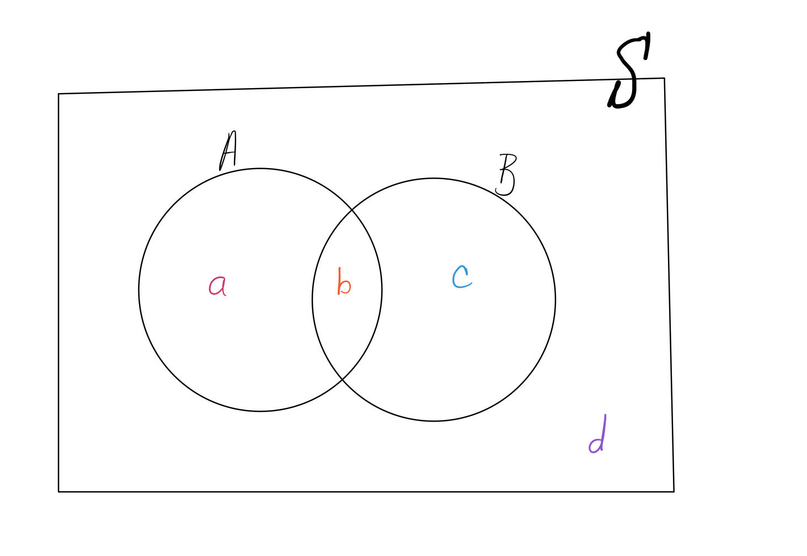
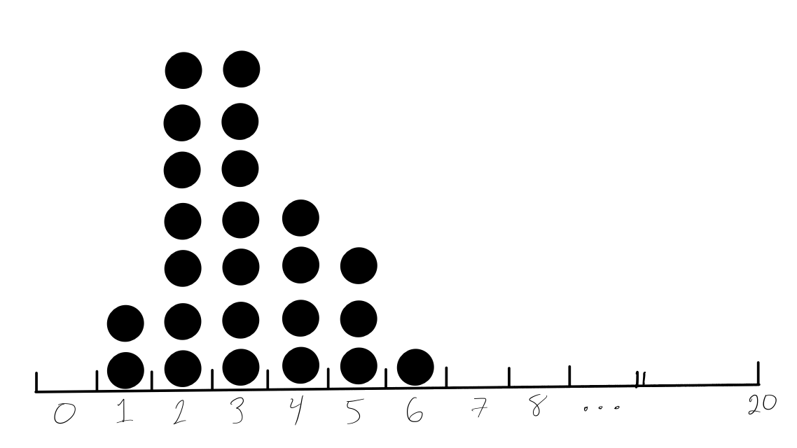
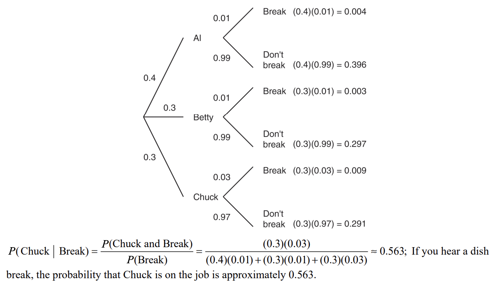

```{r setup, echo=FALSE}
knitr::opts_chunk$set(echo = FALSE, warning = FALSE, message = FALSE)
```


# Unit 2 topics 

* Collecting data

* Randomness and probability


# Collecting data from experiments and observational studies

* Sample surveys 

* Sampling bias

* Experiments and observational studies 


Q1) <span style="color:purple">What role does randomness play in both observational studies and experiments?</span>


Q2) <span style="color:purple">What role does randomness play in experiments alone?</span>


# From randomness to probability and the laws of probability

* Random variables - Bernoulli, binomial, and normal 

  * Expectation, variance, and their properties 
  
  * Independent categorical variables 

* Probability rules 

  * Independent events
  
  * Disjoint events 
  
  * Conditional probabilities 
  
      * tree diagrams 

        * A tree diagram is most helpful when a problem seems to be describing a conditional probability. 

        * In a tree diagram, all branches extending from the same node must add to 1. 

        * At end end of a tree diagram, all outcomes at the far right should be disjoint (i.e. it should not be possible for any of these outcomes to occur simultaneously) and their probabilities should also sum to 1. 


## Example - Laws of probabilitiy 

Suppose you are given four numbers in a bag that all add to 1.

{height=5cm}

The arbitrary numbers $a$, $b$, $c$, and $d$ are probabilities in the Venn diagram below where $a+b+c+d=1$. 




<span style="color:purple">If we swap the numbers in the bag for $a$, $b$, $c$, and $d$ at random, what is the probability that the events $A$ and $B$ are independent?</span> (Hint: Consider showing that $A$ and $B$ are independent if and only if $ac=bd$.)


## Example - Binomial probabilities 

Suppose we are considering a random event that can be modeled as a series of independent successes or failures. Let's say the probability of a success is $0.3$ and the probability of a failure is $0.7$. Find the following probabilities:

1) The probability of observing three successes (in a row). 

2) The probability of observing three successes out of $10$ trials. 


## Example -  calculate $E(X)$, $Var(X)$, and $sd(X)$

Suppose we have a discrete random variable $X$ with the following probability distribution:

| x | 23 | -14 | 75 | 0 |
|:--- |:--- |:--- |:--- |:--- |
| Pr(X=x) | 0.20 | 0.10 | 0.15 | 0.50 |

* $E(X) = \sum_{x}[x \cdot Pr(X=x)]$ 

* $Var(X) = \sum_{x}\{[x-E(X)]^2 \cdot Pr(X=x)\}$ 

* $sd(X) = \sqrt{Var(X)}$ 


### Example - Tree diagram 

A Diner employs three dishwashers. Al washes $40\%$ of the dishes and breaks only $1\%$ of those he handles. Betty and Chuck each wash $30\%$ of the dishes and Better breaks only $1\%$ of hers, but Chuck breaks $3\%$ of the dishes he washes. 

You're eating at the diner one night and hear a dish break in the kitchen. What's the probability that Chuck is on the job? 


<!-- ## Example - Week 7 In-class Worksheet 

Recall how we collected a sample of the number of green jelly beans out of random samples of size $20$ beans. 

  > Calculate the proportion of these candies that are green colored and then send another group member to the front of the class to draw your observed count of green candies on the dot plot at the front of the class. The number of green candies in your random sample follows a binomial distribution, specifically, Bin(n=20,p=0.15).

Altogether, across both of my Stat 11 sections, we did this $24$ times resulting in the dot plot below: 




Using these results, let's go over the answers for questions 3 - 5 on the worksheet: 


3. Based on the dot plot above, we can tell what a histogram of the $\hat{p}$, the proportion of green candies in random samples of size 20 looks like. Describe the histogram and from this plot, determine the probability of a sample of size $20$ containing $4$ green candies or fewer.</span>

<br>

4. Use a [Binomial table of probabilities](https://uwf.edu/media/university-of-west-florida/colleges/cse/departments/mathematics-and-statistics/documents/student-resources/Binomial-Tables-1.pdf) ], calculate the theoretical probability of of observing $4$ green candies or fewer in a random sample of size $20$. How close is this value to your answer in Problem 3?

  > Note for 4: in R, we could use the following code to calculate this probability: pbinom(4, size=20, p=0.15, lower.tail=TRUE)

<br>

5. If we were to draw larger random samples of the candies, say $n=200$, then the Central Limit Theorem (more on this in Unit 3) tells us that the Normal distribution can approximate a binomial distribution. Using both a Binomial table of probabilities and the [Normal (Z) table of probabilities](https://qcenter.uconn.edu/wp-content/uploads/sites/764/2018/05/Standard-Normal-Ztable.pdf), find the probability of observing $20\%$ or fewer green candies in a random sample of size $n=200$.  

  > Solution to 5: Let $X=$ number of green candies and $p=0.15=$probability of observing a green candy. By the CLT, for large enough $n$, $X \approx N(np, np(1-p))$. In this problem, $np=200\cdot0.15=30$ and $np(1-p)=200(0.15)(1-0.15)=25.5$. We are asked for $Pr(X \leq 0.2\cdot 200)=Pr(X \leq 40)$ but we only have a table of Standard Normal probabilities. Thus we must find $Pr(Z \leq \frac{40-30}{\sqrt{25.5}})=Pr(Z \leq 1.98)=0.9761$. So, the probability we observe $20\%$ or fewer green candies out of a random sample of $n=200$ candies is approximately $97.61\%$, according to the Z table. 
  
  > (Note, we could find this probability in R with the following code: pnorm(((.2\*200) - (200\*.15))/sqrt(200\*.15\*(1-.15)), 0, 1, lower.tail=TRUE). If you do this, you'll see that the answer really closely matches that of the following code: pbinom(.2\*200, trials=200, 0.15, lower.tail=TRUE), justifying the use of the CLT.)
  
  > The Steps to solving this problem involve: 

  Step 1) Convert the quantile given in the problem into a quantile of the Standard Normal distribution. 
    
  Step 2) Find the probability associated with this standardized quantile using the Table of Standard Normal probabilities. -->


  


<!---### Note about showing your work 

If you use a graphing calculator on your quiz, you may be able to compute Binomial and/or Normal probabilities directly. However, for any fill-in-the-blank or free-response questions, you will not get full credit if you simply write the answer without showing any work or explaining your reasoning. Therefore, it is not enough to know how to find these probabilities in a graphing calculate. It is better to understand and apply formulas from the formula sheet and/or to use approximations from a Binomial or Normal table of probabilities. --->


# Solutions to some of the exercises above 

## Venn diagram and probability 

Events $A$ and $B$ are independent if and only if $Pr(A \mid B) = Pr(A)$. Based on the Venn diagram, this occurs if and only if
$$\frac{b}{b+c} = a+ b = \frac{a+b}{a+b+c+d},$$
which simplifies to $ac = bd$. 

There are $4! = 24$ total possible ways to assign, at random, these four numbers to the labeled parts of the Venn diagram. However, there are only eight different combinations of these four numbers that satisfy the equation above: 

1) $a=0.45$, $c=0.1$ and $b=0.3$, $d=0.15$

2) $a=0.45$, $c=0.1$ and $b=0.15$, $d=0.3$

3) $a=0.1$, $c=0.45$ and $b=0.3$, $d=0.15$

4) $a=0.1$, $c=0.45$ and $b=0.15$, $d=0.3$

5) $a=0.3$, $c=0.15$ and $b=0.45$, $d=0.1$

6) $a=0.3$, $c=0.15$ and $b=0.1$, $d=0.45$

7) $a=0.15$, $c=0.3$ and $b=0.45$, $d=0.1$

8) $a=0.14$, $c=0.3$ and $b=0.1$, $d=0.45$

Therefore, $Pr(A \text{ and } B \text{ are independent}) = 8/24 = 1/3$. 

## Binomial probabilities 

1) The probability of observing three successes (in a row) is $0.3^3$.

2) The probability of observing three successes out of $10$ trials is $10C3 \cdot 0.3^3 \cdot (1-0.3)^7$. 

## Derive $E(X)$, $Var(X)$, and $sd(X)$

* $E(X) = \sum_{x}[x \cdot Pr(X=x)] = \dots =14.45$ 

* $Var(X) = \sum_{x}\{[x-E(X)]^2 \cdot Pr(X=x)\} = \dots =668.9874$ 

* $sd(X) = \sqrt{Var(X)} = 25.865$ 

## Tree diagram 



<!-- ## Follow-up question related to Example - Week 7 In-class Worksheet 

What if in question 5, I had instead asked you to find the lower $20\%$ quantile for the distribution of $X=$ the number of green candies, using the CLT? This still requires understanding how to convert between non-Standard Normal distributions and Standard Normal distributions. To answer this question, follow these steps:

Step 1) Find the lower $20\%$ quantile of a standard Normal distribution (using R or the table of Standard Normal probabilities). In this case, the answer is approximately $-0.84$. 

Step 2) Un-standardize this quantile using the fact that (based on the CLT) we have $E(X) = np = 200(0.15) = 30$ and $Var(X) = np(1-p) = 200(0.15)(1-0.15) = 25.5$. 

Now we have that the lower $20\%$ quantile for the number of green candies is $(-0.84)\sqrt{25.5} + 30 = 25.758.$ --> 
