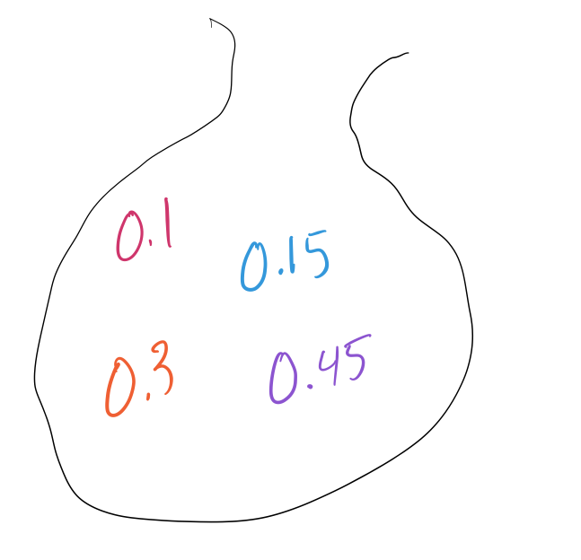

```{r setup, echo=FALSE}
knitr::opts_chunk$set(echo = FALSE, warning = FALSE, message = FALSE)
```


# Unit 2 topics 

* Collecting data

* Randomness and probability


# Week 4 - Collecting data from experiments and observational studies

* Sample surveys 

* Experiments and observational studies 


## Example 

<span style="color:purple">What role does randomness play in both observational studies and experiments?</span>


<span style="color:purple">What role does randomness play in experiments alone?</span>


# Week 6 - From randomness to probability and the laws of probability

* Random variables 

* Probability rules 


## Example 

Suppose you are given four numbers in a bag that all add to 1.

{height=5cm}

The arbitrary numbers $a$, $b$, $c$, and $d$ are probabilities in the Venn diagram below where $a+b+c+d=1$. 


<span style="color:purple">If we swap the numbers in the bag for $a$, $b$, $c$, and $d$ at random, what is the probability that the events $A$ and $B$ are independent?</span> (Hint: Consider showing that $A$ and $B$ are independent if and only if $ac=bd$.)

# Week 7 - Random variables and probability models

* Expectation of random variables 

* Independence 


## Example - Week 7 In-class Worksheet 

Recall how we collected a sample of the number of green jelly beans out of random samples of size $20$ beans. 

  > Calculate the proportion of these candies that are green colored and then send another group member to the front of the class to draw your observed count of green candies on the dot plot at the front of the class. The number of green candies in your random sample follows a binomial distribution, specifically, Bin(n=20,p=0.15).

Altogether, across both of my Stat 11 sections, we did this $24$ times resulting in the dot plot below: 


Using these results, let's go over the answers for questions 3 - 5 on the worksheet: 


3. Based on the dot plot above, we can tell what a histogram of the $\hat{p}$, the proportion of green candies in random samples of size 20 looks like. Describe the histogram and from this plot, determine the probability of a sample of size $20$ containing $4$ green candies or fewer.</span>

<br>

4. Use a [Binomial table of probabilities](https://uwf.edu/media/university-of-west-florida/colleges/cse/departments/mathematics-and-statistics/documents/student-resources/Binomial-Tables-1.pdf) ], calculate the theoretical probability of of observing $4$ green candies or fewer in a random sample of size $20$. How close is this value to your answer in Problem 3?

<br>

5. If we were to draw larger random samples of the candies, say $n=200$, then the Central Limit Theorem (more on this in Unit 3) tells us that the Normal distribution can approximate a binomial distribution. Using both a Binomial table of probabilities and the [Normal (Z) table of probabilities](https://qcenter.uconn.edu/wp-content/uploads/sites/764/2018/05/Standard-Normal-Ztable.pdf), find the probability of observing $20\%$ or fewer green candies in a random sample of size $n=200$. Explain why these values are so close. 

### Continuity correction 

You were assigned to read a section that discusses the continuity correction technique. This is not something that you will be assessed on as I just want you to be familiar with the idea for your own edification. 

***

# Study tips 

## Have you....

1. Read the relevant sections of Chapters 10 - 15? 

2. Completed IHW #5 - #10? 

3. Checked your answers to GHW #3 with the solution key? 

4. Taken notes on which topics or examples are most challenging to you? 

***
  
# Student Requested Examples 
  
## Binomial probabilities 

Suppose we are considering a random event that can be modeled as a series of independent successes or failures. Let's say the probability of a success is $0.3$ and the probability of a failure is $0.7$. Find the following probabilities:

1) The probability of observing three successes (in a row). 

2) The probability of observing three successes out of $10$ trials. 


### Note about showing your work 

If you use a graphing calculator on your quiz, you may be able to compute Binomial and/or Normal probabilities directly. However, for any fill-in-the-blank or free-response questions, you will not get full credit if you simply write the answer without showing any work or explaining your reasoning. Therefore, it is not enough to know how to find these probabilities in a graphing calculate. It is better to understand and apply formulas from the formula sheet and/or to use approximations from a Binomial or Normal table of probabilities. 


## Derive $E(X)$, $Var(X)$, and $sd(X)$, for a random variable $X$. 

Suppose we have a discrete random variable $X$ with the following probability distribution:

| x | 23 | -14 | 75 | 0 |
|:--- |:--- |:--- |:--- |:--- |
| Pr(X=x) | 0.20 | 0.10 | 0.15 | 0.50 |

* $E(X) = \sum_{x}[x \cdot Pr(X=x)]$ 

* $Var(X) = \sum_{x}\{[x-E(X)]^2 \cdot Pr(X=x)\}$ 

* $sd(X) = \sqrt{Var(X)}$ 

## Tree diagram 

* According to your textbook, "it is a good idea to make a tree diagram any time you plan to use the General Multiplication Rule." [pg 408] 

* In a tree diagram, all branches extending from the same node must add to 1. 

* At end end of a tree diagram, all outcomes at the far right should be disjoint (i.e. it should not be possible for any of these outcomes to occur simultaneously) and their probabilities should also sum to 1. 

### Example - Tree diagram 

Suzy's Diner employs three dishwashers. Al washes $40\%$ of the dishes and breaks only $1\%$ of those he handles. Betty and Chuck each wash $30\%$ of the dishes and Better breaks only $1\%$ of hers, but Chuck breaks $3\%$ of the dishes he washes. 

You're eating at the diner one night and hear a dish break in the kitchen. What's the probability that Chuck is on the job? 


***

# Looking ahead 

Start to think about who you would like to work with on your final group project. (Groups must be of 3-4 people each.) Detailed instructions for the final project are posted on Moodle. 

What kind of question do you want to use your statistics skills to answer? And, just as importantly, what kind of question can you answer in five weeks? 

If you want to get a head start, you are welcome to attend the Stat Problem Solving Data Challenge hosted by Prof Suzy on Monday and Tuesday, March 20 and 21. (There will be pizza!)


# Solutions to some of the exercises above 

## Venn diagram and probability 

Events $A$ and $B$ are independent if and only if $Pr(A \mid B) = Pr(A)$. Based on the Venn diagram, this occurs if and only if
$$\frac{b}{b+c} = a+ b = \frac{a+b}{a+b+c+d},$$
which simplifies to $ac = bd$. 

There are $4! = 24 total possible ways to assign, at random, these four numbers to the labeled parts of the Venn diagram. However, there are only eight different combinations of these four numbers that satisfy the equation above: 

1) $a=0.45$, $c=0.1$ and $b=0.3$, $d=0.15$

2) $a=0.45$, $c=0.1$ and $b=0.15$, $d=0.3$

3) $a=0.1$, $c=0.45$ and $b=0.3$, $d=0.15$

4) $a=0.1$, $c=0.45$ and $b=0.15$, $d=0.3$

5) $a=0.3$, $c=0.15$ and $b=0.45$, $d=0.1$

6) $a=0.3$, $c=0.15$ and $b=0.1$, $d=0.45$

7) $a=0.15$, $c=0.3$ and $b=0.45$, $d=0.1$

8) $a=0.14$, $c=0.3$ and $b=0.1$, $d=0.45$

Therefore, $Pr(A \text{ and } B \text{ are independent}) = 8/24 = 1/3$. 

## Binomial probabilities 

1) The probability of observing three successes (in a row) is $0.3^3$.

2) The probability of observing three successes out of $10$ trials is $10C3 \cdot 0.3^3 \cdot (1-0.3)^7$. 

## Derive $E(X)$, $Var(X)$, and $sd(X)$

* $E(X) = \sum_{x}[x \cdot Pr(X=x)] = \dots =14.45$ 

* $Var(X) = \sum_{x}\{[x-E(X)]^2 \cdot Pr(X=x)\} = \dots =668.9874$ 

* $sd(X) = \sqrt{Var(X)} = 25.865$ 

## Tree diagram 

