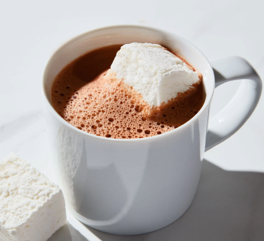
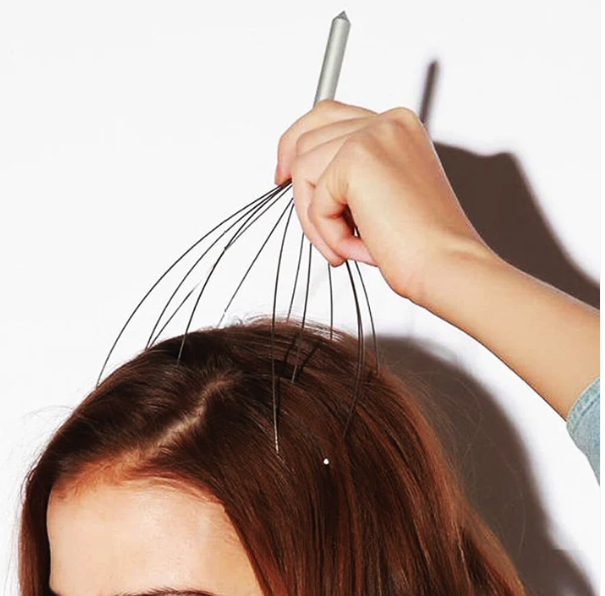

Often times, we hear news stories or see videos that reference scientific research using statistical methods. Unfortunately, what makes for an interesting headline or story is not often the most accurate interpretation of statistical results, even (especially) when those results are declared to be "statistically significant". 

For example, consider Woman’s World magazine, a publication with a circulation of over 1.3 million readers. The January 11, 2021, issue contained the articles with the two headlines and excerpts below.  

Even though you may not understand all of the statistical details in the abstracts just yet, what do you notice about the magazine's reporting of these scientific publications? 

# Headline 1: Japanese breakthrough lowers dementia risk by 64%. STAY SHARP!

{width=300px}

**Excerpt:** “Good news for chocolate lovers: Sip 2 mugs of hot cocoa daily and a study in The American Journal of Clinical Nutrition found you’ll up your “good” cholesterol by 24%. Researchers credit cocoa compounds called flavonoids with the heart-smart effect. What’s more, Appalachian State University scientists say folks who enjoy 25 grams of dark chocolate (about four squares) daily have better memories and multitasking ability than those who don’t indulge.”

## Actual scientific article 

The study references in this article is from The American Journal of Clinical Nutrition and can be found at DOI: https://doi.org/10.3945/ajcn.114.092189 Volume 101, Issue 3, March 2015, Pages 538–548.

**Abstract:** 

Background: Recent evidence has indicated that flavanol consumption may have many health benefits in humans, including improved cognitive activities.

Objective: The aim was to evaluate the effect of flavanol consumption on cognitive performance in cognitively intact elderly subjects.

Design: This was a double-blind, controlled, parallel-arm study conducted in $90$ elderly individuals without clinical evidence of cognitive dysfunction who were randomly assigned to consume daily for $8$ wk a drink containing $993 mg$ [high flavanol (HF)], $520 mg$ [intermediate flavanol (IF)], or $48 mg$ [low flavanol (LF)] cocoa flavanols (CFs). Cognitive function was assessed at baseline and after $8$ wk by using the Mini-Mental State Examination (MMSE), the Trail Making Test (TMT) A and B, and the Verbal Fluency Test (VFT).

Results: The changes in MMSE score in response to the $3$ different treatments were not different. In contrast, there was a positive impact of the intervention on specific aspects of cognitive function. Mean changes ($\pm$ SEs) in the time required to complete the TMT A and B after consumption of the HF ($−8.6 \pm 0.4$ and $−16.5 \pm 0.8 s$, respectively) and IF ($−6.7 \pm 0.5$ and $−14.2 \pm 0.5 s$, respectively) drinks significantly ($p < 0.0001$) differed from that after consumption of the LF drinks ($−0.8 \pm 1.6$ and $−1.1 \pm 0.7 s$, respectively). Similarly, VFT scores significantly improved among all treatment groups, but the magnitude of improvement in the VFT score was significantly ($p < 0.0001$) greater in the HF group ($7.7 \pm 1.1$ words/60 s) than in the IF ($3.6 \pm 1.2$ words/60 s) and LF ($1.3 \pm 0.5$ words/60 s) groups. Significantly different improvements in insulin resistance ($p < 0.0001$), blood pressure ($p < 0.0001$), and lipid peroxidation ($p = 0.001$) were also observed for the HF and IF groups in comparison with the LF group. Changes in insulin resistance explained $\approx 17\%$ of changes in composite z score (partial r2 = $0.1703$, $p < 0.0001$).

Conclusions: This dietary intervention study provides evidence that regular CF consumption can reduce some measures of age-related cognitive dysfunction, possibly through an improvement in insulin sensitivity. These data suggest that the habitual intake of flavanols can support healthy cognitive function with age. This trial was registered at www.controlled-trials.com as ISRCTN68970511.

 
 
 

# Headline 2: Proven! Shower "tickle" fires up virus-fighting cells. Immunity Boost!

{width=300px}

**Excerpt:** “Linger longer in the shower - Aah, that warm water feels so good. While you’re showering, simply massaging your scalp for 10 minutes heightens your ability to quash invading viruses by as much as 32%, suggests research in Scientific Reports. Explains study co-author Sam Brod, Ph.D., stimulating scalp nerves eases stress and encourages the release of virus-killing immune cells (T cells).” 

## Actual scientific article 

This quoted study is from Scientific Reports can be found at: DOI: https://doi.org/10.1038/srep10913 Volume 5, Article number: 10913 (2015).

**Abstract:** Recent clinical evidence suggests that the therapeutic effect of massage involves the immune system and that this can be exploited as an adjunct therapy together with standard drug-based approaches. In this study, we investigated the mechanisms behind these effects exploring the immunomodulatory function of stroking as a surrogate of massage-like therapy in mice. C57/BL6 mice were stroked daily for 8 days either with a soft brush or directly with a gloved hand and then analysed for differences in their immune repertoire compared to control non-stroked mice. Our results show that hand- but not brush-stroked mice demonstrated a significant increase in thymic and splenic T cell number ($p<0.05$; $p<0.01$). These effects were not associated with significant changes in CD4/CD8 lineage commitment or activation profile. The boosting effects on T cell repertoire of massage-like therapy were associated with a decreased noradrenergic innervation of lymphoid organs and counteracted the immunosuppressive effect of hydrocortisone in vivo. Together our results in mice support the hypothesis that massage-like therapies might be of therapeutic value in the treatment of immunodeficiencies and related disorders and suggest a reduction of the inhibitory noradrenergic tone in lymphoid organs as one of the possible explanations for their immunomodulatory function.

 
 
 

Source: DANA Center for Mathematics Pathways 