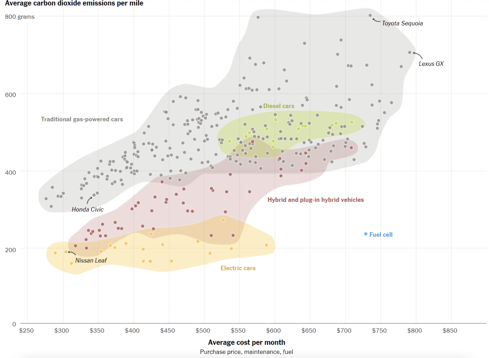

<br>
**Name:** _____________________________________

<br>
**Instructions:** Consider the data presented in the image below. Work with your group mates to answer each of the five questions. 
<br>

```{r setup, echo=FALSE, include=FALSE}
require(knitr)
library(tidyverse)
knitr::opts_chunk$set(message = FALSE) # include this if you don't want markdown to knit messages
knitr::opts_chunk$set(warning = FALSE) # include this if you don't want markdown to knit warnings
```

 

<br>

# 1. What are the observational units that constitute the sample of data being visualized in the plot above?

\vspace{2cm}

# 2. How many variables are represented in this plot and which of these variables are categorical?

\vspace{2cm}

# 3.  How would you describe the distribution of diesel cars compared to the distribution of traditional gas-powered cars?

\vspace{3cm}

# 4. Come up with a bad title for this plot, one that intentionally misleads careless readers.

\vspace{3cm}

# 5. Now, come up with a more accurate title. 

