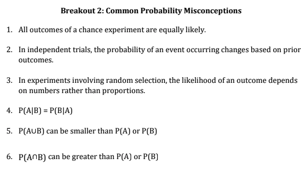

<br>
**Name:** _____________________________________

<br>
**Instructions:** There are X parts to this worksheet. First, work on the X questions. Then, when instructed by your professor, get into groups to discuss your answers to Part X and move on to complete Part X. Before getting started however, take a moment and reflect on ways in which you can show your assigned group members respect. You may also view this initial [list of examples](https://docs.google.com/document/d/1emP8SiS2IO-_blKdVmVp-CJTr0NLlKG4vzMnphH-P7E/edit?usp=sharing) that we will add to over the semester.

**Briefly,** in the space below, specify one way in which you will work to show your group members respect during today's lesson:
<br>
<br>
<br>
<br>

```{r setup, echo=FALSE, include=FALSE}
require(knitr)
library(tidyverse)
knitr::opts_chunk$set(message = FALSE) # include this if you don't want markdown to knit messages
knitr::opts_chunk$set(warning = FALSE) # include this if you don't want markdown to knit warnings
```


[LLN and long run frequencies vs subjective probability] 
[Formal laws of probability (conditional prob and Bayes rule)]
[Independent events vs disjoint] 
[draw tree diagram]


The Drake Equation 

In 1961 astronomer Frank Drake developed an equation to try to estimate the number of extraterrestrial civilizations in our galaxy that might be able to communicate with us via radio transmissions. Now largely accepted by the scientific community, the Drake equation has helped spur efforts by radio astronomers to search for extraterrestrial intelligence. Here is the equation:
$$N_{C} = N \cdot f_p \cdot n_e\cdot f_l \cdot f_i \cdot f_{c} \cdot f_{L}.$$
OK, it looks a little messy, but here’s what it means:

!()[./images/wk6-drake-eqn.png]


So, how many ETs are out there? That depends; values chosen for the many factors in the equation depend on ever-evolving scientific knowledge and one’s personal guesses. But now, some questions.

# 1.  What quantity is calculated by 

(a) the first product, $N \cdot f_p$?

(b) the product, $N \cdot f_p \cdot n_e \cdot f_l$?


<br>
<br>
<br>
<br>


# 2.  What probability is calculated by the product $f_l \cdot f_i$? 

<br>
<br>
<br>
<br>


# 3. Which of the factors in the formula are conditional probabilities? Restate each in a way that makes the condition clear.

<br>
<br>
<br>
<br>

***

R4.3 plan a trip and estimate the costs for random flight costs 

Each year a company must send 3 officials to a meeting in China and 5 officials to a meeting in France. 

Airline ticket prices vary from time to time, but the company purchases all tickets for a country at the same price. 

Past experience has shown that tickets to China have a mean price of $\$1000$, with a standard deviation of $\$150$, while the 
mean airfare to France is $\$500$, with a standard deviation of $\$100$.


# 4. Define random variables and use them to express the total amount the company will have to spend to send these delegations to the two meetings.


<br>
<br>
<br>
<br>

# 5. Find the mean and standard deviation of the total cost of the trip in Problem 4. Do you need to make any assumptions in calculating these means? How about the standard deviations

<br>
<br>
<br>
<br>


***

# Part 1 


# Part 2 

Each student flip a coin 30 times and note the number of heads. Have each student repeat. this process again so there are a total of at least 50 observations of the number of heads in 30 flips. Using data from the entire class construct a dotplot of the observed values. 


After looking at the dotplot created in class, reconsider your answer to the first question. For each of the three students, explain why you now think they did or did not actually do the experiment. 


# Probability Misconceptions



1. If a fair die is rolled five times, which of the following sequences is most likely to result?

a. 2 6 1 5 3
b. 6 4 2 1 5
c. 2 4 4 4 4
d. 2 6 1 5 3 and 6 4 2 1 5 are equally likely and they are more likely than 2 4 4 4 4
e. 2 6 1 5 3, 6 4 2 1 5, and 2 4 4 4 4 are all equally likely


2. If you flip a fair coin and get heads 5 times in a row, what is the chance of getting tails on the next flip?

a. Greater than 0.5
b. 0.5
c. Less than 0.5


3. Two boxes contain red and blue balls. Box 1 has 14 blue balls and 4 red balls. Box 2 has 10
blue balls and 2 red balls. There are more blue balls in Box 1 than Box 2. If you pick one ball
at random from each box, are you more likely to choose a blue ball from Box 1 or Box 2?


4. Suppose a fair coin will be flipped twice. Consider the following three events:

A: 0 heads are observed
B: 1 head is observed
C: 2 heads are observed

Which of the following in true?
a. P(A) < P(B) < P(C)
b. P(A) = P(B) = P(C)
c. P(B) is greater than P(A) and P(B)
 
5.Think about the following two probabilities:

1. The probability that a man that is over 6 feet tall is a professional basketball player
2. The probability that a man is over 6 feet tall given that he is a professional
basketball player

Which of the following is true?

a. Probability 1 is greater than probability 2
b. Probability 2 is greater than probability 1
c. The two probabilities are equal


6. Think about the following two probabilities:
1. The probability that a randomly selected adult American likes to surf
2. The probability that a randomly selected adult American lives in California and likes
to surf

Which of the following is true?

a. Probability 1 is greater than probability 2
b. Probability 2 is greater than probability 1
c. The two probabilities are equal

7. Suppose that 78% of the students at a particular college have a Facebook account and 43%
have a Twitter account.

a) Using only this information, what is the largest possible value for the percentage who
have both a Facebook account and a Twitter account? Describe the (unrealistic)
situation in which this occurs.

b) Using only this information, what is the smallest possible value for the percentage who
have both a Facebook account and a Twitter account? Describe the (unrealistic)
situation in which this occurs.
