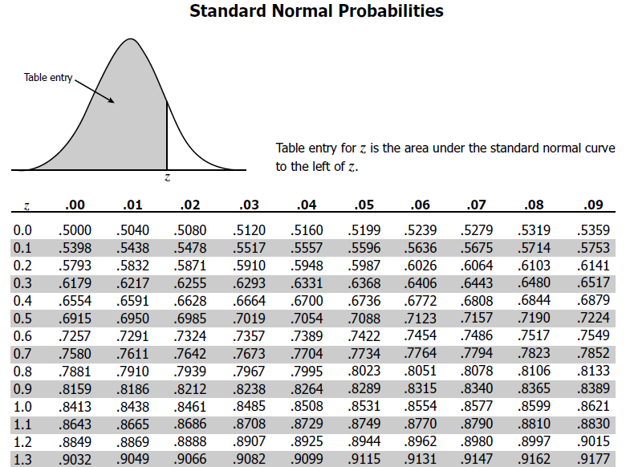

<br>
**Name:** _____________________________________

<br>
**Instructions:** There are X parts to this worksheet. First, work on the X questions. Then, when instructed by your professor, get into groups to discuss your answers to Part X and move on to complete Part X. Before getting started however, take a moment and reflect on ways in which you can show your assigned group members respect. You may also view this initial [list of examples](https://docs.google.com/document/d/1emP8SiS2IO-_blKdVmVp-CJTr0NLlKG4vzMnphH-P7E/edit?usp=sharing) that we will add to over the semester.

**Briefly,** in the space below, specify one way in which you will work to show your group members respect during today's lesson:
<br>
<br>
<br>
<br>

```{r setup, echo=FALSE, include=FALSE}
require(knitr)
library(tidyverse)
knitr::opts_chunk$set(message = FALSE) # include this if you don't want markdown to knit messages
knitr::opts_chunk$set(warning = FALSE) # include this if you don't want markdown to knit warnings
```

[have student groups draw random samples of size 20 or 30 from larger bag]


# 1.  What are the mean and standard deviation of the number of heads? How many standard deviations above (or below) the mean is the number of heads observed (via actual coin tossing)?


<br>
<br>
<br>
<br>


# 2.  What would be the observed number of heads if we observed an amount that was two standard deviations above the mean? If instead we tossed the coin $100$ times, would this same number of heads still be unusual? If not, how many more heads would we need to see to get to an amount that is two standard deviations above the mean? Explain how these results refute the “Law of Averages” but confirm the Law of Large Numbers

<br>
<br>
<br>
<br>


***

normal approximation to the binomial model:
The CLT tells us that, if our sample size is large and our data is drawn independently from the population, then the sampling distribution of the sample proportion is a Normal distribution. More specifically, this will follow a Normal distribution with mean $\mu = p$ and variance $\sigma^2 = \frac{p(1-p)}{30}$.

We're not going to generate a sample of $100$ flips of this coin in reality but we can still calculate an estimate for $p$ with the formula:
$$\hat{p} = \frac{1}{n} \sum_{i=1}^{n}x_i.$$

# 3. What can you say about the value of $\hat{p}$ even before you even see the data? Draw a picture of the density curve for the sampling distribution of the sample proportion. Label the mean and one standard deviation above and below the mean on the curve.


<br>
<br>
<br>
<br>
 


# 4. After $n=100$ flips of the coin, suppose we observe $41$ heads and $59$ tails. What is the value of $\hat{p}$ and how far away from the expected value (or mean) of the sampling distribution of the sample proportions is this? 

<br>
<br>
<br>
<br>


# 5.  What is the probability that, repeating this experiment again and again produces the same value of $\hat{p}$ or something larger? Draw a picture shading the region corresponding to this probability and use the Z-table below to approximate its value.


<br>
<br>
<br>
<br>





*** 

```{r}
#set.seed(101)
X = rbinom(n=1, size = 14, p=0.05)

```


# Relevant HWs 

* HW 5 Spring 20

* HW 6 Spring 20 

* HW 7 Spring 20 

* Practice problems 3 S20 

# TO DO: 

* include examples of calculating different probabilities including "at least one" or "one or more", etc. 

* make this activity more about probability calculations than looking ahead. would still be good to get students to practice with normal table and binomial table (no R use) and demonstrate how it can approximate. give them problems that require them to use info from sec 3 of last class notes 

***

Candy company claims that 5\% of the Jelly Beans it produces are licorice flavor.Suppose that the candies are packaged at random in small bags containing about 50 Jelly Beans. A class of students open several bags , counts the various colors of the candies, and calculates the proportion that are licorice 

The number of licorice candies in the sample follows a binomial distribution. A histogram of the proportion of licorice candies in random samples of size 50 looks like this.... 

expected value $np$ and variance $np(1-p)$ 


If $n$ is larger, say $100$, find the expected value and variance. Then compute probabilities and find quantiles and compare to those of a normal distbn  

Find the probability of exactly 7 licorice candies. Find the probability of 7 or more licorice candies.


say in a super-size bag of 1000 Jelly Beans we found $8\%$ licorice flavored. Is this an unusually larger proportion? 

answer by calculating how many standard deviations above the mean this is from a Normal model 

